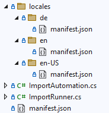

# {{ page.title }}

<!---
Ziele:
- Mechanismus für Lokalisierung beschreiben

Inhalt:
- Übersetzung der Informationen im Manifest
- allgemeine Herangehensweise zur Lokalisierung von UI-Elementen beschreiben
--->

The Import SDK supports multilingual plug-ins, the content of the manifest as well as other UI elements can be localized. This chapter deals with the use of this feature.

## Manifest localization
The plug-in system supports localization of the manifest file, in which the supported language abbreviations appear as additional subfolders in the "locals" subfolder and contain a manifest.json.\


Name value pairs are used.\
Example content of a localized manifest.json insides locales\en-US\ folder:
```json
{
  "$schema": "../../../schemas/localizations.schema.json",
  "translation": {
    "title": "English title from plug-in",
    "ImportAutomation18626.title": "Automation (localization) (Localized for [en-US])"
  }
}
```
<!-- Besseres Bsp.? -->

The used schema:
```json
{
  "$schema": "https://json-schema.org/draft/2020-12/schema",
  "$id": "AutoImporterPluginManifestLocalizationsSchema",
  "title": "Manifest schema",
  "description": "A list of localizations for an PiWeb AutoImporter plug-in",
  "type": "object",
  "properties": {
    "$schema": {
      "type": "string"
    },
    "translation": {
      "type": "object",
      "description": "The list of localizations for the plug-in",
      "properties": {
        "title": {
          "description": "The localization for the plug-in title",
          "type": "string"
        },
        "description": {
          "description": "The localization for the plug-in description",
          "type": "string"
        },
        "homepage": {
          "description": "The localization for the plug-in homepage",
          "type": "string"
        },
        "contact": {
          "description": "The localization for the plug-in contact",
          "type": "string"
        },
        "documentation": {
          "description": "The localization for the plug-in documentation",
          "type": "string"
        },
        "<importAutomationId>.title": {
          "description": "The localization for the plug-in import automation title",
          "type": "string"
        },
        "<importAutomationId>.description": {
          "description": "The localization for the plug-in import automation description",
          "type": "string"
        }
      }
    }    
  }
}
```
<!-- TODO Anpassen, Umstellung auf SingleModule -->

## ILocalizationHandler
You can use an implementation of the interface ILocalizationHandler to make your own translations. These translations are currently supported in the *IStatusService* by the **PostImportEvent** and **SetActivity** methods and in the *IImportHistoryService* interface for the **AddMessage** method.

{: .note }
These messages are stored semantically and translated into the current language when the application is started. This language does not have to be the language in which the message was created. If the required plug-in is no longer available, there is a fallback to a defined message (usually in English).

```c#
public class LocalizationHandler : ILocalizationHandler
{
    public string LocalizeAndFormatText(string text, object[] args, ILocalizationContext context)
    {
        return string.Format(
            context.FormatCulture,
            LocalizeText(text, context.TranslationCulture),
            args);
    }

    private static string LocalizeText(string text, CultureInfo translationCulture)
    {
        if (translationCulture.TwoLetterISOLanguageName == "de")
        {
            return text switch
            {
                "Info" => "Eine Info-Level-Nachricht",
                "InfoWithArg" => "Eine Info-Level Nachricht mit Argument {0}",
                "Error" => "Eine Error-Level-Nachricht",
                "ErrorWithArg" => "Eine Error-Level-Nachricht mit Argument {0}",
                _ => $"#{text}"
            };
        }

        return text switch
        {
            "Info" => "Some info level message",
            "InfoWithArg" => "Some info level message with argument {0}",
            "Error" => "Some error level message",
            "ErrorWithArg" => "Some error level message with argument {0}",
            _ => $"#{text}"
        };
    }
}
```

In the implementation of IPlugin, the custom handler is registered via GetLocalizationHandler.
```c#
public class MyPlugin : IPlugin
{
    public Task Init(IPluginContext context)
    {
        context.RegisterImportAutomation("MyImportModule", new MyImportModule());
        return Task.CompletedTask;
    }

    public ILocalizationHandler GetLocalizationHandler(ILocalizationHandlerContext context)
    {
        return new LocalizationHandler();
    }
}
```

The LocalizationHandler is used automatically when the PostImportEvent of the StatusService is called, for example.
```c#
public sealed class MyImportRunner : IImportRunner
{
    private readonly IStatusService _StatusService;

    public MyImportRunner(IImportRunnerContext context)
    {
        _StatusService = context.StatusService;
    }

    public async Task RunAsync(CancellationToken cancellationToken)
    {
        try
        {
            _StatusService.PostImportEvent(EventSeverity.Info, "Info");
            _StatusService.PostImportEvent(EventSeverity.Info, "InfoWithArg", 1);

            _StatusService.PostImportEvent(EventSeverity.Error, "Error");
            _StatusService.PostImportEvent(EventSeverity.Error, "ErrorWithArg", 1);

            await Task.Delay(TimeSpan.FromMilliseconds(-1), cancellationToken).ConfigureAwait(false);
        }
        catch (OperationCanceledException)
        {
            // Do nothing
        }
    }
}
```

## Custom texts and future
Further translations could take place via a separate implementation, e.g. within the ILocalizationHandler, and could be controlled via a JSON file or similar.\
In the future, it is planned that the Import SDK will offer further possibilities for translation, similar to the manifest translation.