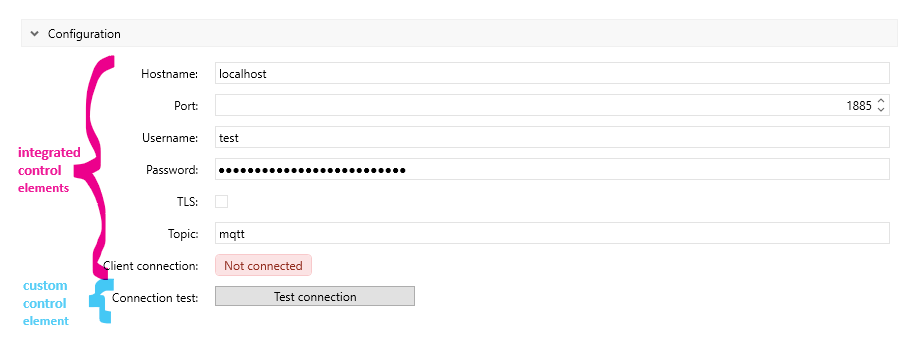

<!---
Ziele:
- aufzeigen, wie eigene UI-Elemente integriert werden können

Inhalt:
- anhand Beispiel-Plug-in das Vorgehen beschreiben
--->

# {{ page.title }}
The Import SDK already provides a large number of configuration elements, but it can happen that these elements are not sufficient. The Import SDK therefore also supports the creation of your own elements.\
For more information about native elements read [User configuration & storage]().

## Example control element
This article shows the steps required to create your own configuration element. The example of a button is used for this:


## Needed elements
1. ButtonViewModel.cs
2. ButtonView.xaml
3. ImportConfiguration.cs (IAutomationConfiguration)

## ButtonViewModel.cs - ConfigurationItemBase
Represents the base implementation for IConfigurationItem which is recommended for any configuration item. This class is the basis for the ViewModel for our button:
```c#
using CommunityToolkit.Mvvm.Input;
using Zeiss.PiWeb.Import.Sdk.ConfigurationItems;

public sealed class ButtonViewModel( Action callback ) : ConfigurationItemBase
{
	public IRelayCommand ButtonClickCommand { get; set; } = new RelayCommand( callback, () => true );
}
```

## ButtonView.xaml
A WPF-based UI file must be provided, xaml. As usual with WPF, this file contains the description of the UI interface, in our example we define our buttons there:
```xml
<UserControl x:Class="Zeiss.MQTTPlugin.ButtonView"
             xmlns="http://schemas.microsoft.com/winfx/2006/xaml/presentation"
             xmlns:x="http://schemas.microsoft.com/winfx/2006/xaml"
             xmlns:d="http://schemas.microsoft.com/expression/blend/2008"
             xmlns:local="clr-namespace:Zeiss.MQTTPlugin"
             xmlns:mc="http://schemas.openxmlformats.org/markup-compatibility/2006"
             d:DataContext="{d:DesignInstance local:ButtonViewModel}"
             d:DesignHeight="300"
             d:DesignWidth="300"
             mc:Ignorable="d">

    <StackPanel Margin="0,5">
        <Button Command="{Binding ButtonClickCommand}"
                Content="Test connection"
                Width="200"
                HorizontalAlignment="Left" />
    </StackPanel>
</UserControl>
```

## IAutomationConfiguration
The implementation of the `IAutomationConfiguration` interface can be used to place your own configuration elements; further information on this can be found in [User configuration & storage]().

```c#
using Zeiss.PiWeb.Import.Sdk.ConfigurationItems;
using Zeiss.PiWeb.Import.Sdk.Modules.ImportAutomation;
using Zeiss.PiWeb.Import.Sdk.PropertyStorage;

public class ImportConfiguration : IAutomationConfiguration
{
	private static readonly Section _ConfigurationSection = new Section() { Title = "Configuration", Priority = 1 };

	public ImportConfiguration( IPropertyStorage storage )
	{
		Hostname = new StringConfigurationItem( storage, nameof( Hostname ), "localhost" )
		{
			Priority = 0,
			Section = _ConfigurationSection,
			Title = "Hostname",
			Tooltip = "Hostname of MQTT broker. e.g. localhost"
		};

		[...]

		Button = new ButtonViewModel( TestConnection )
		{
			Priority = 7,
			Section = _ConfigurationSection,
			Title = "Connection test",
			Tooltip = "Tries to connect to given server."
		};
	}

	[ConfigurationItem]
	public StringConfigurationItem Hostname { get; }

	[...]
	
	[ConfigurationItem]
	public ButtonViewModel Button { get; }
    
    [...]
}
```

We define properties with the help of the `[ConfigurationItem]` annotation, these properties are initialized accordingly in the constructor. The `Button` property is initialized with our ViewModel `ButtonViewModel`. A callback is passed there, which is executed when the button is clicked, where your own logic can be executed accordingly.