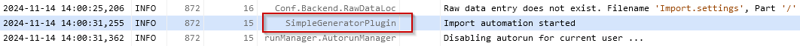
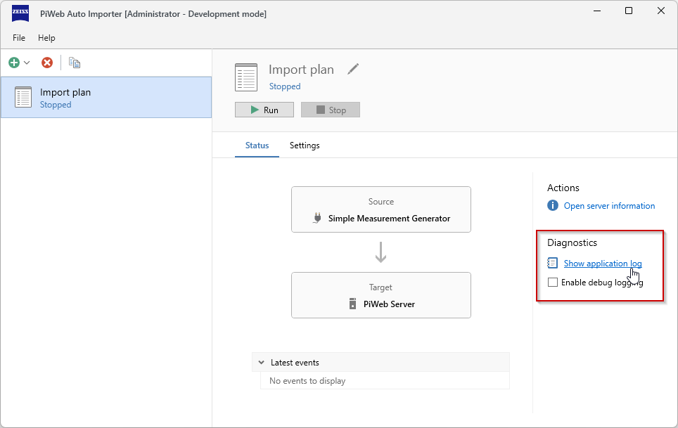
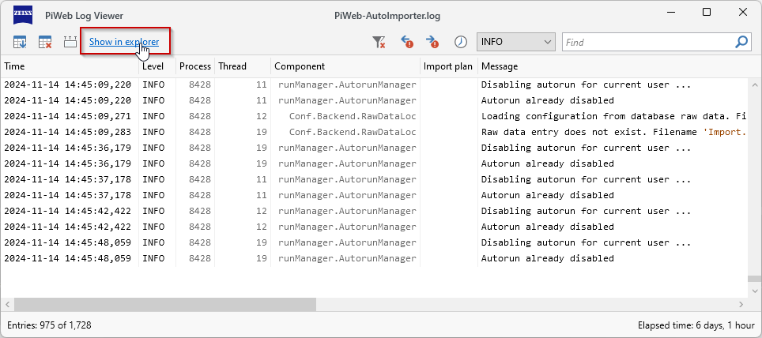

# {{ page.title }}
{: .no_toc }
*PiWeb Auto Importer* keeps several log files for diagnostic purposes. Import plug-ins hosted by *PiWeb Auto Importer* may add entries to these logs as well. In this article we are going to explain which log files exist, how to write log entries to these files and how to always view the correct log.

## Table of Contents
{: .no_toc }
1. TOC
{:toc}

## How to write log entries from plug-ins?
To write a log entry, an `Ilogger` instance is necessary. Most calls from *PiWeb Auto Importer* to your plug-in implementation will provide such an instance as part of the `context` parameter. A simple example of writing a log entry may look like this:

```c#
public class ImportRunner : IImportRunner
{
  private readonly ILogger _Logger;

  public ImportRunner(ICreateImportRunnerContext context)
  {
    _Logger = context.Logger;
  }

  public async Task RunAsync(CancellationToken cancellationToken)
  {
    _Logger.LogInformation("Import automation started");
    ...
    _Logger.LogInformation("Import automation finished");
  }
}
```
Log entries of plug-ins can be identified by the plug-in id in the component column:
{: .framed}

### Log levels
{: .no_toc }
Log entries can be written with different log levels depending on the severity of the message. The available log levels are
- `Trace`,
- `Debug`,
- `Information`,
- `Warning` and
- `Error`

Each of these levels has its own log method on `ILogger`. You can also use the general `ILogger::Log(LogLevel, ...)` method and specify the desired log level as first argument. Use `ILogger.IsEnabled(LogLevel)` to find out whether a log level is severe enough to be actually written to the log.

### Message templates
{: .no_toc }
A log message can be a message template that takes additional arguments and inserts them into the actual log message:
```c#
var counter = 2;
var path = "c:\\some\\file.txt";
_Logger.LogInformation("Importing file number {Number}: {Path}", counter, path);
```
For more in-depth information about how arguments are matched with the message template placeholders see [Message Templates](https://messagetemplates.org/ "Message Templates"){:target="_blank"}.

### Exceptions
{: .no_toc }
Exceptions can be logged by passing them as first argument before the message template.
```c#
try
{
  ...
}
catch (exception ex)
{
  _Logger.LogError(ex, "Failed to import {Path}", path);
}
```
Exceptions are always logged in detail with their stacktrace and all direct and indirect inner exceptions. 

## Which log files are written by *PiWeb Auto Importer*?
*PiWeb Auto Importer* writes two kinds of log files:
- The single application log file contains all events that occur in-process. This log file will contain any log entries written by plug-ins running as part of a default import plan. The corresponding log file can be found at a user specific location in the filesystem:
```
%LOCALAPPDATA%\Zeiss\PiWeb\PiWeb-AutoImporter.log
``` 
- A service log file for each import plan run as Windows service. This log file will contain any log entries written by plug-ins running as part of a Windows service import plan. The corresponding log file can be found at a location in the filesystem that is not user specific:
```
%ALLUSERSPROFILE%\Zeiss\PiWeb\AutoImporter - [Name].log
```
`[Name]` corresponds to the import plan name.

## Where are the log entries of my import plan?
Since the target log file depends on whether an import plan is configured to run as Windows service or not, looking at the wrong log file is a common problem. However, *PiWeb Auto Importer* offers an easy way to open the correct log file for any given import plan on the status page of the import plan. On the right side there is a diagnostics section with a link to open the log. This is either `Show application log` or `Show service log`. Only the correct link will be shown.



Clicking the show log link will open *PiWeb Log Viewer* displaying the log. The log viewer also provides the option to open the Windows explorer with the relevant folder to find the currently displayed log file. You can use this to easily share the log file itself if necessary.



{: .note}
The diagnostic section also has a `Enable debug logging` checkbox that can be used to temporarily increase the log level to Debug without needing to restart the application. This even works for import plans running as Windows service.