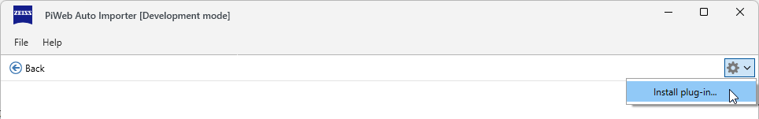
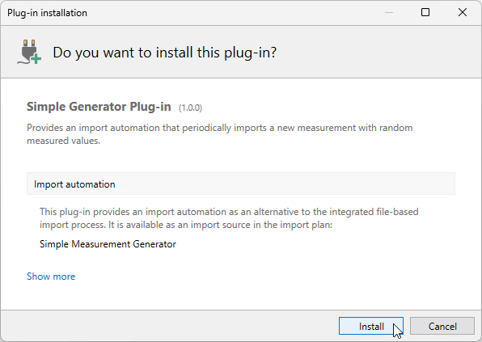
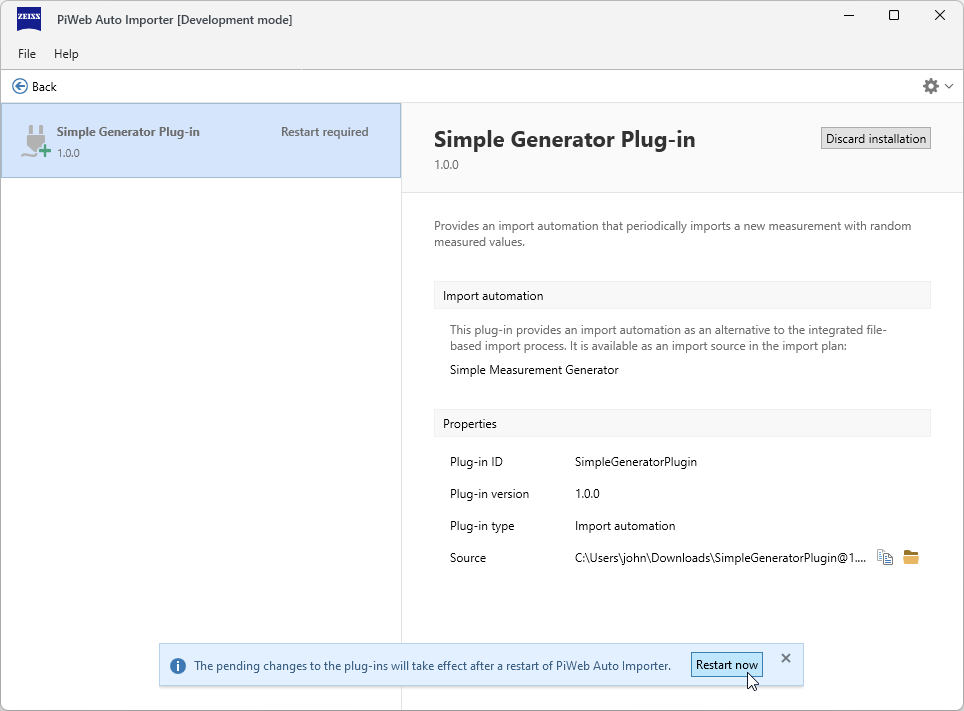
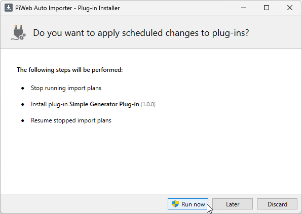
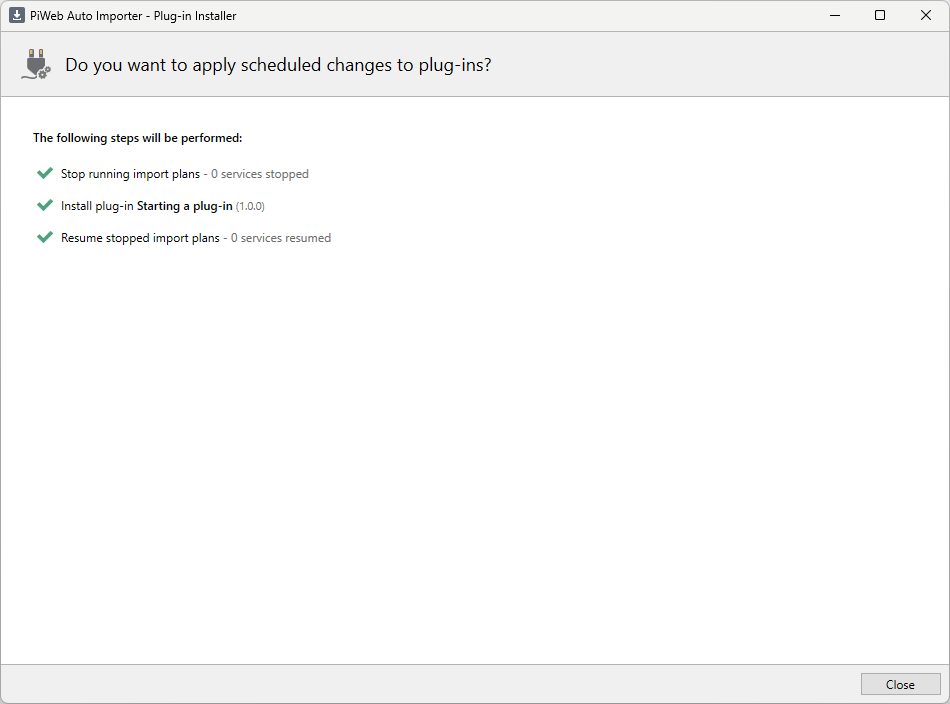
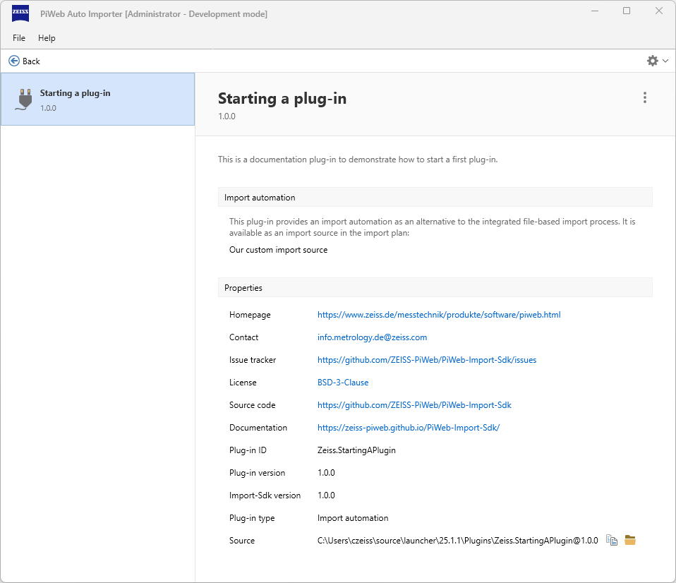
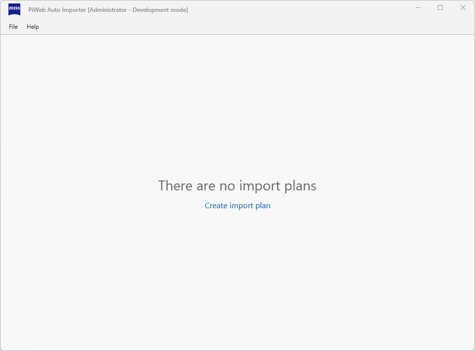
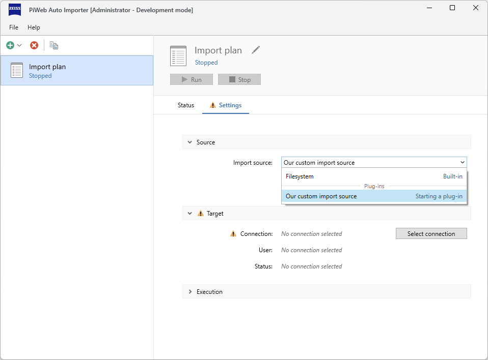
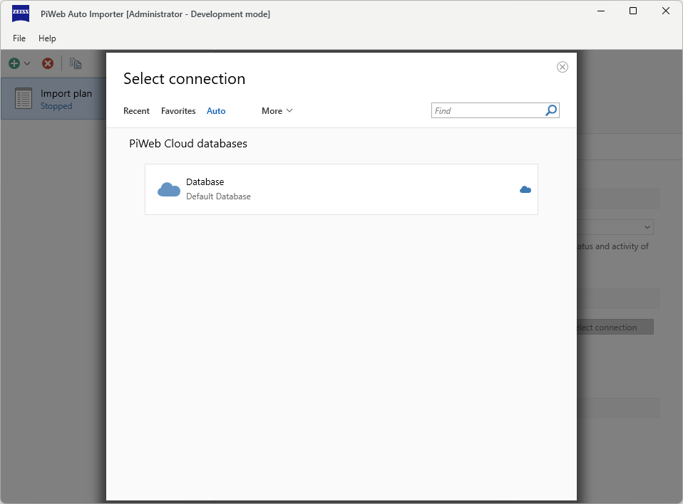
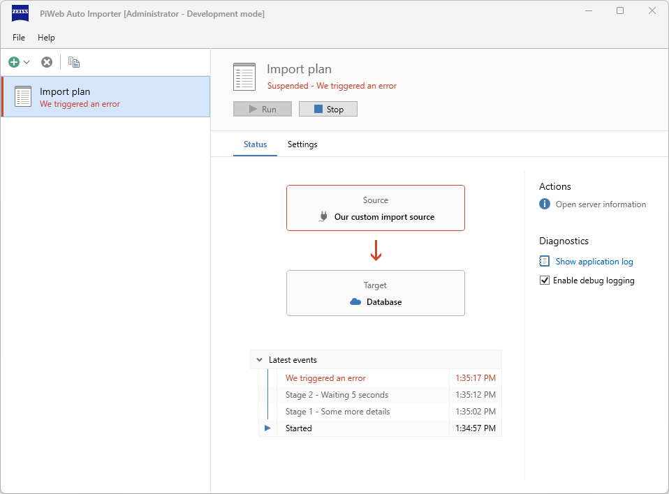

<!---
Ziele:
- aufzeigen, wie das Plug-in beim Kunden eingerichtet werden kann

Inhalt:
- Installation
    - Ablage in Plug-in-Ordner
    - Installation via Auto Importer
        - eventuell Dateiendung beachten
- aktuell noch kein Plug-in-Store vorhanden
--->

# {{ page.title }}
In this article we will show you how to create a plug-in and install it in the Auto Importer. We will also show you how to set an installed plug-in as the import source in an import plan.

## Create plug-in
If the plug-in project uses our import sdk template as recommended by us. The build function `GeneratePluginPackageOnBuild` is automatically provided. This option is visible in the project file:\
`<GeneratePluginPackageOnBuild>true</GeneratePluginPackageOnBuild>`\
If the project is compiled, the necessary pip is automatically generated and placed inside your output directory.

## Install a plug-in
The generated **pip** file can be installed directly in the Auto Importer as a plug-in.\
This works via the install function in the Auto Importer, via drag & drop into the Auto Importer window and via file system.

### Download compiled example plug-in
We provide a ready-to-use plug-in (pip file) under the following link:\
[Zeiss.StartingAPlugin@1.0.0.pip](../../assets/pips/Zeiss.StartingAPlugin%401.0.0.pip){:target="_blank"}\
This can be used to run a plug-in installation.

### Install option
The Auto Importer provides an installer option, for which the following steps must be carried out:

1. Open `File > Plug-ins...`, You can select the Install plug-in... option via the cogwheel in the top right-hand area. option. Alternatively, if you have not yet installed a plug-in, you can select Install plug-in directly in the middle of the view.

This will open the file explorer with filtering for Auto Importer plug-in files.
2. After selecting the desired plug-in, an overview of the manifest data appears.

3. After the action was scheduled, you will be prompted to restart the Auto Importer.
{: .framed }
4. When restarting, the planned action is recognized and the plug-in installer is started. This shows the pending actions. Administration rights are required to execute the actions (`Run now`). To ensure that all import plans can be updated, all service import plans are stopped and then restarted.

5. A green tick appears in front of successfully executed actions. The plug-in installer can now be closed, after which the Auto Importer starts with the installed plug-in.

### Drag & drop
It is also possible to drag Auto Importer plug-in files into the Auto Importer window. This then automatically recognizes that an installation is desired. The overview window with the plug-in to be installed then appears directly.
Here too, the Auto Importer must be restarted afterwards.

This function allows you to install plug-ins directly from a mail attachment, for example.

### File system
The Auto Importer goes through subfolders of the `Plugins` folder in its installation path to find a manifest.json there. It evaluates this manifest file and loads the corresponding plug-in when the program is started.\
This is also the only place in the production environment from which plug-ins are loaded. If you place a corresponding folder in this path, the Auto Importer will load it as a plug-in the next time the program is started.

## Check plug-in installation
To ensure that the plug-in has been installed correctly, you can call up the plug-in management view (`File > Plug-ins...`) again. The loaded plug-in will now appear there.\

## Create import plan
To test the installed plug-in, an import plan must first be created; an import plan defines a source and a target. To do this, please click on `Create import plan`.\

## Import plan with custom import source
If the plug-in has been loaded correctly, the custom import source can be selected as an import source in an import plan. Please adjust all settings according to the screenshot.\

To select your cloud database as the destination, please go to Select connection and select Auto.\

Via `Run`, the import plan is started with this configuration. The plug-in only demonstrates the switching of the activity and status log. At the end of the execution, an error is provoked.\

You can find out more about import visualization options at [Import monitoring](). The following articles describe the minimum source code required for a plug-in.