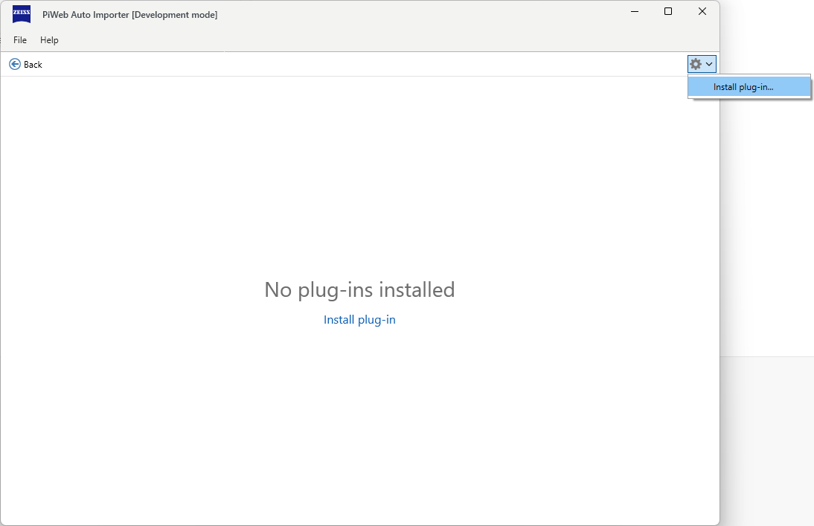
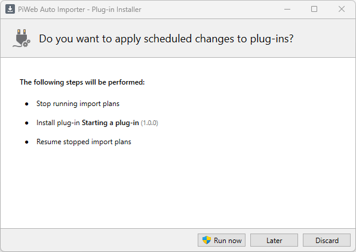
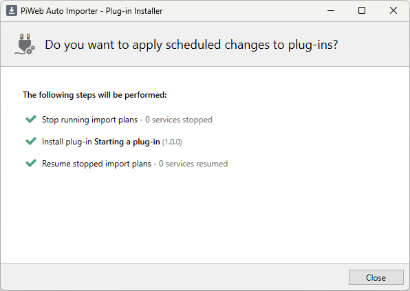

<!---
Ziele:
- aufzeigen, wie das Plug-in beim Kunden eingerichtet werden kann

Inhalt:
- Installation
    - Ablage in Plug-in-Ordner
    - Installation via Auto Importer
        - eventuell Dateiendung beachten
- aktuell noch kein Plug-in-Store vorhanden
--->

# {{ page.title }}
The compiled plug-in must be packed together with the manifest file in a **pip** file. This pip file can be installed directly in the Auto Importer as a plug-in.\
This works via the install function in the Auto Importer, via drag & drop into the Auto Importer window and via file system.\
As a plug-in developer, you can use the build process from the Import SDK. The pip file is actually a zip file, i.e. it can also be created in other ways and then renamed.

## Download compiled example plug-in
We provide a ready-to-use plug-in (pip file) under the following link:\
[Zeiss.StartingAPlugin@1.0.0.pip](../assets/pips/Zeiss.StartingAPlugin%401.0.0.pip){:target="_blank"}\
This can be used to run a plug-in installation.

## Install option
The Auto Importer provides an installer option, for which the following steps must be carried out:

1. Open `File > Plug-ins...`, You can select the Install plug-in... option via the cogwheel in the top right-hand area. option. Alternatively, if you have not yet installed a plug-in, you can select Install plug-in directly in the middle of the view.

This will open the file explorer with filtering for Auto Importer plug-in files.
2. After selecting the desired plug-in, an overview of the manifest data appears.

3. After the action was scheduled, you will be prompted to restart the Auto Importer.

4. When restarting, the planned action is recognized and the plug-in installer is started. This shows the pending actions. Administration rights are required to execute the actions (`Run now`). To ensure that all import plans can be updated, all service import plans are stopped and then restarted.

5. A green tick appears in front of successfully executed actions. The plug-in installer can now be closed, after which the Auto Importer starts with the installed plug-in.

## Drag & drop
It is also possible to drag Auto Importer plug-in files into the Auto Importer window. This then automatically recognizes that an installation is desired. The overview window with the plug-in to be installed then appears directly.
Here too, the Auto Importer must be restarted afterwards.

This function allows you to install plug-ins directly from a mail attachment, for example.

## File system
The Auto Importer goes through subfolders of the `Plugins` folder in its installation path to find a manifest.json there. It evaluates this manifest file and loads the corresponding plug-in when the program is started.\
This is also the only place in the production environment from which plug-ins are loaded. If you place a corresponding folder in this path, the Auto Importer will load it as a plug-in the next time the program is started.