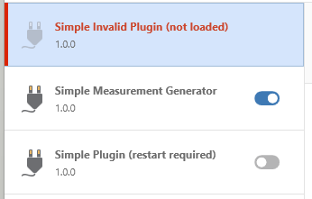
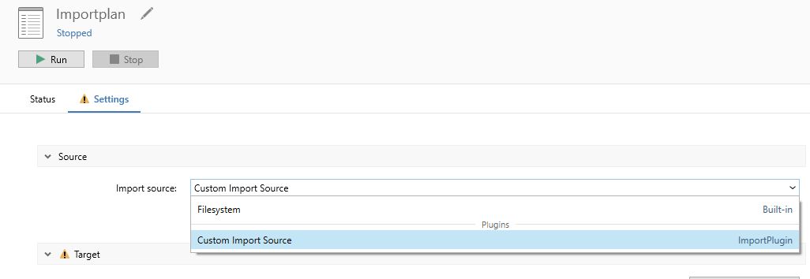

# {{ page.title }}

<!---
Ziele:
- aufzeigen, was benötigt und wie eingerichtet wird, um ein Plugin entwickeln zu können
 
Inhalt:
- Nutzung von Visual Studio / Rider / VS Code erwähnen
- Installation und Einrichtung von PiWeb
    - PiWeb Lizenz als Voraussetzung (PiWeb Cloud als Alternative)
    - PiWeb Server muss laufen
- Einrichtung des Auto Importers
    - Importplan anlegen, Zieldatenbank definieren, Importquelle festlegen
    - Aktivierung des Developer Mode für Auto Importer beschreiben
    - Verwendung Kommandozeilenparameter für Plugin-Ordner erklären
- Template erwähnen, muss noch in GitHub bereitgestellt werden und auf Formats erweitert werden
--->

This chapter defines the environment required to start developing your own plug-in for the Auto Importer.

## PiWeb server
A PiWeb server is not necessarily required for development. However, this is recommended in order to be able to validate the correct saving process.
A corresponding license is required to operate a PiWeb server, an alternative is PiWeb cloud with the test phase contained therein. See https://www.zeiss.com/metrology/en/software/zeiss-piweb.html or https://piwebcloud.metrology.zeiss.com 

The installation and configuration can be found in the PiWeb server tech guide:\
https://techguide.zeiss.com/en/zeiss-piweb-2025r1/article/introduction_to_piweb_server.html

## Auto Importer
The PiWeb Auto Importer software must be installed in order to test / load your own plugin.

### Development mode
For security reasons, the Auto Importer only allows plugins to be loaded from its program folder. In plugin development, however, it can be helpful to manage and develop your own plugin in a separate environment.\
For this reason, the Auto Importer provides a development mode.

An entry in the registry is required to activate this mode. This must be placed under **Computer\HKEY_LOCAL_MACHINE\SOFTWARE\Zeiss\PiWeb\AutoImporter**:\
Name: **DevelopmentMode** as a string with the value: **True**

If development mode is active, this is displayed accordingly in the title bar.

### Command for external plugin folder
The development mode makes it possible to load plugins from a given folder in the Auto Importer:\
**-pluginSearchPaths "C:\Plugins"**

There should be a subfolder for each plugin in this folder. [Read more about structure]().

### Auto Importer plugin management
To check whether the Auto Importer has loaded the desired plugin, you can go to **File > Plugins...**. There you will see a list of all known plugins and their load status.\

**gray text "not loaded"**: Plugin is not active. Activate via gray toggle button and restart the application.\
**blue toggle button**: Plugin is active.\
**red text "not loaded"**: There was an error with this plugin, it is not active. See [troubleshooting]() for more information.

Plugins can be activated and deactivated via this view. Only active plugins are loaded when the Auto Importer is started and can therefore be used as an import source.

> [!IMPORTANT]
> Changing the state (active/inactive) of a plugin requires a restart of the Auto Importer.

### Import plan with own module
If the plugin has been loaded correctly and modules have been recognized, they can be selected as an import source in an import plan:\

After selecting the module, the defined configuration entries are displayed.\
Via **Run** the import plan is started with this configuration.

### Logging
The application log can be opened via **Show application log**, on the status view. Corresponding entries and problems are recorded there. See chapter [monitoring]() to write your own entries there.

## Project template
We provide a project template for Visual Studio and Rider. This contains the minimum project structure to start developing a plugin.

<!-- Nach GitHub verschieben & Link bereitstellen -->

### Rider
Add the current folder to `Add` > `New Project...` > `More Templates` > `Install Template...` and press `Reload`.
On the left hand side should be a new template called `PiWeb AutoImporter Plugin (internal)` at the bottom under `Other`.

> [!NOTE]
> Rider < 2024.1 does not support entering values for optional parameters for custom project templates.
See also: https://youtrack.jetbrains.com/issue/RIDER-16759

### Visual Studio
Open a terminal in this location and run `dotnet new install`.
When adding a new project there should now be a template called `PiWeb AutoImporter Plugin (internal)`.

### Command line
Open a terminal in this location and run `dotnet new install`.
Now you can add new projects with `dotnet new zeiss-ai-plugin`. Use `dotnet new zeiss-ai-plugin -h` to see options.

To get more information about the files and their content read the next chapter [Create your first plugin]().