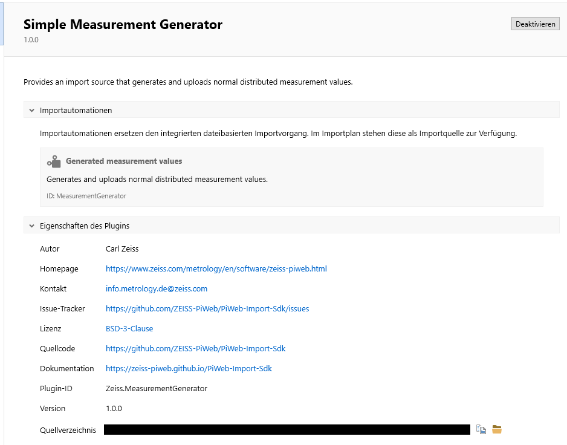

# {{ page.title }}

<!---
Ziele:
- mit sehr einfachem Beispiel erste Schritte für Pluginentwicklung aufzeigen

Inhalt:
- C#-Project Template für Plugins nutzen
    - Kurzbeschreibung Manifest-Inhalt und Anpassungen vornehmen (z.B. ID, Autor)
    - IPlugin Implementierung beschreiben
- Plug-in verwenden
    - Auto Importer mit Plug-in und im Developer Mode starten
    - Plug-in sollte in der Plug-in-Übersicht gelistet sein
    - Troubleshooting: aufzeigen, wo man sehen kann, wenn Plug-in nicht geladen werden konnte
- Vorgehen ohne Template beschreiben
    - Manifest anlegen (Verweis auf Unterkapitel)
    - IPlugin implementieren (Verweis auf Plug-in structure Kapitel)
- Beispiel als Zip zur Verfügung stellen
- Next steps
    - erwähnen, dass als nächstes Entscheidung bzgl. Modultyp notwendig ist
--->

This chapter describes what is required to create a minimal plug-in.

## Import SDK nuget
The Import SDK nuget is required for the development of Auto Importer plugins. This can be obtained from TODO.\
> [!IMPORTANT]
> Please ensure that this assembly is not copied to the output.

```json
<PackageReference Include="Zeiss.PiWeb.Import.Sdk" Version="$(ImportSdkNuGetVersion)">
    <Private>false</Private>
    <ExcludeAssets>runtime</ExcludeAssets>
</PackageReference>
```
<!-- URL bereitstellen, in offiziellem nuget Feed? -->

## manifest.json
```json
{
    "$schema": "../schemas/manifest.schema.json",
    "id": "Zeiss.ImportPluginDemo",
    "version": "1.0.0",
    "title": "ImportPlugin",
    "description": "Demonstrates the ability to add import sources to an import plan by implementing import modules.",
    "author": "Carl Zeiss",
    "contact": "info.metrology.de@zeiss.com",
    "homepage": "https://www.zeiss.com/metrology/en/software/zeiss-piweb.html",
    "issueTracker": "https://github.com/ZEISS-PiWeb/PiWeb-Import-Sdk/issues",
    "licenseName": "BSD-3-Clause",
    "licenseUrl": "https://github.com/ZEISS-PiWeb/PiWeb-Import-Sdk/blob/develop/LICENSE.txt",
    "sourceCode": "https://github.com/ZEISS-PiWeb/PiWeb-Import-Sdk",
    "documentation": "https://zeiss-piweb.github.io/PiWeb-Import-Sdk",
    "provides": [
        {
            "type": "ImportAutomation",
            "id": "MyImportModule",
            "title": "Custom Import Source",
            "description": "This import module does nothing and is only useful for testing import modules."
        }
    ]
}
```
The manifest describes your plug-in content and defines the modules which are provided.\
**manifest.json** has to be in the root of your plug-in folder.

### Plug-in information
**$schema:** The schema we provide to validate your manifest.\
**id:** The unique identifier for this plug-in. The plug-in identifier must be unique overall installed plugins.\
**version:** Your managed version of the plug-in.\
**title:** Title shown in plug-in management view of Auto Importer.\
**description:** Description shown in plug-in management view of Auto Importer.\
**provides:** Collection of module information.



### Module information
**type:** ImportAutomation or ImportFormat, see chapter [Choose your module type]() for further information.\
**id:** Unique identifer for this module, must be unique within the plug-in.\
**title:** Title shown in the module selection of plug-in management view of Auto Importer.\
**description:** Description shown in the module selection of plug-in management view of Auto Importer.

## IPlugin and IPluginContext
IPlugin represents a PiWeb Auto Importer plug-in. Here you register your modules with the Auto Importer.

```c#
using Zeiss.PiWeb.Import.Sdk;

public class Plug-in : IPlugin
{
    public Task Init(IPluginContext context)
    {
        context.RegisterImportAutomation("MyImportModule", new MyImportModule());

        return Task.CompletedTask;
    }
}
```
> [!NOTE]
> In this example an ImportAutomation is registered. You can also register ImportFormat, read the next chapter [Choose your module type]() for more information.

**Init:** Initializes the plug-in. Usually called during startup of the hosting application while showing a splash screen. Startup finishes when the returned task is completed. *RegisterImportAutomation* on *IPluginContext* is used to register your defined module with the system.

> [!IMPORTANT]
> The *id* of *RegisterImportAutomation* and *RegisterImportFormat* from *IPluginContext* needs to be identical with your manifest.

For an overview of the different module types, please follow the next chapter [Choose your module type]().