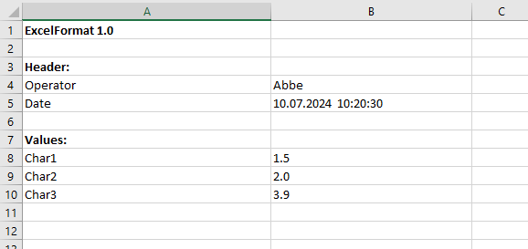

# {{ page.title }}

<!---
Ziele:
- anhand einer einfachen Beispielanwendung Schritt für Schritt das Vorgehen und die wichtigsten Themen für den Modultyp beschreiben

Inhalt:
- IImportFormat implementieren
    - für einfaches Beispielformat GetGroup- und Parse-Methode implementieren
    - zur weiteren Erklärung der Details auf Unterkapitel "Module: Import format" verweisen
- Implementierung registrieren
- Implementierung im manifest eintragen
- Format mit Beispieldatei verwenden
--->

<!-- Anderes Plug-in erstellen, einfach zeilenweise -->

Import Format Plug-ins allow you to import previously unsupported files with the Auto Importer. We will demonstrate the necessary procedure using a simple Excel example.

Here is the example Excel file:\


Cell A1 should provide our identification, so it is possible to handle different Excel files from different plug-ins. The header **Header:** defines the start of the attribute listing. Followed by the heading **Values:** which lists our measured values.

## Download source code
<!-- TODO zip Datei verlinken/bereistellen -->

## manifest.json
```json
{
  "$schema": "../schemas/manifest.schema.json",
  "id": "Zeiss.ExcelImport",
  "version": "1.0.0",
  "title": "Excel-Import",
  "description": "This plug-in contains a an import format for importing Excel files.",
  "author": "Zeiss",

  "provides": [
    {
      "type": "ImportFormat",
      "id": "ImportFormat",
      "title": "Excel-Import",
      "description": "Imports a simple excel format into PiWeb."
    }
  ]
}
```

## IPlugin
The module must be registered in the Auto Importer when the application is started.

```c#
using System.Threading.Tasks;
using Zeiss.PiWeb.Import.Sdk;

public class Plugin : IPlugin
{
    /// <inheritdoc />
    public Task Init(IPluginContext context)
    {
        context.RegisterImportFormat("ImportFormat", new ImportFormat());

        return Task.CompletedTask;
    }
}
```

**RegisterImportFormat:**\
Registers an import format. The ID of the Import Format module and the object (of type **IImportFormat**) to be registered must be given.

{: .important }
The id of RegisterImportFormat from IPluginContext needs to be identical with your id in the manifest.

## IImportFormat

### StandardFileExtensions
StandardFileExtensions returns a collection of file extensions as a string, which should be responded to later during import. In our case, we register the Excel file extension *xlsx*.
```c#
public IReadOnlyCollection<string> StandardFileExtensions => [".xlsx"];
```

### DecideImportAction
Decides what should be done with the given import group. In this method, the module must check whether the available files are to be imported by this module. A primary file with the correct extension is defined for this purpose. Further files are provided in the IImportGroup and context information in the IGroupContext parameter.\
In our example, we look at the Excel file provided and check whether *ExcelFormat 1.0* is in cell A1. If this is not the case, we reject the ImportGroup via **ImportAction.Pass**. If the file is correct, it is marked for import using **ImportAction.Import**. For further import actions, see chapter [Module Import format]().

```c#
public async ValueTask<ImportAction> DecideImportAction(IImportGroup importGroup, IGroupContext context)
{
    // Is Excel file?
    if (!importGroup.PrimaryFile.HasExtension(".xlsx"))
        return ImportAction.Pass;

    // Open primary file as Excel workbook
    await using var stream = importGroup.PrimaryFile.GetDataStream();
    using var workbook = new XLWorkbook( stream );

    var sheet = workbook.Worksheet( 1 );
    
    // Excel sheet contains our format?
    if (sheet.Cell( 1, 1 ).Value.ToString() != "ExcelFormat 1.0")
        return ImportAction.Pass;

    // Mark for import
    return ImportAction.Import;
}
```

### ParseImportData
After the file has been marked for import by the *DecideImportAction* method, the parser must process it, i.e. the necessary measurement data and information must be read out and provided in an importable structure. This task is performed by the *ParseImportData* method.

```c#
public async Task<ImportData> ParseImportData(IImportGroup importGroup, IParseContext context)
{
    // Open primary file as Excel workbook.
    await using var stream = importGroup.PrimaryFile.GetDataStream();
    using var workbook = new XLWorkbook(stream);

    var sheet = workbook.Worksheet(1);

    // InspectionPlanPart represents a part that is to be created/updated in the PiWeb Server.
    var root = new InspectionPlanPart(importGroup.PrimaryFile.BaseName);
    // Adding a measurement to this part.
    var measurement = root.AddMeasurement();
        
    // Create variables for headers.
    foreach (var row in GetRowsForSection(sheet, "Header:"))
    {
        var variable = row.Cell(1).Value.ToString();
        var value = row.Cell(2).Value.ToString();

        // Set those variables on the root part.
        root.SetVariable(variable, value);
    }

    // Create Value variables for each characteristic.
    foreach (var row in GetRowsForSection(sheet, "Values:"))
    {
        var characteristicName = row.Cell(1).Value.ToString();
        
        // Adds characteristic to root part.
        var characteristic = root.AddCharacteristic(characteristicName);
        // Adds measured value to that characteristic.
        var measuredValue = measurement.AddMeasuredValue(characteristic);
        
        // Check for number or string content of that measured value.
        if (row.Cell(2).Value.IsNumber)
            measuredValue.SetVariable("Value", row.Cell(2).Value.GetNumber());
        else
            measuredValue.SetVariable("Value", row.Cell(2).Value.ToString());
    }

    return new ImportData(root);
}

// A helper method that returns rows that are within the specified section.
private static IEnumerable<IXLRow> GetRowsForSection(IXLWorksheet sheet, string section)
{
    var isInSection = false;
    
    foreach (var row in sheet.RangeUsed().Rows())
    {
        if (isInSection)
        {
            if (row.Cell(1).Value.IsBlank)
                yield break;

            yield return row.WorksheetRow();
            continue;
        }

        isInSection = row.Cell(1).Value.ToString() == section;
    }
}
```
