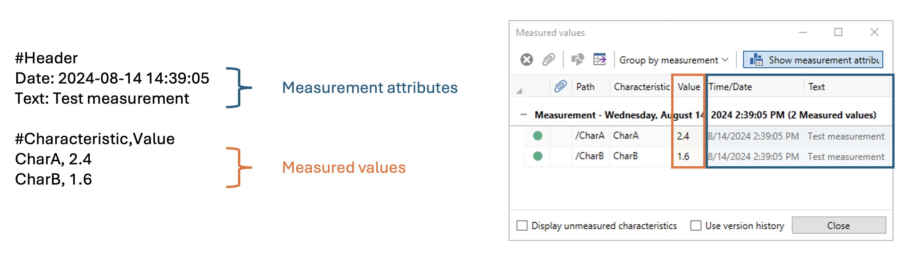
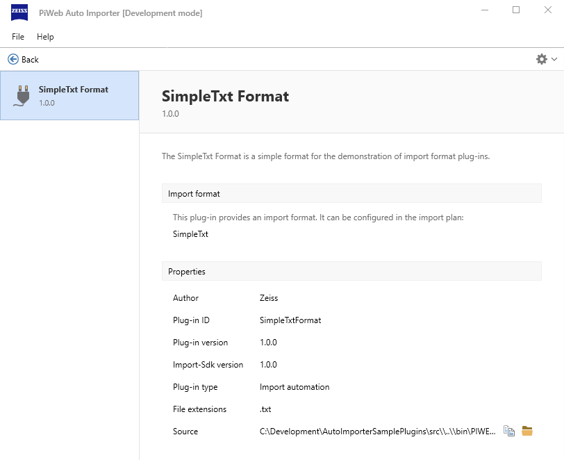
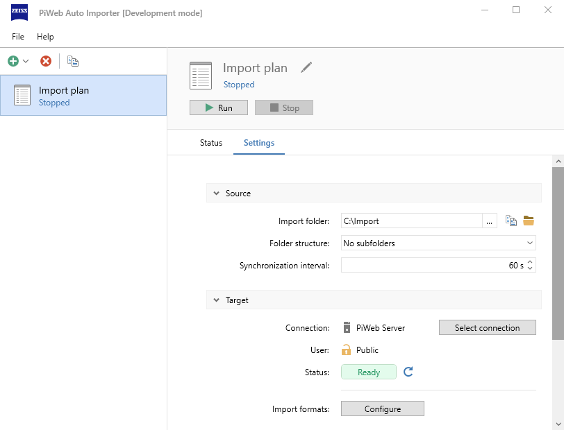
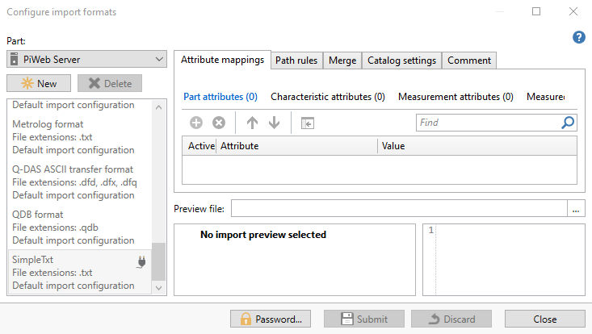
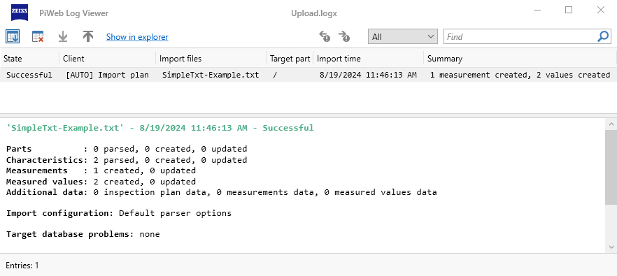
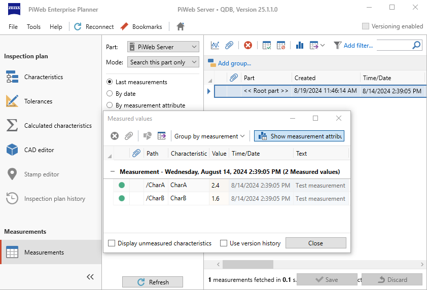

<!---
Ziele:
- anhand einer einfachen Beispielanwendung Schritt für Schritt das Vorgehen und die wichtigsten Themen für den Modultyp beschreiben

Inhalt:
- IImportFormat implementieren
    - für einfaches Beispielformat GetGroup- und Parse-Methode implementieren
    - zur weiteren Erklärung der Details auf Unterkapitel "Module: Import format" verweisen
- Implementierung registrieren
- Implementierung im manifest eintragen
- Format mit Beispieldatei verwenden
--->

# {{ page.title }}
Import format plug-ins allow you to import files of previously unsupported file formats with the Auto Importer. In this article we will show you, how you can create an import format plug-in for a simple measurement file. 

## Get the example file
We want to write a plug-in for an example file format called SimpleTxt. The following information of a single measurement contained in a SimpleTxt file should be imported.\

```
#Header
Date: 2024-08-14 14:39:05
Text: Test measurement

#Characteristic,Value
CharA, 2.4
CharB, 1.6
```

A SimpleTxt file has to start with `#Header` in the first line. The following lines contains information about the measurement like the measurement date and the operator name. After the header part follows a list of the characteristics and the corresponding measured values. This part begins after the line starting with `#Characterstic`.

You can download the example file here to test your plug-in: 
<!-- TODO: Provide example file and link to it -->

## Create a new project
To start the development of the import format plug-in create a new .NET project. Use the provided project template for Microsoft Visual Studio or JetBrains Rider. You can find the link to the project template and information how to use it in [Development environment](). Further information about the content of the project template is contained in [Project template]().

## Adapt information in manifest file
Using the project template generates already a `manifest.json` file in the project. This manifest file contains information about the plug-in. You can modify the values in the json file as follows for the example plug-in.

```json
{
  "$schema": "../schemas/manifest.schema.json",
  "id": "SimpleTxtFormat",
  "version": "1.0.0",
  "title": "SimpleTxt Format",
  "description": "The SimpleTxt Format is a simple format for the demonstration of import format plug-ins.",
  "author": "Zeiss",
  "provides": {
    "type": "ImportFormat",
    "displayName": "SimpleTxt",
    "fileExtensions": [
      ".txt"
    ]
  }
}
```

The most important thing here is that you define a unique `id` and `version` for the plug-in, that you use `ImportFormat` as value for the `type` property and that you specify that the file extension for the SimpleTxt files is `.txt`. The other json properties are mainly relevant for the display of the plug-in in the Auto Importer UI. You can find further information about the manifest file in [Manifest]().

## Create an import group filter
In addition to the manifest.json file, the project template has already created two classes `Plugin` and `ImportFormat`. In the `CreateImportFormat` method of the `Plugin` class a new instance of the `ImportFormat` class is returned. The `ImportFormat` class contains two methods `CreateImportGroupFilter` and `CreateImportParser`, which still need to be implemented. First, we want to consider the implementation of the `CreateImportGroupFilter` method.\
In this method you have to return an implementation of the `IImportGroupFilter`. An import group filter has to decide which import files should be handled by this import format.\
Create a new class `SimpleTxtImportGroupFilter` that accordingly implements `IImportGroupFilter`. The class could look like this (you will implement the method later):

```c#
public class SimpleTxtImportGroupFilter : IImportGroupFilter
{
    public async ValueTask<FilterResult> FilterAsync(IImportGroup importGroup, IFilterContext context)
    {
        throw new NotImplementedException();
    }
}
```

Now you can return a new instance of the `SimpleTxtImportGroupFilter` in the `CreateImportGroupFilter` method of the `ImportFormat` class like follows:

```c#
public IImportGroupFilter CreateImportGroupFilter(ICreateImportGroupFilterContext context)
{
    return new SimpleTxtImportGroupFilter();
}
```

And finally, let's look at the implementation of the `FilterAsync` method of the `SimpleTxtImportGroupFilter`. You could implement the method as follows:

```c#
public async ValueTask<FilterResult> FilterAsync(IImportGroup importGroup, IFilterContext context)
{
    // Check file extension.
    if (!importGroup.PrimaryFile.HasExtension(".txt"))
        return FilterResult.None;

    await using var stream = importGroup.PrimaryFile.GetDataStream();
    using var reader = new StreamReader(stream);

    // Check file content match with SimpleTxt format.
    var firstLine = reader.ReadLine();
    if (firstLine != null && firstLine.StartsWith("#Header"))
        return FilterResult.Import;
            
    return FilterResult.None;
}
```

An import group is passed to this method. Such an import group contains at least one import file but additional files could be added which should be imported together. For the SimpleTxt format only one Simpletxt file has to be considered.\
We execute two checks for the import file in the `FilterAsync` method. At first we check whether the import file has the expected file extension `.txt`. Secondly we read the first line of the file and verify whether the line starts with `#Header`. If both checks were successful, we assume that the import file a SimpleTxt file. Therefore we return `FilterResult.Import` as filter result. Otherwise we return `FilterResult.None` so that the file is not imported with our parser for the SimpleTxt format.\
For further information about the filter method see [Import format]().

## Create an import file parser
Finally, you need to implement the second method `CreateImportParser` of the `ImportFormat` class. For this, you have to create an implementation of the `IImportParser`. A parser should read out the information in the import file and transform them into an importable structure. A parser class for the SimpleTxt format with still missing parser functionality could look like this:

```c#
public class SimpleTxtImportParser : IImportParser
{
    public async Task<ImportData> ParseAsync(
        IImportGroup importGroup,
        CancellationToken cancellationToken,
        IParseContext context)
    {
        throw new NotImplementedException();
    }
}
```

Before we consider the implementation of the `ParseAsync` method, you can now complete the method `CreateImportParser` in `ImportFormat` as follows:

```c#
public IImportParser CreateImportParser(ICreateImportParserContext context)
{
    return new SimpleTxtImportParser();
}
```

We will now go through the implementation of the `ParseAsync` method in detail. But let us first consider what you want to achieve in this method. You want to transform the information in the import file in an importable structure. The example file contains information about one measurement that should be added for the import target part in the PiWeb database. The header information in the import file should be imported as attribute values of this measurement. The values in the list of characteristics should be imported as measured values of the measurement assigned to the corresponding characteristics below the import target part. In PiWeb, the measured value is saved as the value for the K1 attribute of a measured value entity.  



You can start implementing the `ParseAsync` method by creating an inspection plan part and a new measurement for this part. You must also create an instance of a `StreamReader` to be able to read the content of the import file.

```c#
// Create root part and measurement.
var root = new InspectionPlanPart(importGroup.PrimaryFile.BaseName);
var measurement = root.AddMeasurement();

// Create reader for import file.
await using var stream = importGroup.PrimaryFile.GetDataStream();
using var reader = new StreamReader(stream);
```

Now you can read the header information and set a measurement attribute for each header variable. In this example we only create attributes for the `Date` and the `Text` header variable. The creation of the header attributes ends when a line starting with `#Characteristic` is detected or no further line exists.

```c#
string? line;

// Parse header attributes.
while ((line = reader.ReadLine()) != null)
{
    if( string.IsNullOrEmpty(line))
        continue;

    if (line.StartsWith("#Characteristic"))
        break;

    var rowItems = line.Split(": ");
    var attribute = rowItems[0].Trim();
    var value = rowItems[1].Trim();

    switch (attribute)
    {
        case "Date":
            measurement.SetAttribute(4,value);
            break;
        case "Text":
            measurement.SetAttribute(9,value);
            break;
    }

}
```

You can finally create the characteristics and their associated measured values for the measurement and return the importable structure as an `ImportData` instance as follows:

```c#
// Parse measured value for each characteristic.
while ((line = reader.ReadLine()) != null)
{
    if( string.IsNullOrEmpty(line))
        continue;
                
    var rowItems = line.Split(',');
    var characteristicName = rowItems[0].Trim();
    var value = rowItems[1].Trim();
                
    var characteristic = root.AddCharacteristic(characteristicName);
    var measuredValue = measurement.AddMeasuredValue(characteristic);
    measuredValue.SetAttribute(1,double.Parse(value));
}

return new ImportData(root);
```

The full implementation of the `ParseAsync` method is listed below.

```c#
public class SimpleTxtImportParser : IImportParser
{
    public async Task<ImportData> ParseAsync(
        IImportGroup importGroup,
        CancellationToken cancellationToken,
        IParseContext context)
    {
        // Create root part and measurement.
        var root = new InspectionPlanPart(importGroup.PrimaryFile.BaseName);
        var measurement = root.AddMeasurement();

        // Create reader for import file.
        await using var stream = importGroup.PrimaryFile.GetDataStream();
        using var reader = new StreamReader(stream);

        string? line;

        // Parse header attributes.
        while ((line = reader.ReadLine()) != null)
        {
            if( string.IsNullOrEmpty(line))
                continue;

            if (line.StartsWith("#Characteristic"))
                break;

            var rowItems = line.Split(": ");
            var attribute = rowItems[0].Trim();
            var value = rowItems[1].Trim();

            switch (attribute)
            {
                case "Date":
                    measurement.SetAttribute(4,value);
                    break;
                case "Operator":
                    measurement.SetAttribute(9,value);
                    break;
            }

        }

        // Parse measured value for each characteristic.
        while ((line = reader.ReadLine()) != null)
        {
            if( string.IsNullOrEmpty(line))
                continue;
                
            var rowItems = line.Split(',');
            var characteristicName = rowItems[0].Trim();
            var value = rowItems[1].Trim();
                
            var characteristic = root.AddCharacteristic(characteristicName);
            var measuredValue = measurement.AddMeasuredValue(characteristic);
            measuredValue.SetAttribute(1,double.Parse(value));
        }

        return new ImportData(root);
    }
}
```

The implementation of the example plug-in is now complete. Further information on implementing an import format plug-in can be found in the [Import format]().

## Run your plug-in
To test your plug-in you can build your plug-in project and load your plug-in directly from your build folder. Therefore you have to activate the development mode for the Auto Importer like described in [Development settings](). Then you can start the Auto Importer with the following command line parameter `-pluginSearchPaths "<path to your build folder>"`. When the Auto Importer has started, you can check that your plug-in is loaded by opening the plug-in management view via `File > Plug-ins...`. Your plug-in should be listed there like in the following screenshot.



The functionality of the plug-in can be tested by importing the example file. Therefore create a new default import plan in the Auto Importer. In the import plan, select a connection with the PiWeb cloud or a PiWeb server (find more information in [Import destination]()) and define an import folder where you place the example file. A configuration of the import plan could look like this:



Before you start the Auto Importer you can check whether the SimpleTxt format is listed as a new format in the import configuration. For this click on the `Configure` button in the `Settings` tab of your import plan. In the format list of the import configuration view should you find an entry for the SimpleTxt format.



When the SimpleTxt format is listed in the import configuration dialog and the example file is placed in the import folder you can start the import plan by clicking the `Start` button in the Auto Importer. Then you can check whether the import of the SimpleTxt file was successful in the import history. Therefore click on the `Show history` link in the `Status` tab of the import plan. An new entry in the import history for the SimpleTxt format should be visible and should you inform whether the import was successful.



You can also open a PiWeb Planner and connect to your PiWeb cloud or PiWeb server. A new measurement with measured values for the characteristics `CharA` and `CharB` should be exist.



When the import failed you can find helpful information about possible next steps for a solution in the [Troubleshooting]().