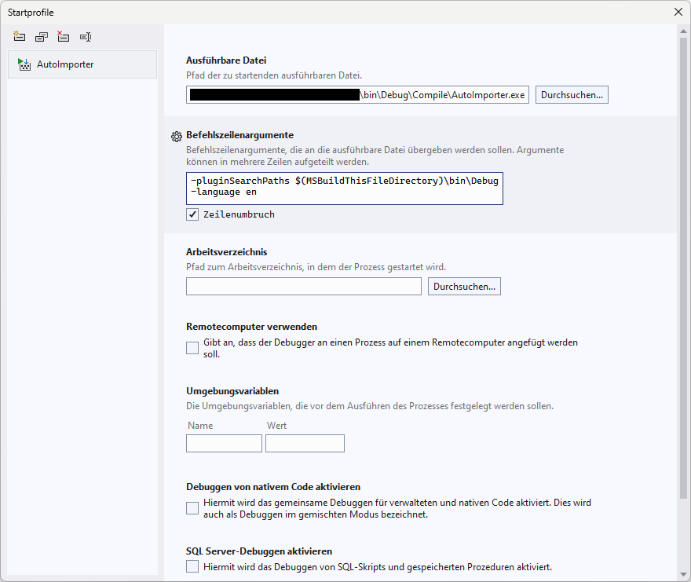

<!---
Ziele:
- anhand einer einfachen Beispielanwendung Schritt für Schritt das Vorgehen und die wichtigsten Themen für den Modultyp beschreiben

Inhalt:
- IImportAutomation implementieren
- Implementierung registrieren
- Implementierung im manifest eintragen
- IImportRunner implementieren (wird für jeden Run erzeugt)
- Events verwenden um zu demonstrieren, dass es läuft (auf genaue Erklärung im Kapitel "Import Monitoring" verweisen)

Notizen:
- Schema mit voller URL auf GitHub bereitstellen
--->

# {{ page.title }}
The plug-in which is created here together should be an import automation. This connects to a PiWeb Cloud instance and checks for the presence of a specific part; if this is not present, the plug-in will create it.

{: .note }
This article only covers the minimum functionality, to go deeper we recommend taking a look at the Plug-in Fundamentals collection.

## Download source code and content
The plug-in presented here can be downloaded in its complete form. However, the following sections also describe the approach using the project template. You can find the source text at the [GitHub repository](https://github.com/ZEISS-PiWeb/PiWeb-Import-Sdk/tree/develop/examples/FirstImportAutomation).

The following files are required for this automation and are included in the example and in the project template. `manifest.json` defines the content of our plug-in. `Plugin.cs` which represents the entry point into the plug-in, in which it registers the import automation. `ImportAutomation.cs` contains the named automation and provides the necessary import runner, which executes the specific import plans. `ImportRunner.cs` contains this IImportRunner and is responsible for the import loop.

## Create a new project
To start the development of the import automation plug-in create a new .NET project. Use the provided project template for Microsoft Visual Studio or JetBrains Rider. You can find the link to the project template and information how to use it in [Development environment](). Further information about the content of the project template is contained in [Project template]().

## Adapt information in manifest file
Using the project template generates already a `manifest.json` file in the project. This manifest file contains information about the plug-in. You can modify the values in the json file as follows for the example plug-in.

```json
{
    "id": "Zeiss.FirstImportAutomation",
    "title": "FirstImportAutomation",
    "description": "This plug-in is used in the Import SDK documentation to create an initial import automation.",

    "provides": {
        "type": "ImportAutomation",
        "displayName": "FirstImportAutomation",
        "summary": "This automation checks a given PiWeb server for the existence of the 'FirstImportAutomationPart' part below the root node."
    }
}

```

The most important thing here is that you define a unique `id` and `version` for the plug-in, that you use `ImportAutomation` as value for the `type` property. The other json properties are mainly relevant for the display of the plug-in in the Auto Importer UI. You can find further information about the manifest file in [Manifest]().

## IPlugin
First we have to register our import automation with the Auto Importer. This is done in the `IPlugin` implementation using the `CreateImportAutomation` method. A new instance of our `ImportAutomation` is returned by this method.

`Plugin.cs:`
```c#
using Zeiss.PiWeb.Sdk.Import;
using Zeiss.PiWeb.Sdk.Import.Modules.ImportAutomation;

namespace Zeiss.FirstImportAutomation;

public class Plugin : IPlugin
{
    public IImportAutomation CreateImportAutomation(ICreateImportAutomationContext context)
    {
        // Registration of a new instance of IImportAutomation with Auto Importer
        return new ImportAutomation();
    }
}
```

## IImportAutomation
Our `IImportAutomation` implementation in turn registers an `IImportRunner`, which then performs the actual import at runtime.
This `ImportRunner` is registered in the `CreateImportRunner` method. As several import plans can use this plug-in as a source, it is important to return a unique instance for each one.

```c#
using Zeiss.PiWeb.Sdk.Import.Modules.ImportAutomation;

namespace Zeiss.FirstImportAutomation;

public class ImportAutomation : IImportAutomation
{
    public IImportRunner CreateImportRunner(ICreateImportRunnerContext context)
    {
        // Creation of a new instance of IImportRunner, called for every import plan
        return new ImportRunner(context);
    }
}
```

`CreateImportRunner`\
Creates a new import runner instance. An import runner is first created and then executed when an import plan is using this import automation as import source is started. Each import plan is expected to use a separate import runner instance. For this reason this method must never return the same `IImportRunner` instance twice. If the import runner cannot be created (e.g. because of invalid import plan settings), a `CreateImportRunnerException` can be thrown. The created instance will be disposed after the import plan is stopped.

## IImportRunner
Is responsible for processing the cyclical import and reacting to problems and errors accordingly. In our example, the Auto Importer connects to our PiWeb Cloud instance and checks for the presence of the part named "FirstImportAutomationPart", the result is displayed to the user via Activities. In addition, the part is created if it is not found. This means that there should always be a part in the second import loop.


```c#
using System;
using System.Linq;
using System.Threading;
using System.Threading.Tasks;
using Zeiss.PiWeb.Api.Core;
using Zeiss.PiWeb.Api.Rest.Common.Authentication;
using Zeiss.PiWeb.Api.Rest.Dtos.Data;
using Zeiss.PiWeb.Api.Rest.HttpClient.Builder;
using Zeiss.PiWeb.Sdk.Import.ImportPlan;
using Zeiss.PiWeb.Sdk.Import.Modules.ImportAutomation;

namespace Zeiss.FirstImportAutomation;

public class ImportRunner(ICreateImportRunnerContext context) : IImportRunner
{
    /// <summary>
    ///     Defined name for the part under which import is to take place.
    /// </summary>
    private const string TargetPartName = "FirstImportAutomationPart";

    /// <summary>
    ///     IActivityService, retrieved by ICreateImportRunnerContext for later use.
    /// </summary>
    private readonly IActivityService _statusService = context.ActivityService;

    public async Task RunAsync(CancellationToken cancellationToken)
    {
        try
        {
            // Define authentication
            var authData = context.ImportTarget.AuthData;

            var authenticationHandler = authData.AuthType switch
            {
                AuthType.Basic => NonInteractiveAuthenticationHandler.Basic(authData.Username, authData.Password),
                AuthType.WindowsSSO => NonInteractiveAuthenticationHandler.WindowsSSO(),
                AuthType.Certificate => NonInteractiveAuthenticationHandler.Certificate(authData.CertificateThumbprint),
                AuthType.OIDC => NonInteractiveAuthenticationHandler.OIDC(authData.ReadAndUpdateRefreshTokenAsync),
                _ => null
            };

            // Rest client for PiWeb API
            using var builder = new RestClientBuilder(new Uri(context.ImportTarget.ServiceAddress))
                .SetAuthenticationHandler(authenticationHandler);

            using var restClient = builder.CreateDataServiceRestClient();

            // Target part path information
            var targetPath = PathInformation.Root;
            targetPath += PathElement.Part(TargetPartName);

            // Check existing of that part in the import loop
            while (!cancellationToken.IsCancellationRequested)
            {
                // Inform user that the plug-in is currently active
                _statusService.SetActivity(
                    new ActivityProperties()
                    {
                        ActivityType = ActivityType.Normal,
                        ShortDisplayText = "Checking PiWeb",
                        DetailedDisplayText = $"Checking PiWeb for {targetPath}"
                    });

                // Request PiWeb API and check for part
                var knownParts = await restClient.GetParts(targetPath, depth: 0, cancellationToken: cancellationToken).ConfigureAwait(false);
                var targetPart = knownParts.FirstOrDefault();

                if (targetPart != null)
                {
                    // Part is known in database

                    _statusService.SetActivity(
                        new ActivityProperties()
                        {
                            ActivityType = ActivityType.Normal,
                            ShortDisplayText = "Part exists",
                            DetailedDisplayText = $"{targetPath} exists in database"
                        });
                }
                else
                {
                    // Part is unknown in database

                    _statusService.SetActivity(
                        new ActivityProperties()
                        {
                            ActivityType = ActivityType.Suspension,
                            ShortDisplayText = "Part does NOT exists",
                            DetailedDisplayText = $"{targetPath} not found in database, creating it"
                        });

                    // Create that part
                    var part = new InspectionPlanPartDto
                    {
                        Uuid = Guid.NewGuid(),
                        Path = targetPath
                    };

                    await restClient.CreateParts([part], cancellationToken: cancellationToken).ConfigureAwait(false);
                }

                // Delay next import loop, save load on the server
                await Task.Delay(TimeSpan.FromSeconds(5), cancellationToken).ConfigureAwait(false);
            }
        }
        catch (OperationCanceledException)
        {
            // Normally, the last save operation should be processed here, as the import plan has been stopped
        }
    }
}
```

Show whole ImportRunner.cs code

### Walkthrough
First, we define our part name as a constant so that we can search for this name in the PiWeb Cloud instance.

```c#
/// <summary>
///     Defined name for the part under which import is to take place.
/// </summary>
    private const string TargetPartName = "FirstImportAutomationPart";
```

We also provide the `IActivityService` from the context. This is used to communicate with the Auto Importer and make status changes known. The `ICreateImportRunnerContext` is provided by the Import SDK through dependency injection.

```c#
/// <summary>
///     IActivityService, retrieved by ICreateImportRunnerContext for later use.
/// </summary>
private readonly IActivityService _statusService = context.ActivityService;
```

```c#
public async Task RunAsync(CancellationToken cancellationToken)
```
`RunAsync` provides the import loop for our plugin. This means that it connects to the PiWeb Cloud instance and checks whether our desired part already exists; if this is not the case, the part is created.

The basic structure is the while loop, which repeatedly executes the desired import logic. We secure this with a try catch block, as the termination of the import plan leads to an `OperationCanceledException`, where appropriate closing procedures should then be carried out to safely terminate the import.

```c#
public async Task RunAsync(CancellationToken cancellationToken)
{
    try
    {
        while( !cancellationToken.IsCancellationRequested )
        {
            // Import loop
        }
    }
    catch (OperationCanceledException)
    {
        // ignore
    }
}
```

To access a PiWeb Server instance via PiWeb API, various authentication methods are offered, which we provide in a switch that checks the import target accordingly.

```c#
// Define authentication
var authData = context.ImportTarget.AuthData;

var authenticationHandler = authData.AuthType switch
{
    AuthType.Basic => NonInteractiveAuthenticationHandler.Basic(authData.Username, authData.Password),
    AuthType.WindowsSSO => NonInteractiveAuthenticationHandler.WindowsSSO(),
    AuthType.Certificate => NonInteractiveAuthenticationHandler.Certificate(authData.CertificateThumbprint),
    AuthType.OIDC => NonInteractiveAuthenticationHandler.OIDC(authData.ReadAndUpdateRefreshTokenAsync),
    _ => null
};
```

Next, we use the PiWeb API to establish the connection, this is done via a REST client. To do this, we use the `ImportTarget` information provided via the context.

```c#
// Rest client for PiWeb API
using var builder = new RestClientBuilder(new Uri(context.ImportTarget.ServiceAddress))
    .SetAuthenticationHandler(authenticationHandler);

using var restClient = builder.CreateDataServiceRestClient();
```

The desired part substructure is now created. In this simple example, we assume that our `TargetPartName` is located directly under the root of the server. This structure is required to query the PiWeb server.

```c#
// Target part path information
var targetPath = PathInformation.Root;
targetPath += PathElement.Part(TargetPartName);
```

Now our actual import loop starts. We make our activity known to the Auto Importer via the `_statusService`.

```c#
// Inform user that the plug-in is currently active
_statusService.SetActivity(
    new ActivityProperties()
    {
        ActivityType = ActivityType.Normal,
        ShortDisplayText = "Checking PiWeb",
        DetailedDisplayText = $"Checking PiWeb for {targetPath}"
    }
);
```


Now we request the PiWeb Cloud instance using our part structure. This returns the existing part if it is already known, otherwise null.

```c#
// Request PiWeb API and check for part
var knownParts = await restClient.GetParts(targetPath, depth: 0, cancellationToken: cancellationToken).ConfigureAwait(false);
var targetPart = knownParts.FirstOrDefault();
```

If our part is available, we display this accordingly in the Auto Importer. If it does not exist, the PiWeb Server is informed that it should be created.

```c#
if (targetPart != null)
{
    // Part is known in database

    _statusService.SetActivity(
        new ActivityProperties()
        {
            ActivityType = ActivityType.Normal,
            ShortDisplayText = "Part exists",
            DetailedDisplayText = $"{targetPath} exists in database"
        }
    );
}
else
{
    // Part is unknown in database

    _statusService.SetActivity(
        new ActivityProperties()
        {
            ActivityType = ActivityType.Suspension,
            ShortDisplayText = "Part does NOT exists",
            DetailedDisplayText = $"{targetPath} not found in database, creating it"
        }
    );

    // Create that part
    var part = new InspectionPlanPartDto
    {
        Uuid = Guid.NewGuid(),
        Path = targetPath
    };

    await restClient.CreateParts([part], cancellationToken: cancellationToken).ConfigureAwait(false);
}
```

As a final action, we delay the following loop pass by 5 seconds to keep the load on the instance low.

```c#
// Delay next import loop, save load on the server
await Task.Delay(TimeSpan.FromSeconds(5), cancellationToken).ConfigureAwait(false);
```

We now have the necessary code for our import automation test and can execute it.

## Running the plug-in
### Start via command line
To test your plug-in you can build your plug-in project and load your plug-in directly from your build folder. Therefore you have to activate the development mode for the Auto Importer like described in [Development settings](). Then you can start the Auto Importer with the following command line parameter `-pluginSearchPaths "<path to your build folder>"`. When the Auto Importer has started, you can check that your plug-in is loaded by opening the plug-in management view via `File > Plug-ins...`. Your plug-in should be listed there like in the following screenshot.\


We also need an import plan that uses our import source and uses the existing cloud instance as the target. To do this, we create a new import plan using the green plus icon and configure it as shown in the screenshot.\


If we now click on Start, the automation is executed and after the third import loop it should look like this:\


### Start from Visual Studio
It is possible to transfer the commands directly from Visual Studio to the Auto Importer. To do this, use the following `launchSettings.json`:

```json
{
    "profiles": {
        "AutoImporter": {
            "commandName": "Executable",
            "executablePath": "C:\\Program Files\\Zeiss\\PiWeb\\AutoImporter.exe",
            "commandLineArgs": "-pluginSearchPaths $(MSBuildThisFileDirectory)\\bin\\Debug -language en"
        }
    }
}
```

{: .important }
`executablePath` must contain your path to the `AutoImporter.exe`.

 You can also define the debug properties manually, see the following screenshot:

 