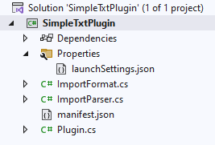
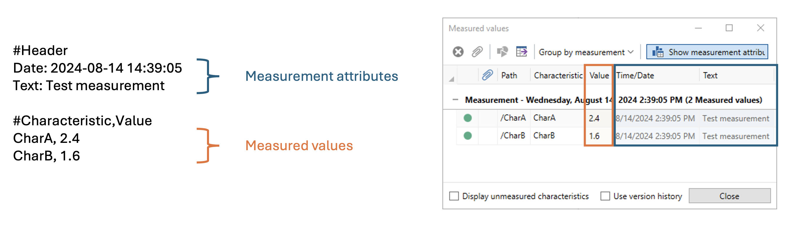
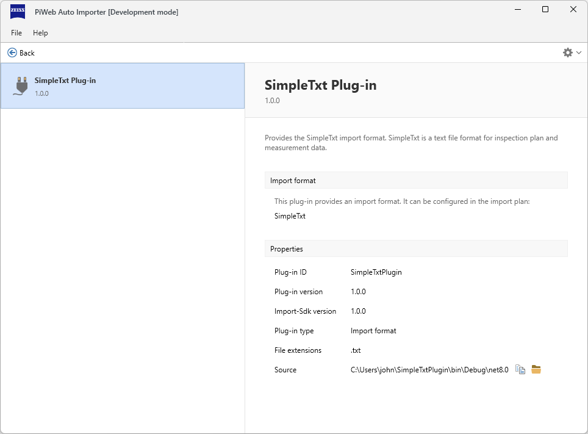
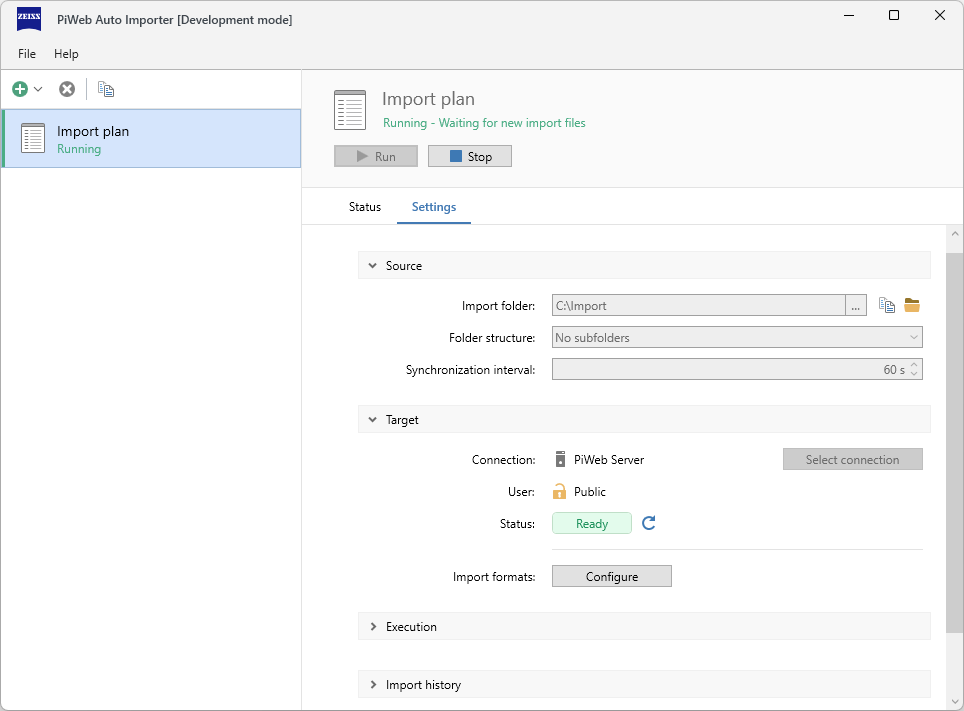
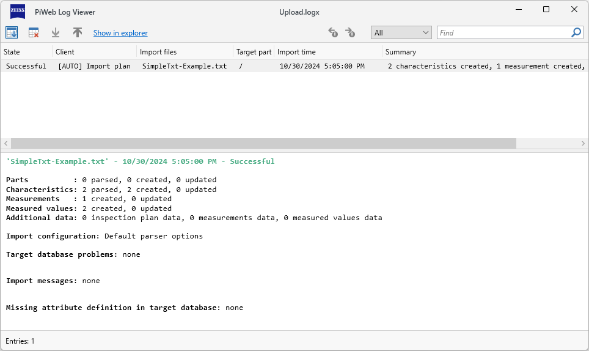
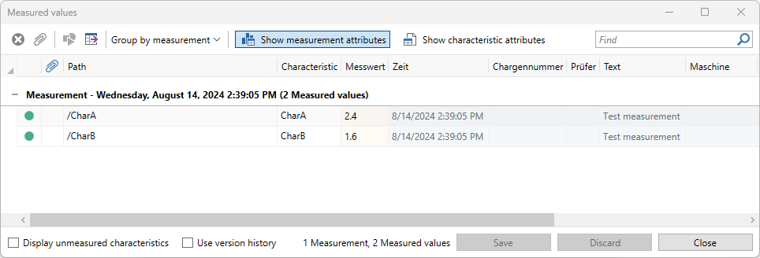

<!---
Ziele:
- anhand einer einfachen Beispielanwendung Schritt für Schritt das Vorgehen und die wichtigsten Themen für den Modultyp beschreiben

Inhalt:
- IImportFormat implementieren
- für einfaches Beispielformat GetGroup- und Parse-Methode implementieren
- zur weiteren Erklärung der Details auf Unterkapitel "Module: Import format" verweisen
- Implementierung registrieren
- Implementierung im manifest eintragen
- Format mit Beispieldatei verwenden
--->

# {{ page.title }}
{: .no_toc }
Import format plug-ins allow you to automate the import of files with unsupported formats using *PiWeb Auto Importer*. In this article we will show you step-by-step, how to create a simple but fully functional import format plug-in and how to use this plug-in to import an example file with *PiWeb Auto Importer*.

{: .note}
The full sources of the plug-in built in this article are part of the *Import SDK* plug-in examples and can be found [here](https://github.com/ZEISS-PiWeb/PiWeb-Import-Sdk/tree/develop/examples/SimpleTxtPlugin).

## Table of Contents
{: .no_toc }
1. TOC
{:toc}

## The import file format
The file format we want to import is called *SimpleTxt*. Although this is not a real format produced by any measuring software, it is a good representation of the typical output of a measuring machine. Here is an example:

```
#Header
Date: 2024-08-14 14:39:05
Text: Test measurement

#Characteristic,Value
CharA, 2.4
CharB, 1.6
```

A *SimpleTxt* file always represents a single measurement. The format starts with `#Header` as first line in the file. The following lines contain general information about the measurement (for example the date of the measurement or the operator of the measuring machine) in the form of name value pairs separated by a colon. The value part of the file begins with the line `#Characterstic,Value`. Each following line consists of a characteristic name and its coresponding measured value separated by a comma. A *SimpleTxt* file can contain as many general information entries and measured characteristics as necessary.

*SimpleTxt* files always have the file extension `.txt`.

You can download this example file here:  
[SimpleTxt-Example.txt](https://raw.githubusercontent.com/ZEISS-PiWeb/PiWeb-Import-Sdk/refs/heads/develop/examples/FirstImportFormat/SampleData/SimpleTxt-Example.txt){:target="_blank"}

## Step 1 - Create a new .NET project
To start developing the new import format plug-in, create a new .NET project using the project template `PiWeb-Import-Sdk Plugin`. Enter `SimpleTxtPlugin` as project name and select `Import format` as Plugin type. If you are using this guide to start your own import format plug-in, use another project name that better fits your import format.

{: .note }
If you are missing the `PiWeb-Import-Sdk Plugin` project template, have a look at [Project templates](#project-templates) for project template installation instructions.

The newly created project should now look similar to this:

{: .framed }

Let us have a look at the files created by the project template: The `manifest.json` file is the manifest of the plug-in. We will deal with it in the next step. In addition to the manifest file, the project template has also created three source code files for us: `Plugin.cs`, `ImportFormat.cs` and `ImportParser.cs`. Each of these files contains a class of the same name:
- `Plugin` is the entry point of the plug-in. It acts as a factory for the import format provided by our plug-in. The project template already set this up to create instances of `ImportFormat`, so we do not need to change its implementation.
- `ImportFormat` represents our new import format. It acts as a factory to delegate its two responsibilities: Firstly, it creates instances of `ImportParser` thus determining how to process import file contents. Secondly, it creates an instance of `IImportGroupFilter` to determine which import files should actually be handled by an associated import format. We will create a custom filter for *SimpleTxt* files in step 3.
- `ImportParser` implements the actual import logic that transforms the content of a file to inspection plan data and measurement data that can be uploaded. We will implement it to read and transform *SimpleTxt* files in step 4.

There is also a `launchSettings.json` which contains a launch configuration that builds our plug-in and starts a locally installed *PiWeb Auto Importer* with the necessary configuration to load and run our plugin directly from the build output. We come back to this later when we are testing the new plug-in.

## Step 2 - Edit the plug-in manifest
One of the automatically created project files is the plug-in manifest `manifest.json`. This manifest file contains static information about the plug-in. Most entries are given sensible default values but we need to set a few values specific to our new plug-in project:

```json
{
  "$schema": "https://raw.github.com/ZEISS-PiWeb/PiWeb-Import-Sdk/refs/heads/pub/schemas/manifest-schema.json",
  "id": "SimpleTxtPlugin",
  "version": "1.0.0",
  "title": "SimpleTxt Plug-in",
  "description": "Provides the SimpleTxt import format. SimpleTxt is a text file format for inspection plan and measurement data.",

  "provides": {
    "type": "ImportFormat",
    "displayName": "SimpleTxt",
    "fileExtensions": [
      ".txt"
    ]
  }
}
```

The first two properties we have updated are `title` and `description`. These two values determine how our new plug-in should be displayed in the plug-in management view of *PiWeb Auto Importer*. This is not strictly necessary for a working plug-in, but it helps us to find our plug-in in the plug-in management view. Similarly, the `displayName` property in the `provides` section specifies how the import format provided by our plug-in should be displayed when *PiWeb Auto Importer* needs to refer to it, for example in the import settings.

Our third change is the addition of the `fileExtensions` list in the `provides` section. The list of file extensions is also used for display purposes but also to provide file extension masks in file selection dialogs.

{: .note }
There are many other optional manifest properties. You can find more information about the manifest file in [Manifest]().

## Step 3 - Create an import group filter
At this point we can start working on the actual plug-in implementation. First we are going to implement a custom `IImportGroupFilter` to define which import files should actually be handled by our new import format. The interface only specifies a single method `FilterAsync` that we need to implement. Create a new class `SimpleTxtImportGroupFilter` with the following content:

```c#
using System.IO;
using System.Text;
using System.Threading.Tasks;
using Zeiss.PiWeb.Sdk.Import.ImportFiles;

namespace SimpleTxtPlugin;

public class SimpleTxtImportGroupFilter : IImportGroupFilter
{
  public async ValueTask<FilterResult> FilterAsync(IImportGroup importGroup, IFilterContext context)
  {
    // Check file extension.
    if (!importGroup.PrimaryFile.HasExtension(".txt"))
      return FilterResult.None;

    await using var stream = importGroup.PrimaryFile.GetDataStream();
    using var reader = new StreamReader(stream, Encoding.UTF8);

    // Check file content match with SimpleTxt format.
    var firstLine = await reader.ReadLineAsync();
    if (firstLine != null && firstLine.StartsWith("#Header"))
      return FilterResult.Import;
            
    return FilterResult.None;
  }
}
```

This `FilterAsync` method is called whenever *PiWeb Auto Importer* wants to import any files. The given import group represents the files to import. Unless we explicitely add additional files to this group, it will always consist of a single file given by its `PrimaryFile` property. The return value of this method specifies whether the file group will be imported using our new import format. Returning `FilterResult.Import` will bind the current group to our import format and import it accordingly. Returning `FilterResult.None` means the group is unrelated to our import format. It may still be picked up by another import format of another plug-in though. The implementation above first checks whether the filename has a ".txt" extension and then whether the file content starts with the `#Header` line.

Now that we have this filter implementation, we can use it as part of the import format by updating the `CreateImportGroupFilter` method in the `ImportFormat` class:

```c#
public IImportGroupFilter CreateImportGroupFilter(ICreateImportGroupFilterContext context)
{
    return new SimpleTxtImportGroupFilter();
}
```

## Step 4 - Implement the import file parser
The last step is to actually implement the parsing of *SimpleTxt* files. But first we have to think about how to map the file contents to inspection plan data and measurement data. Since each *SimpleTxt* file only contains data for a single measurement, we will create only a single (root) part and a corresponding measurement per import file. The properties of the `#header` section should respectively be mapped to measurement attributes K4 (Date) and K9 (Text) of the single measurement. Then, for each line in the `#Characterstic,Value` section, a characteristic below the part and a corresponding measured value in the measurement should be generated.

{: .framed }

To achieve this behavior, we need to implement the `ParseAsync` method in the `ImportParser` class. Here is the full implementation:

```c#
public async Task<ImportData> ParseAsync( 
  IImportGroup importGroup,
  IParseContext context,
  CancellationToken cancellationToken)
{
  // Create root part and measurement.
  var root = new InspectionPlanPart(importGroup.PrimaryFile.BaseName);
  var measurement = root.AddMeasurement();

  // Create reader for import file.
  await using var stream = importGroup.PrimaryFile.GetDataStream();
  using var reader = new StreamReader(stream, Encoding.UTF8);

  string? line;

  // Parse header attributes.
  while ((line = await reader.ReadLineAsync(cancellationToken)) != null)
  {
    if (string.IsNullOrEmpty(line))
      continue;

    if (line.StartsWith("#Characteristic"))
      break;

    var rowItems = line.Split(":", 2);
    if (rowItems.Length < 2)
      continue;

    var attribute = rowItems[0].Trim();
    var value = rowItems[1].Trim();

    switch (attribute)
    {
      case "Date":
        var isValidDate = DateTime.TryParse(
          value,
          CultureInfo.InvariantCulture,
          DateTimeStyles.AssumeLocal,
          out var dateTimeValue);

      if (isValidDate)
        measurement.SetAttribute(4, dateTimeValue);
        break;

      case "Text":
        measurement.SetAttribute(9, value);
        break;
    }
  }

  // Parse measured value for each characteristic.
  while ((line = await reader.ReadLineAsync(cancellationToken)) != null)
  {
    var rowItems = line.Split(',', 2);

    if (rowItems.Length < 1)
      continue;
    var characteristicName = rowItems[0].Trim();
    if (string.IsNullOrWhiteSpace(characteristicName))
      continue;
    var characteristic = root.AddCharacteristic(characteristicName);

    if (rowItems.Length < 2)
      continue;
    var value = rowItems[1].Trim();
    if (!double.TryParse(value, CultureInfo.InvariantCulture, out var doubleValue))
      continue;
                    
    var measuredValue = measurement.AddMeasuredValue(characteristic);
    measuredValue.SetAttribute(1, doubleValue);
  }
  
  return new ImportData(root);
}
```

We begin with creating a root part and a measurement on this part. This part is the root of all the data we will extract from the import file. During upload, this root part will be merged into the target part by *PiWeb Auto Importer*. The original name of the import target part will be kept during this operation, so the name of the root part does not matter. However, it is good practice to specify a sensible name and we simply use the import file name (without extension) in this example.

Now that we have a part and a corresponding measurement, we can read the import file line by line and add attributes, characteristics and measured values as specified by the import file. Finally we return the root part wrapped in an `ImportData` instance.

## Testing the plug-in
After building the project, the plug-in is ready to test. Since the project template already created launch settings for the project, running *PiWeb Auto Importer* to host the new plug-in is as easy as hitting the start button of your IDE.

{: .framed }

This will start *PiWeb Auto Importer* with the necessary command line parameters to load the plug-in build from the current project and also attach a debugger to the process.

{: .note }
> For this to work correctly, two conditions need to be met:
> - *PiWeb Auto Importer* must be installed locally. The executable is expected to be found in <span class="nowrap">`%ProgramFiles%\Zeiss\PiWeb\AutoImporter.exe`</span>. If the *PiWeb Auto Importer* executable is in another path, you need to update the path specified in `launchSettings.json` accordingly.
> - *PiWeb Auto Importer* must be in development mode. See [Development mode](#development-mode) for details on how to activate development mode.

After *PiWeb Auto Importer* has started, the *SimpleTxt* plug-in should be available in the plug-in management view opened via <span class="nowrap">`File > Plug-ins...`</span> and there should be no error messages.



When the plug-in is loaded and shows no errors, the new format is available and will automatically be used in all import plans. We can now try to import the example file by creating a new import plan (or reusing an existing one). Configure a source folder, a target *PiWeb* backend and hit the run button.



Now you can drop [SimpleTxt-Example.txt](https://raw.githubusercontent.com/ZEISS-PiWeb/PiWeb-Import-Sdk/refs/heads/develop/examples/FirstImportFormat/SampleData/SimpleTxt-Example.txt){:target="_blank"} in the configured import folder to import it. If everything worked correctly, the resulting import history will look similar to this:



You can also open *PiWeb Planner* and connect to the same *PiWeb backend*. A new measurement with measured values for the characteristics `CharA` and `CharB` should exist.



## Next Steps
Now that we have a running plug-in, you can continue with [Deployment]() explaining how to actually deploy your plug-in to a *PiWeb Auto Importer* in production use. You may also want to read the articles in the [Plug-in fundamentals]() and [Advanced topics]() sections to get a better understanding of the concepts behind plug-ins and also learn about other features available for your own plug-in implementations.