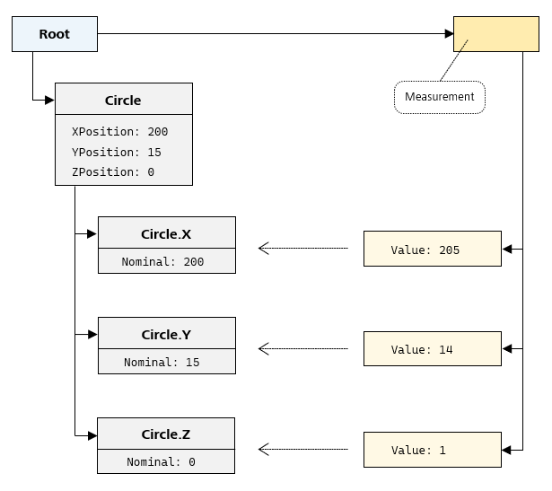
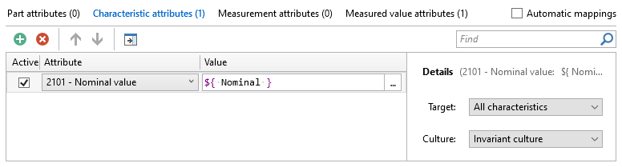
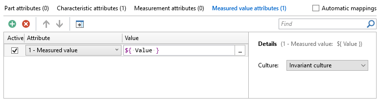
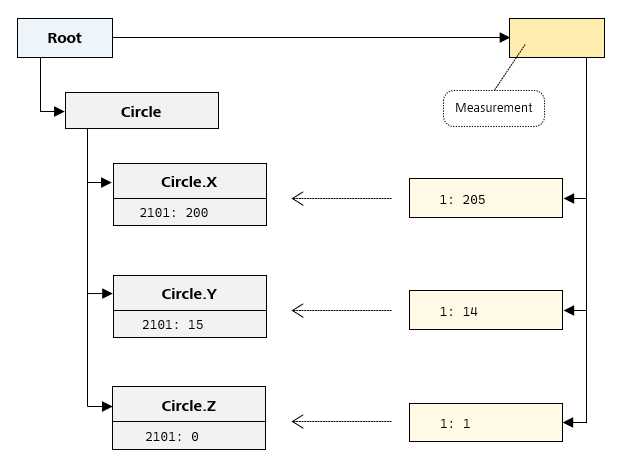
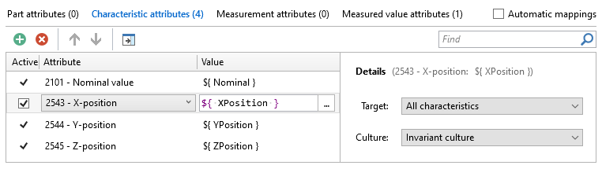
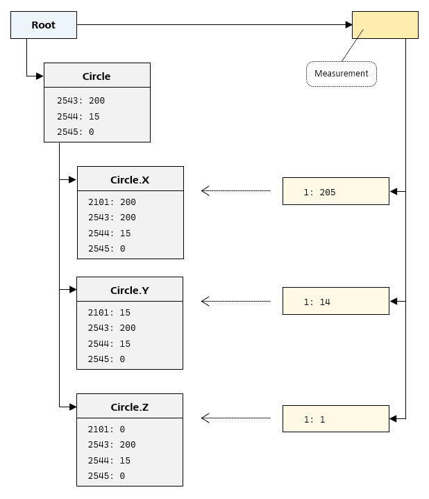

# {{ page.title }}
{: .no_toc }
Attribute mapping is an *PiWeb Import SDK* feature that enables you to write more generic but user configurable *import format plug-ins*.
In this article we will explain the general idea of this feature and how to integrate it in your own *import format plug-in* implementations.

## Table of Contents
{: .no_toc }
1. TOC
{:toc}

## When should I use attribute mapping?
Importing values extracted from an import file as specific attributes of an inspection plan entity, a measurement or a measured value is often impractical, unless the plug-in is tailored for a specific customer.
There are a number of common scenarios that run into this problem:

- An import format allows customizable header entries. Which entries exist and which meaning they have is therefore entirely customer specific. An *import format plug-in* which has a fixed mapping of these values to attributes can only be customer-specific.
- Similarly, *PiWeb backends* may be configured to have customer specific attributes and so only the customer knows which values should be stored in these custom attributes.
- Another common example is import formats that contain both absolute values and deviation values as measurement data. The customer needs to decide which of these two values should be imported as attribute 1 (the measured value).

Rather than writing a different plug-in for each customer, customizable *attribute mapping* can be used to solve these problems.

## How does attribute mapping work?
The basic idea of *attribute mapping* is to create *attribute variables* on imported entities instead of directly creating attributes. Unlike *attributes*, *attribute variables* are not imported directly.
Instead, they can be mapped to attributes during import by applying *mapping rules* configured in the import configuration.
This adds the flexibility to tailor an import to the needs of a specific customer via import configuration instead of changing the import implementation. 

## Declaring support
*PiWeb Auto Importer* only shows the *mapping rules* configuration in the import configuration UI when the configured *import format* declares support for this feature.
To declare such support, we need to implement `CreateConfiguration()` when implementing `IImportFormat`.

```c#
public sealed class ImportFormat : IImportFormat
{
    ...

    public IImportFormatConfiguration CreateConfiguration(ICreateImportFormatConfigurationContext context)
    {
        return new ImportFormatConfiguration { SupportsAttributeMapping = true };
    }
}
```

Now users can configure *mapping rules* for this import format.

## Attribute variables

*Attribute variables* are very similar to normal attributes except that they use names (i.e. Strings) as keys instead of a numeric id. Associating *attribute variables* with import data also works similar to normal attributes.
Let's look at an example import implementation:

```c#
var root = new InspectionPlanPart("Root");

var circle = root.AddCharacteristic("Circle");
circle.SetVariable("XPosition", 200);
circle.SetVariable("YPosition", 15);
circle.SetVariable("ZPosition", 0);

var circleX = circle.AddCharacteristic("Circle.X");
circleX.SetVariable("Nominal", 200);

var circleY = circle.AddCharacteristic("Circle.Y");
circleY.SetVariable("Nominal", 20);

var circleZ = circle.AddCharacteristic("Circle.Z");
circleZ.SetVariable("Nominal", 0);

var measurement = root.AddMeasurement();
measurement.AddMeasuredValue(circleX).SetVariable("Value", 205);
measurement.AddMeasuredValue(circleY).SetVariable("Value", 14);
measurement.AddMeasuredValue(circleZ).SetVariable("Value", 1);
```

The resulting data to import is structured like this:

{: .framed }

Some of the entities have associated *attribute variables* but importing this without configuring any *mapping rules* will actually create empty entities because the variables themselves are not imported
and no actual attributes are created from the *attributes variables* yet. We need to define some *mapping rules*.

## Mapping rules
For *attribute variables* to have any effect on the import, one or more mapping rules must be specified in the import configuration. A mapping rule consists of 3 mandatory components:

1. **The target entity type.** It specifies the set of entities to which the rule should be applied. This is usually the set of all entities of one of the basic entity types: `All parts`, `All characteristics`, `All measurements` or `All measured values`.
However, there are also narrower sets available, for example `Direct characteristics`, the set of all characteristics which have no children.
2. **The target attribute.** It specifies which attribute key should be created by this *mapping rule* on all of the chosen target entities. For example a *mapping rule* for creating nominal values on characteristics would target attribute key 2101.
3. **The attribute value.** This finally specifies what value the attribute should receive. This can be a static value like `0` or it can be a reference to any *attribute variable* associated with the entity this *mapping rule* is currently applied to.
Referencing a variable uses syntax like `${ variablename }` where `variablename` is the key of the *attribute variable*. If this evaluates to `null` for an entity, the attribute is not created on this entity.

   {: .note }
   The variable reference syntax only allows variable names that are accepted by this regular expression: <span class="nowrap">`[_a-zA-Z][_a-zA-Z0-9]*`</span>.  Avoid using *attribute variable* names that do not conform to this.

Let's have a look at a reasonable configuration of *mapping rules* for the attribute variables we defined earlier:

- The first *mapping rule* maps the `Nominal` *attribute variables* to attribute 2101 (Nominal value).

   {: .framed }

- The second *mapping rule* maps the `Value` *attribute variables* to attribute 1 (Measured value).  

   {: .framed }

The result will now look like this (showing attributes but omitting attributes variables):

{: .framed }

## Extended variable search

When a referenced *attribute variable* does not exist on the entity a *mapping rule* is applied to, the variable is searched for on other related entities. For example there is no `XPosition` *attribute variable* on any of the three leaf characteristics in our example import data above. However, we can still map `XPosition` to attribute 2543 on all characteristics by adding a normal mapping rule:

{: .framed }

The variable will be found on the parent characteristic and its value will be mapped to the attribute. The same is true for the other two position attributes. The result will now look like this (showing attributes but omitting attributes variables):

{: .framed }

Which entities are searched and in what order depends on the type of the original target entity:

- **Rules that target parts**: `part ⟶ parent part* ⟶ root part`  
If the variable is not found on the target part, its parent part is searched. If the parent part also does not have the variable, its parent part is searched. This continues until the variable is found or the root part is reached.
- **Rules that target characteristics**: `characteristic ⟶ parent entity* ⟶ root part`  
If the variable is not found on the target characteristic, its parent characteristic or parent part is searched. If the parent entity also does not have the variable, its parent entity is searched. This continues until the variable is found or the root part is reached.
- **Rules that target measurements**: `measurement ⟶ measured part ⟶ parent part* ⟶ root part`  
If the variable is not found on the target measurement, its measured part is searched. If the part does not have the variable, its parent part is searched. If the parent part also does not have the variable, its parent part is searched. This continues until the variable is found or the root part is reached.
- **Rules that target measured values**: `measured value ⟶ measured characteristic; measurement ⟶ measured part ⟶ parent part* ⟶ root part`  
If the variable is not found on the target measured value, its measured characteristic is searched. If the characteristic does not have the variable, the measurement is searched. If the measurement does not have the variable, its measured part is searched. If the part does not have the variable, its parent part is searched. If the parent part also does not have the variable, its parent part is searched. This continues until the variable is found or the root part is reached.

If the variable cannot be found anywhere, its value is assumed to be `null`. If such a `null` value is mapped to an attribute, the attribute will not be created.

## Automatic mappings

If the "Automatic mappings" option is active in the import configuration, some *attribute variables* are automatically mapped to attributes. For an attribute variable to be mapped automatically, the following conditions must be met:
- The variable is named Kx, Kxx, Kxxx, Kxxxx or Kxxxxx where each x is a decimal digit (0-9) and there are no leading 0s. For example K1 or K2101. The number in the name specifies the attribute it should be mapped to.
- The entity to map the attribute to must be of the correct type. For example if attribute 2101 is a characteristic attribute, automatic mapping will only ever map K2101 to characteristics.
- There is no explicit mapping rule for the target attribute configured. For example automatic mapping will not map K2101 to the attribute 2101 if there is already a mapping rule targeting this attribute.

Using automatic mapping is slightly more flexible than directly setting attributes on your import data because automatic mapping of an attribute can be prevented by creating an explicit *mapping rule* for the same attribute. This prevents automatic mapping even when the rule evaluates to `null` or explicitly maps `${ null }` which will not actually create the attribute. Also automatic mapping compatible *attribute variables* are usable in mapping rules unlike attributes.

## Providing default mapping rules

As mentioned before, importing data with *attribute variables* without having *mapping rules* configured can result in empty entities. This forces all users to configure the correct *mapping rules* before any useful data can be imported. It would be much more convenient to have a working import by default and only requiring the modification of *mapping rules* when customer specific behavior is necessary. To make such a working import by default possible, *default mapping rules* can be specified by an import format. These *mapping rules* are used when no import configuration for the format is available. They are also used as initial configuration values when a new import configuration is created by the user.

The default mapping rules must be declared by an import format when its configuration is queried, i.e. when the `CreateConfiguration()` method is called on its `IImportFormat` implementation. Here is an example specifying the mapping rules we used above as *default mapping rules* of the format:

```c#
using System.Collections.Immutable;
...

public sealed class ImportFormat : IImportFormat
{
    ...

    public IImportFormatConfiguration CreateConfiguration(ICreateImportFormatConfigurationContext context)
    {
        return new ImportFormatConfiguration
        {
            SupportsAttributeMapping = true,
            DefaultAttributeMappingConfiguration = new AttributeMappingConfiguration
            {
                AutoMapping = true,
                MappingRules = new[] {
                    new MappingRule { 
                        MappingTarget = MappingTarget.Measurement,
                        AttributeKey = 1,
                        ValueExpression = "${ Value }" },
                    
                    new MappingRule {
                        MappingTarget = MappingTarget.Characteristic,
                        AttributeKey = 2101,
                        ValueExpression = "${ Nominal }" },

                    new MappingRule {
                         MappingTarget = MappingTarget.Characteristic,
                         AttributeKey = 2543,
                         ValueExpression = "${ XPosition }" },

                    new MappingRule {
                         MappingTarget = MappingTarget.Characteristic,
                         AttributeKey = 2544,
                         ValueExpression = "${ YPosition }" },
                    
                    new MappingRule {
                         MappingTarget = MappingTarget.Characteristic,
                         AttributeKey = 2545,
                         ValueExpression = "${ ZPosition }" }

                }.ToImmutableList()
            }
        };
    }
}
```
