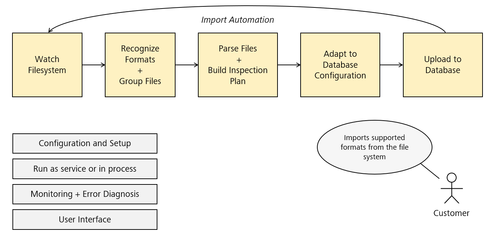
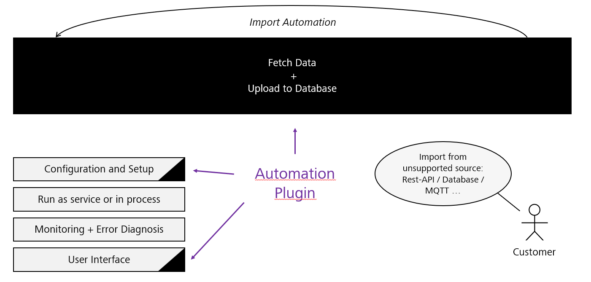
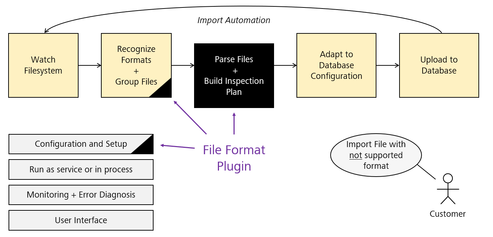

<!---
Ziele:
- Modultypen aus Anwendersicht und technisch beschreiben

Inhalt:
- Modultypen beschreiben
- Anwendungsfälle auflisten
- Vor- und Nachteile definieren
    - für Import automation erwähnen, dass sowohl Datenabruf als auch Datenupload von Plug-in definiert werden muss
- Überblick zu Abläufen in AI 
    - was wird durch Plug-in im AI ersetzt, was bleibt bestehen
- Erwähnung, welches Interface je nach Modultyp implementiert werden muss (für Details Verweis auf Unterkapitel zu einzelnen Modulen)
- Registrierung der Instanz beim Plug-in beschreiben
- Verlinkung auf weitere Kapitel zu Modulen
--->

# {{ page.title }}
The PiWeb Import SDK provides two different types of plug-ins: **Automation** and **Format**. These plug-ins are designed to allow customized data import to PiWeb.

Without plug-ins, the Auto Importer would perform the following steps to import a given file:\

## Automation plug-ins
Automation plug-ins are designed to automate the process of data import from various sources. They are ideally used when you need to import data regularly from a source that PiWeb does not support by default. E.g. from a REST api.

{: .note }
With this plug-in type, the data query and sending to PiWeb has to be implemented. The public PiWeb API can be used for this.

## Format plug-ins
Format plug-ins, on the other hand, are designed to support different data formats. They are used when you need to import data in a **file** format that PiWeb does not support natively.

Auto Importer takes over the complete data synchronization with PiWeb.

The plug-in must provide a file grouping logic and the parser. The task of the parser is to generate a logical tree that maps the measurement data so that it can be imported.

