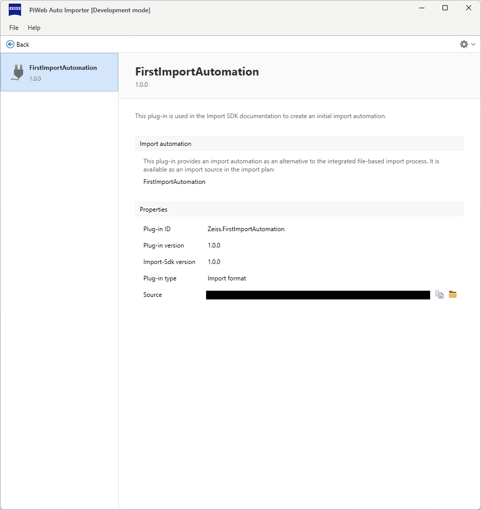
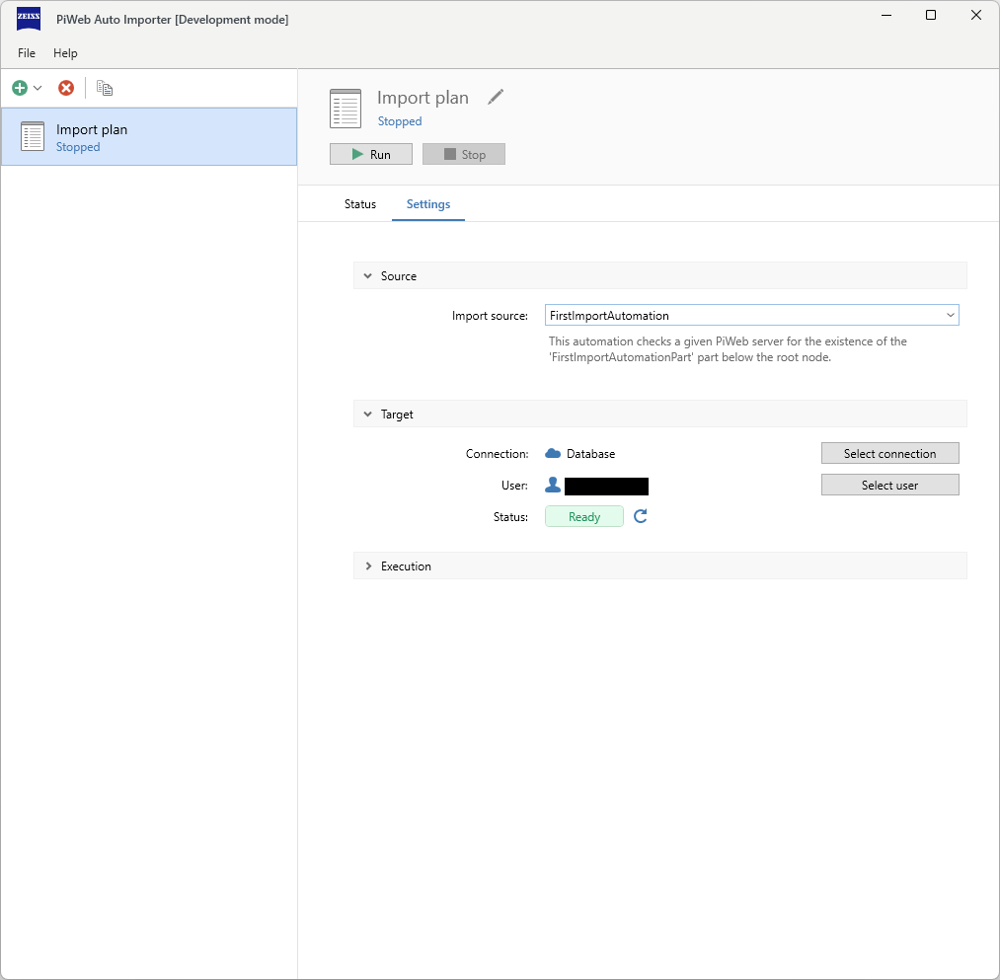

<!---
Ziele:
- Inhalt und Aufbau der Manifest-Datei erklären

Inhalt:
- einzelne Properties der Manifest-Datei
    - entsprechend Validierungslogik Anforderungen beschreiben
- auf Json-Template verweisen
- Versionierung erklären (Versionsschema, Kompatibilität)
--->

# {{ page.title }}
The manifest.json file defines the content of a plug-in. It contains information such as title, description, author, homepage, etc. The plug-in type and the name and summary of the import source are also defined (in the provides section). This page is intended to provide these possibilities.

## Schema
A schema is used to define and validate the content of mainfest.json. This can be viewed under\
[manifest-schema.json](https://raw.githubusercontent.com/ZEISS-PiWeb/PiWeb-Import-Sdk/refs/heads/pub/schemas/manifest-schema.json)\
Only manifest files that adhere to this schema can be loaded by the Auto Importer.

## Manifest properties
The following properties can be used to provide information to the Auto Importer / user:

<!-- Version, SemVer erklären -->

| Property name | Required | Description | Example |
| - | - | - | - |
| \$schema | |URL to json schema file, for validation | https://raw.githubusercontent.com/ZEISS-PiWeb/PiWeb-Import-Sdk/refs/tags/release/1.0.0/schemas/manifest-schema.json |
| id | required | The unique identifier of the plug-in | Zeiss.FirstImportAutomation |
| title | required | The title of the plug-in | FirstImportAutomation |
| description | required | The description of the plug-in | This plug-in is used in the Import SDK documentation to create an initial import automation. |
| assemblyPath | | The path to the plug-in assembly (pattern: .*\\.dll$). Defaults to the id | Zeiss.FirstImportAutomation.dll |
| localesPath | | A custom path to the plug-in's localizations. Default is the folder 'locales' | mytranslations |
| author | | The author of the plug-in | Carl Zeiss |
| company | | The company of the author | Carl Zeiss IQS Deutschland GmbH |
| contact | | The contact email address of the plug-in author | info.metrology.de@zeiss.com |
| homepage | | The homepage with details for the plug-in | https://www.zeiss.de/messtechnik/produkte/software/piweb.html |
| issueTracker | | The issue tracker url for the plug-in | https://github.com/ZEISS-PiWeb/PiWeb-Import-Sdk/issues |
| licenseName | | The licence type of the plug-in | BSD-3-Clause |
| licenseUrl | | The licence url for the plug-in | https://github.com/ZEISS-PiWeb/PiWeb-Import-Sdk/blob/develop/LICENSE.txt |
| sourceCode | | The source code url for the plug-in | https://github.com/ZEISS-PiWeb/PiWeb-Import-Sdk |
| documentation | | The documentation url for the plug-in | https://zeiss-piweb.github.io/PiWeb-Import-Sdk/ |
| version | | The self managed version of the plug-in. Defaults to 1.0.0 | 1.0.0 |
| provides| required | Contains an object that provides information about the import source. Read below for more information | |

### Provides property for import automation

| Property name | Required | Description | Example |
| - | - | - | - |
| type | required | ImportAutomation, see [Choose your plug-in type]() | ImportAutomation |
| displayName | required | The display name of the import source | Our custom import source |
| summary | required | The summary of the import source | This import automation does only change the status and activity of an import plan. |

### Provides property for import format

| Property name | Required | Description | Example |
| - | - | - | - |
| type | required | ImportFormat, see [Choose your plug-in type]() | ImportFormat |
| displayName | required | The display name of the import source | Our custom import source |
| defaultPriority | | The default priority of the plugin import format execution. Built-in formats are using the range 100-1000. If the priority of a format is less than 100 then it is able to handle import files before the built-in formats. If the priority of a format is greater than 1000 the format will only be used if no built-in format handles the file | 50 |
| fileExtensions | | The associated file extensions of this format. This information is used to create masks for file selection dialogs. Wildcards are not supported | [\".txt\", \".csv\"] |

### Minimal import automation example
The following manifest provides minimal information:

```json
{
  "id": "Zeiss.FirstImportAutomation",
  "title": "FirstImportAutomation",
  "description": "This plug-in is used in the Import SDK documentation to create an initial import automation.",

  "provides": {
    "type": "ImportAutomation",
    "displayName": "FirstImportAutomation",
    "summary": "This automation checks a given PiWeb Server for the existence of the 'FirstImportAutomationPart' part below the root node."
  }
}
```

This is what the plug-in with the minimal manifest looks like in the Auto Importer:



