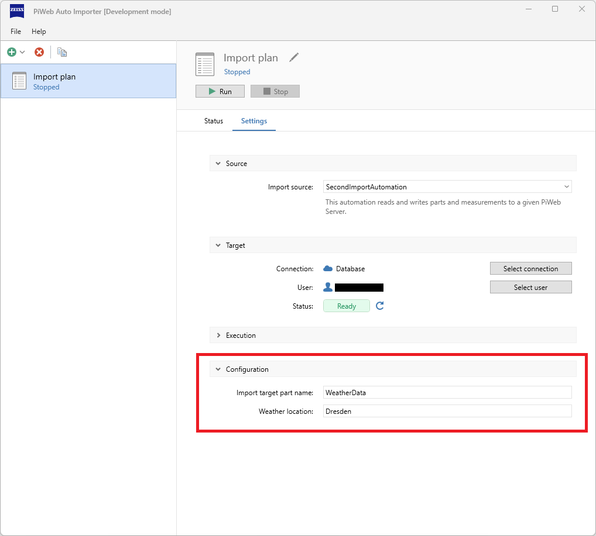
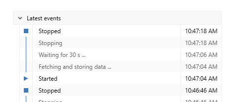
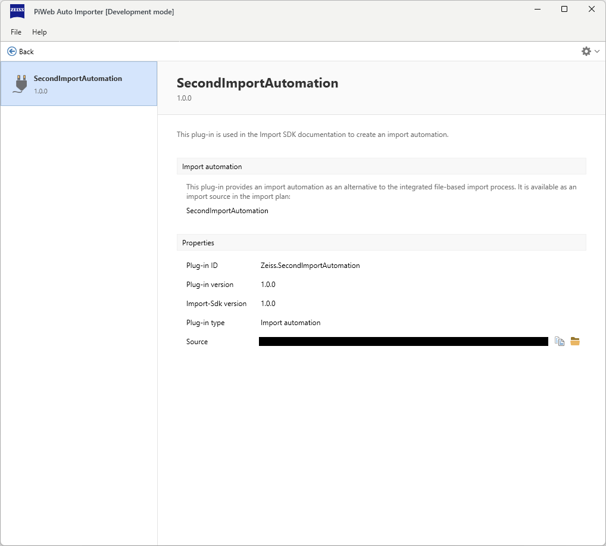
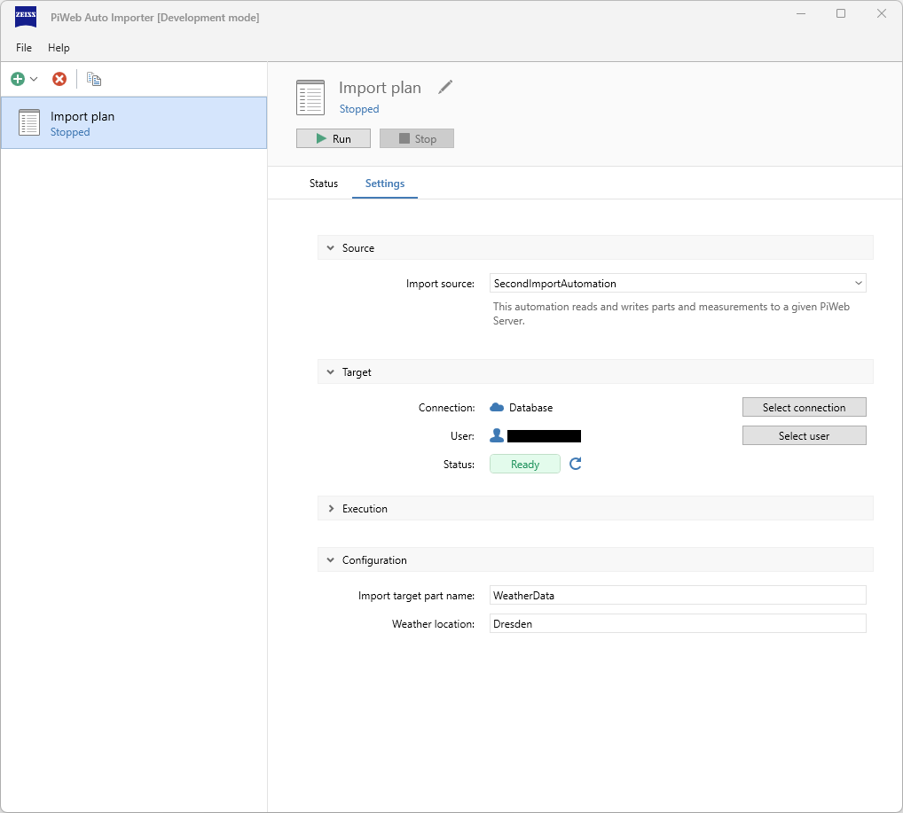
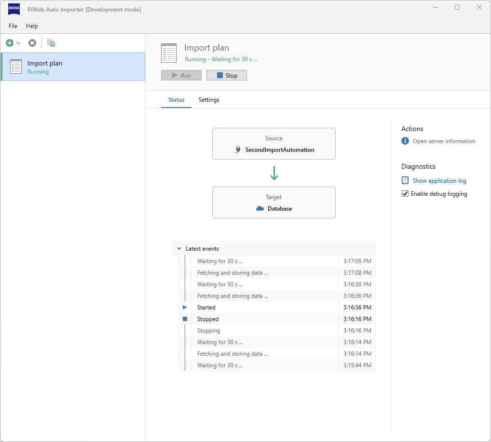
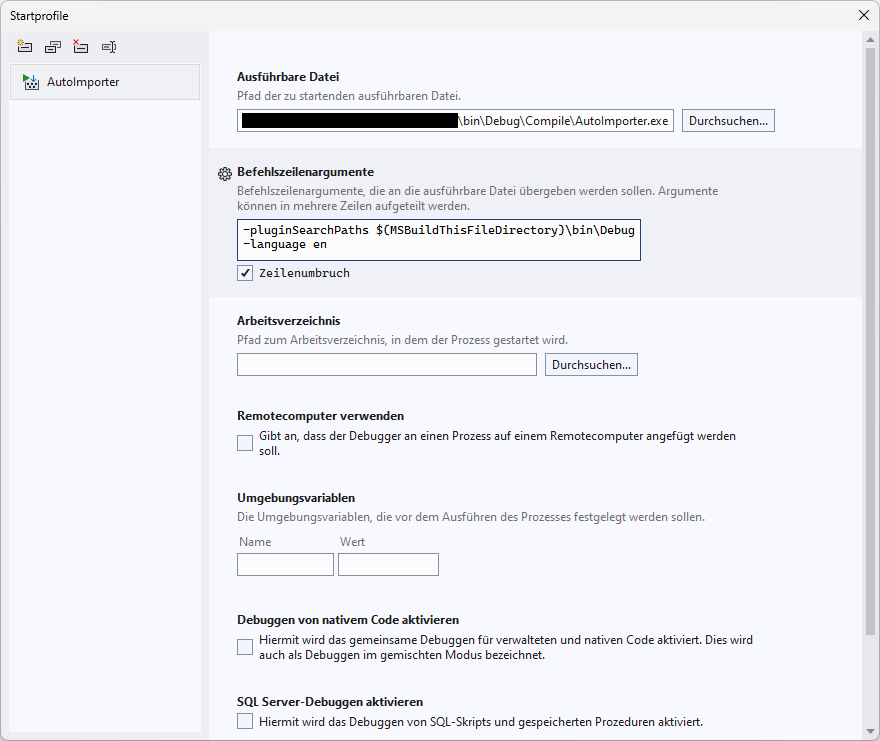
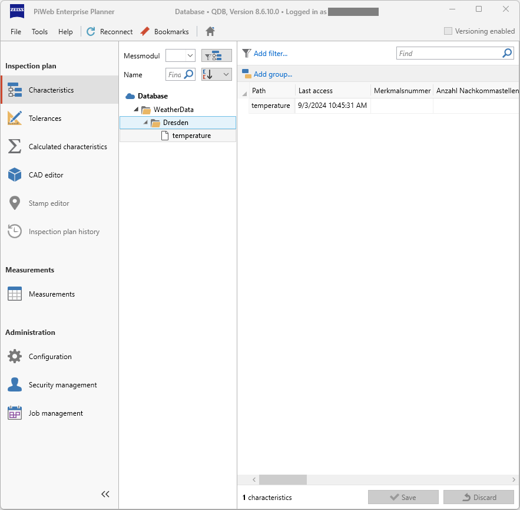
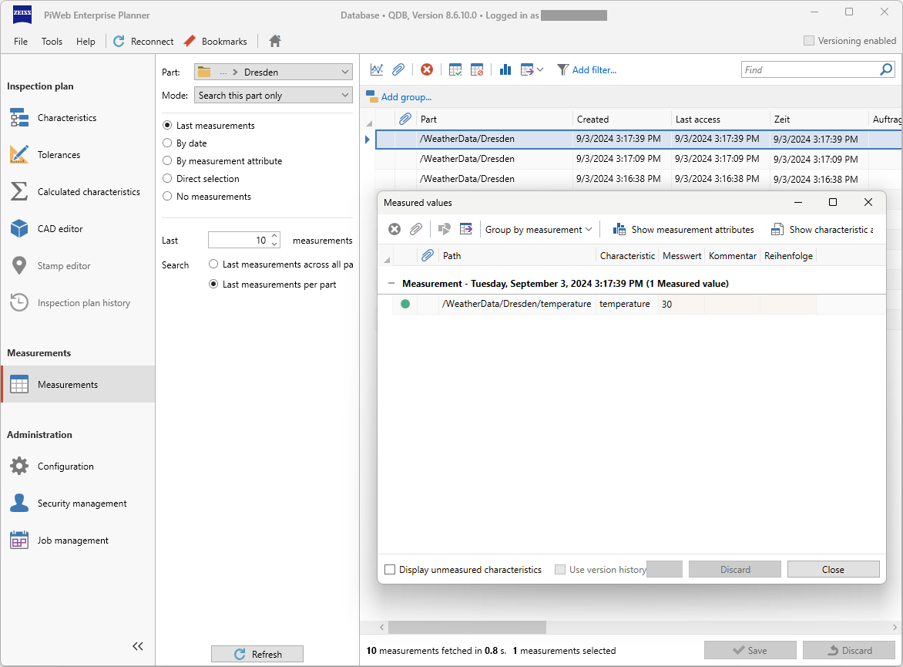

<!---
Ziele:
- Hinweise zur weiteren Umsetzung des Modultyps geben (insbesondere Datenabruf und -upload)

Inhalt:
- ImportRunner beschreiben
- Datenabruf
    - Möglichkeiten beispielhaft aufzeigen
    - auf Beispielplug-ins verweisen
- Datenupload
    - auf PiWeb API verweisen
--->

# {{ page.title }}
This article describes the implementation of an import automation plug-in. A general explanation of this type can be found in [Plug-in type](). Will will extend the simple example from [Create your first import automation](), but don't worry if you haven't read this article, all the necessary steps are also covered here. The required information for this plug-in type in the manifest.json file is described in [Manifest]().

To get a better impression of the functionality, this plug-in will read weather data from a website and import it into PiWeb Cloud under a part defined by the user.

## Download source code and content
The plug-in presented here can be downloaded in its complete form. However, the following sections also describe the approach using the project template. You can find the source text at the [GitHub repository](https://github.com/ZEISS-PiWeb/PiWeb-Import-Sdk/tree/develop/examples/SecondImportAutomation).

## Create a new project
To start the development of the import automation plug-in create a new .NET project. Use the provided project template for Microsoft Visual Studio or JetBrains Rider. You can find the link to the project template and information how to use it in [Development environment](). Further information about the content of the project template is contained in [Project template]().

## Adapt information in manifest file
Using the project template generates already a `manifest.json` file in the project. This manifest file contains information about the plug-in. You can modify the values in the json file as follows for the example plug-in.

```json
{
    "id": "Zeiss.SecondImportAutomation",
    "version": "1.0.0",
    "title": "SecondImportAutomation",
    "description": "This plug-in is used in the Import SDK documentation to create an import automation.",

    "provides": {
        "type": "ImportAutomation",
        "displayName": "SecondImportAutomation",
        "summary": "This automation reads and writes parts and measurements to a given PiWeb Server."
    }
}
```

The most important thing here is that you define a unique `id` and `version` for the plug-in, that you use `ImportAutomation` as value for the `type` property. The other json properties are mainly relevant for the display of the plug-in in the Auto Importer UI. You can find further information about the manifest file in [Manifest]().

## IPlugin
First we have to register our import automation with the Auto Importer. This is done in the `IPlugin` implementation using the `CreateImportAutomation` method. A new instance of our `ImportAutomation` is returned by this method.

`Plugin.cs:`
```c#
using Zeiss.PiWeb.Sdk.Import;
using Zeiss.PiWeb.Sdk.Import.Modules.ImportAutomation;

namespace Zeiss.SecondImportAutomation;

public class Plugin : IPlugin
{
    public IImportAutomation CreateImportAutomation(ICreateImportAutomationContext context)
    {
        // Registration of a new instance of IImportAutomation with Auto Importer
        return new ImportAutomation();
    }
}
```

## IImportAutomation
Our `IImportAutomation` implementation in turn registers an `IImportRunner`, which then performs the actual import at runtime. This `ImportRunner` is registered in the `CreateImportRunner` method. As several import plans can use this plug-in as a source, it is important to return a unique instance for each one.

We also define an `IAutomationConfiguration` in the `CreateConfiguration` method. This allows us to request and evaluate input from the user. We use this to define the name of the top import part.

`ImportAutomation.cs:`
```c#
using Zeiss.PiWeb.Sdk.Import.Modules.ImportAutomation;

namespace Zeiss.SecondImportAutomation;

public class ImportAutomation : IImportAutomation
{
    public IImportRunner CreateImportRunner(ICreateImportRunnerContext context)
    {
        // Creation of a new instance of IImportRunner, called for every import plan
        return new ImportRunner(context);
    }

    public IAutomationConfiguration CreateConfiguration(ICreateAutomationConfigurationContext context)
    {
        // Creation of a new instance of IAutomationConfiguration, called for every import plan
        return new AutomationConfiguration(context.PropertyStorage);
    }
}
```

`CreateImportRunner`\
Creates a new import runner instance. An import runner is first created and then executed when an import plan is using this import automation as import source is started. Each import plan is expected to use a separate import runner instance. For this reason this method must never return the same `IImportRunner` instance twice. If the import runner cannot be created (e.g. because of invalid import plan settings), a `CreateImportRunnerException` can be thrown. The created instance will be disposed after the import plan is stopped.

`CreateConfiguration`\
Creates a new automation configuration instance. An automation configuration is first created when an import plan uses this import automation as import source. Each import plan is expected to use a separate automation configuration instance. For this reason this method must never return the same `IAutomationConfiguration` instance twice.

## IAutomationConfiguration
The `IAutomationConfiguration` interface allows us to define input fields and thus offer the user setting options. As already mentioned, we give the Auto Importer user the option of defining a name for the top import part.

This then looks like this in the Auto Importer:\


`AutomationConfiguration.cs:`
```c#
using Zeiss.PiWeb.Sdk.Common.ConfigurationItems;
using Zeiss.PiWeb.Sdk.Common.PropertyStorage;
using Zeiss.PiWeb.Sdk.Import.Modules.ImportAutomation;

namespace Zeiss.SecondImportAutomation;

public class AutomationConfiguration(IPropertyStorage storage) : IAutomationConfiguration
{
    // Define a new settings section
    private static readonly Section _configurationSection = new Section() { Title = "Configuration", Priority = 1 };

    [ConfigurationItem]
    public StringConfigurationItem ImportPartName { get; } = new StringConfigurationItem(storage, nameof(ImportPartName), "WeatherData")
    {
        Priority = 1,
        Section = _configurationSection,
        Title = "Import target part name",
        Tooltip = "Defines the name of the part under which all subsequent imports take place."
    };

    [ConfigurationItem]
    public StringConfigurationItem WeatherLocation { get; } = new StringConfigurationItem(storage, nameof(WeatherLocation), "Dresden")
    {
        Priority = 2,
        Section = _configurationSection,
        Title = "Weather location",
        Tooltip = "The name of the location where the weather is to be queried."
    };
}
```

A new section is defined in the `_configurationSection` variable, with the title **Configuration** and priority **1**. In the `IAutomationConfiguration`, it is possible to define your own sections as well as use existing ones. To ensure sorting, the priority is also specified. For more details on configurations and sections, see [User configuration & storage]().

The input fields are defined via properties with the annotation `[ConfigurationItem]`. Our input fields are of type `StringConfigurationItem`, i.e. it allows text input. There are many different types, these are also listed under [User configuration & storage]().

{: .note }
It is also possible to create your own configuration elements if the predefined elements are not sufficient. See [Custom UI]().

## IImportRunner
Is responsible for processing the cyclical import and reacting to problems and errors accordingly. In our example, the Auto Importer connects to our PiWeb Cloud instance and checks for the presence of the defined import target part name. In addition, the part is created if it is not found. The import loop also checks the import source and creates new measured values under the defined part.


`ImportRunner.cs:`
```c#
using System;
using System.Collections.Generic;
using System.Linq;
using System.Net.Http;
using System.Threading;
using System.Threading.Tasks;
using Zeiss.PiWeb.Api.Core;
using Zeiss.PiWeb.Api.Rest.Common.Authentication;
using Zeiss.PiWeb.Api.Rest.Dtos.Data;
using Zeiss.PiWeb.Api.Rest.HttpClient.Builder;
using Zeiss.PiWeb.Api.Rest.HttpClient.Data;
using Zeiss.PiWeb.Sdk.Common.Logging;
using Zeiss.PiWeb.Sdk.Import.ImportPlan;
using Zeiss.PiWeb.Sdk.Import.Modules.ImportAutomation;
using Attribute = Zeiss.PiWeb.Api.Core.Attribute;

namespace Zeiss.SecondImportAutomation;

public class ImportRunner : IImportRunner
{
    // Define delay between two import loops
    private static readonly TimeSpan _interval = TimeSpan.FromSeconds(30);

    // Save ICreateImportRunnerContext for later use
    private readonly ICreateImportRunnerContext _importRunnerContext;

    // Fields for configuration items
    private readonly string _targetPartName;
    private readonly string _location;

    public ImportRunner(ICreateImportRunnerContext importRunnerContext)
    {
        _importRunnerContext = importRunnerContext;

        // Reading values of configuration items, defined in AutomationConfiguration.cs
        _targetPartName = _importRunnerContext.PropertyReader.ReadString(nameof(AutomationConfiguration.ImportPartName));
        _location = _importRunnerContext.PropertyReader.ReadString(nameof(AutomationConfiguration.WeatherLocation));
    }

    public async Task RunAsync(CancellationToken cancellationToken)
    {
        try
        {
            // Validate parameters
            if (string.IsNullOrWhiteSpace(_targetPartName) || string.IsNullOrWhiteSpace(_location))
            {
                _importRunnerContext.ActivityService.SetActivity(new ActivityProperties
                {
                    ActivityType = ActivityType.Suspension,
                    ShortDisplayText = "Parameter invalid",
                    DetailedDisplayText = "Target part name or location is not valid, abort."
                });

                return;
            }

            using var piWebRestClient = CreatePiWebRestClient();

            // Import loop
            while (!cancellationToken.IsCancellationRequested)
            {
                // Inform user that the plug-in is currently active
                _importRunnerContext.ActivityService.SetActivity(new ActivityProperties
                {
                    ActivityType = ActivityType.Normal,
                    DetailedDisplayText = "Fetching and storing data ..."
                });

                // Request PiWeb API and check for part
                var targetPart = await EnsurePartAsync(piWebRestClient, $"{_targetPartName}/{_location}", cancellationToken);
                var characteristic = await EnsureCharacteristicAsync(
                    piWebRestClient,
                    targetPart.Path,
                    "temperature",
                    cancellationToken);

                // Request import source
                var data = await FetchWeatherDataAsync(_location);
                if (data != null)
                {
                    // Got data, save it

                    var temperature = data[0];

                    var measurement = new DataMeasurementDto
                    {
                        Uuid = Guid.NewGuid(),
                        Time = DateTime.Now,
                        PartUuid = targetPart.Uuid,
                        Characteristics = new Dictionary<Guid, DataValueDto>()
                        {
                            { characteristic.Uuid, new DataValueDto { Attributes = [new Attribute(1, temperature)] } }
                        }
                    };

                    await piWebRestClient.CreateMeasurementValues([measurement], cancellationToken: cancellationToken);

                    _importRunnerContext.ActivityService.SetActivity(
                        new ActivityProperties
                        {
                            ActivityType = ActivityType.Normal,
                            DetailedDisplayText = "Saved data, waiting for {0} s ..."
                        }, _interval.TotalSeconds);
                }
                else
                {
                    // Error with the import source

                    _importRunnerContext.ActivityService.SetActivity(
                        new ActivityProperties
                        {
                            ActivityType = ActivityType.Suspension,
                            DetailedDisplayText = "Could not reach weather api, waiting for {0} s ..."
                        }, _interval.TotalSeconds);
                }

                // Delay next import loop, save load on the server and import source
                await Task.Delay(_interval, cancellationToken);
            }
        }
        catch (OperationCanceledException)
        {
            // ignore
        }
        catch (Exception ex)
        {
            _importRunnerContext.ActivityService.SetActivity(
                new ActivityProperties
                {
                    ActivityType = ActivityType.Suspension,
                    DetailedDisplayText = ex.InnerException?.Message ?? ex.Message
                }
            );
            _importRunnerContext.Logger.LogError(ex.InnerException?.Message ?? ex.Message);
        }
    }

    /// <summary>
    ///     Creates a valid PathInformation according to the specified path to a part.
    /// </summary>
    private static PathInformation AsPartPath(string partPath)
    {
        var path = PathInformation.Root;

        foreach (var element in partPath.Split('/', StringSplitOptions.RemoveEmptyEntries))
            path += PathElement.Part(element);

        return path;
    }

    /// <summary>
    ///     Ensures that the given part path is available on the PiWeb Server.
    /// </summary>
    private static async Task<InspectionPlanPartDto> EnsurePartAsync(
        DataServiceRestClient restClient,
        string path,
        CancellationToken cancellationToken)
    {
        var partPath = AsPartPath(path);

        var parts = await restClient.GetParts(partPath, depth: 0, cancellationToken: cancellationToken)
            .ConfigureAwait(false);

        if (parts.Count > 0)
            return parts[0];

        var part = new InspectionPlanPartDto
        {
            Uuid = Guid.NewGuid(),
            Path = partPath
        };

        await restClient.CreateParts([part], cancellationToken: cancellationToken)
            .ConfigureAwait(false);

        return part;
    }

    /// <summary>
    ///     Ensures that the characteristic under the given part is available on the PiWeb Server. 
    /// </summary>
    private static async Task<InspectionPlanCharacteristicDto> EnsureCharacteristicAsync(
        DataServiceRestClient restClient,
        PathInformation partPath,
        string characteristic,
        CancellationToken cancellationToken)
    {
        var characteristics = await restClient.GetCharacteristics(partPath, cancellationToken: cancellationToken)
            .ConfigureAwait(false);

        var knownCharacteristic = characteristics.FirstOrDefault(c => c.Path.Name == characteristic);
        if (knownCharacteristic is not null)
            return knownCharacteristic;

        knownCharacteristic = new InspectionPlanCharacteristicDto
        {
            Uuid = Guid.NewGuid(),
            Path = partPath + PathElement.Char(characteristic)
        };

        await restClient.CreateCharacteristics([knownCharacteristic], cancellationToken: cancellationToken).ConfigureAwait(false);

        return knownCharacteristic;
    }

    /// <summary>
    ///     Establishes a connection to PiWeb Server using the PiWeb API.
    /// </summary>
    private DataServiceRestClient CreatePiWebRestClient()
    {
        // Define authentication
        var authData = _importRunnerContext.ImportTarget.AuthData;

        var authenticationHandler = authData.AuthType switch
        {
            AuthType.Basic => NonInteractiveAuthenticationHandler.Basic(authData.Username, authData.Password),
            AuthType.WindowsSSO => NonInteractiveAuthenticationHandler.WindowsSSO(),
            AuthType.Certificate => NonInteractiveAuthenticationHandler.Certificate(authData.CertificateThumbprint),
            AuthType.OIDC => NonInteractiveAuthenticationHandler.OIDC(authData.ReadAndUpdateRefreshTokenAsync),
            _ => null
        };

        // Rest client for PiWeb API
        using var builder = new RestClientBuilder(new Uri(_importRunnerContext.ImportTarget.ServiceAddress))
            .SetAuthenticationHandler(authenticationHandler);

        return builder.CreateDataServiceRestClient();
    }

    /// <summary>
    ///     Uses the wttr.in http interface to retrieve weather data.
    /// </summary>
    /// <param name="location">Location name for which the weather data is to be queried.</param>
    private static async Task<string[]?> FetchWeatherDataAsync(string location)
    {
        var uri = new Uri($"https://wttr.in/{location}?format=%t;%f;%C;%h;%p;%T;%w;%P;%u");

        using var httpClient = new HttpClient();

        try
        {
            var response = await httpClient.GetStringAsync(uri).ConfigureAwait(false);

            var segments = response.Split(";");
            var values = new string[10];

            values[0] = segments[0].Replace("°C", "");              // t: -1°C
            values[1] = segments[1].Replace("°C", "");              // f: -5°C
            values[2] = segments[2];                                // C: Light freezing drizzle
            values[3] = segments[3].Replace("%", "");               // h: 93%
            values[4] = segments[4].Replace("mm", "");              // p: 0.0mm
            values[5] = DateTime.Now.ToString("yyyy-MM-ddT") + segments[5];   // T: 14:17:11+0100
            values[6] = segments[6].Replace("km/h", "")[1..];       // w: →13km/h [speed]
            values[7] = segments[6].Replace("km/h", "")[..1];       // w: →13km/h [direction]
            values[8] = segments[7].Replace("hPa", "");             // P: 1027hPa
            values[9] = segments[8];                                // u: 1

            return values;
        }
        catch (HttpRequestException)
        {
            return null;
        }
    }
}
```

Show whole ImportRunner.cs code

### Walkthrough
#### Prepare data - Fields
First, we define our fields in which we read out data once and make it available to the import loop. This would be the `_interval` which defines the waiting time between two import loop processes. We also save the `ICreateImportRunnerContext` temporarily, as this is provided via dependency injection but is used again and again later on. We also set the contents of our configuration items `_targetPartName` and `_location`.

```c#
// Define delay between two import loops
private static readonly TimeSpan _interval = TimeSpan.FromSeconds(30);

// Save ICreateImportRunnerContext for later use
private readonly ICreateImportRunnerContext _importRunnerContext;

// Fields for configuration items
private readonly string _targetPartName;
private readonly string _location;
```

#### Loading configuration data - ImportRunner constructor
The contents of these fields are provided in the constructor. Our configurations can be read out via the `PropertyReader` of the `ICreateImportRunnerContext` interface. To do this, we pass the key that we have defined in the `IAutomationConfiguration` implementation.

```c#
public ImportRunner(ICreateImportRunnerContext importRunnerContext)
{
    _importRunnerContext = importRunnerContext;

    // Reading values of configuration items, defined in AutomationConfiguration.cs
    _targetPartName = _importRunnerContext.PropertyReader.ReadString(nameof(AutomationConfiguration.ImportPartName));
    _location = _importRunnerContext.PropertyReader.ReadString(nameof(AutomationConfiguration.WeatherLocation));
}
```

#### Import loop activity and PiWeb Server connection - RunAsync
The configuration values are checked in the `RunAsnyc` method. If these do not match, a corresponding activity is set and the import process is terminated. A connection to PiWeb Cloud is then established and the import loop is started.

```c#
public async Task RunAsync(CancellationToken cancellationToken)
{
    try
    {
        // Validate parameters
        if (string.IsNullOrWhiteSpace(_targetPartName) || string.IsNullOrWhiteSpace(_location))
        {
            _importRunnerContext.ActivityService.SetActivity(new ActivityProperties
            {
                ActivityType = ActivityType.Suspension,
                ShortDisplayText = "Parameter invalid",
                DetailedDisplayText = "Target part name or location is not valid, abort."
            });

            return;
        }

        using var piWebRestClient = CreatePiWebRestClient();

        // Import loop
        while (!cancellationToken.IsCancellationRequested)
        {
[...]
```

`CreatePiWebRestClient` provides the options and establishes a connection via REST. To access a PiWeb Server instance via PiWeb API, various authentication methods are offered, which we provide in a switch that checks the import target accordingly.\
Next, we use the PiWeb API to establish the connection, this is done via a REST client. To do this, we use the `ImportTarget` information provided via the context.


```c#
/// <summary>
///     Establishes a connection to PiWeb Server using the PiWeb API.
/// </summary>
private DataServiceRestClient CreatePiWebRestClient()
{
    // Define authentication
    var authData = _importRunnerContext.ImportTarget.AuthData;

    var authenticationHandler = authData.AuthType switch
    {
        AuthType.Basic => NonInteractiveAuthenticationHandler.Basic(authData.Username, authData.Password),
        AuthType.WindowsSSO => NonInteractiveAuthenticationHandler.WindowsSSO(),
        AuthType.Certificate => NonInteractiveAuthenticationHandler.Certificate(authData.CertificateThumbprint),
        AuthType.OIDC => NonInteractiveAuthenticationHandler.OIDC(authData.ReadAndUpdateRefreshTokenAsync),
        _ => null
    };

    // Rest client for PiWeb API
    using var builder = new RestClientBuilder(new Uri(_importRunnerContext.ImportTarget.ServiceAddress))
        .SetAuthenticationHandler(authenticationHandler);

    return builder.CreateDataServiceRestClient();
}
```

Show CreatePiWebRestClient code

#### Basic import loop - RunAsync
The basic structure of the import loop is the while loop, which repeatedly executes the desired import logic. We secure this with a try catch block, as the termination of the import plan leads to an `OperationCanceledException`, where appropriate closing procedures should then be carried out to safely terminate the import.

```c#
public async Task RunAsync(CancellationToken cancellationToken)
{
    try
    {
        while( !cancellationToken.IsCancellationRequested )
        {
            // Import loop
        }
    }
    catch (OperationCanceledException)
    {
        // Complete pending save operations
    }
}
```

#### Creating parts, characteristic and measurements - import loop
In this example, the `ActivityService` is used to announce an activity via `SetActivity`. It has the type `ActivityType.Normal` and the text “Fetching and storing data ...”. This is to make it clear to the user that the import loop is currently active and is checking existing data.



{: .note }
To find out more about activities and events, you can continue reading in [Import monitoring]().

`EnsurePartAsync` is then used to ensure that the desired part structure is still present, theoretically it can change between 2 loops.

To keep the example simple, a fixed charateristic called **temperature** is created or checked via `EnsureCharacteristicAsync`. The measurements are then generated under this characteristic.

`FetchWeatherDataAsync` queries the http interface for weather data for the given location. The return structure can be seen in the method itself.

A new measurement (`new DataMeasurementDto`) is prepared, which is transferred to the PiWeb server via `CreateMeasurementValues`.

<ins>Following properties are used:</ins>\
`Guid Uuid` gets or sets the uuid of this measurement.\
`Guid PartUuid` gets or sets the uuid the part this measurement belongs to. In this case, our defined `targetPart`.\
`DateTime? Time` gets or sets the time of this measurement. If this measurement has no time attribute, then `Zeiss.PiWeb.Api.Rest.Dtos.Data.SimpleMeasurementDto.MinimumValidDatabaseDateTime` will be returned.\
`IReadOnlyDictionary<Guid, DataValueDto> Characteristics` a dictionary containing the uuid of the characteristic and a value to be stored.

The user is then informed again via activity that the import loop has been completed. At the end of the run, the next run is delayed to keep the load on the server low.

```c#
// Import loop
while (!cancellationToken.IsCancellationRequested)
{
    // Inform user that the plug-in is currently active
    _importRunnerContext.ActivityService.SetActivity(new ActivityProperties
    {
        ActivityType = ActivityType.Normal,
        DetailedDisplayText = "Fetching and storing data ..."
    });

    // Request PiWeb API and check for part
    var targetPart = await EnsurePartAsync(piWebRestClient, $"{_targetPartName}/{_location}", cancellationToken);
    var characteristic = await EnsureCharacteristicAsync(
        piWebRestClient,
        targetPart.Path,
        "temperature",
        cancellationToken);

    // Request import source
    var data = await FetchWeatherDataAsync(_location);
    if (data != null)
    {
        // Got data, save it

        var temperature = data[0];

        var measurement = new DataMeasurementDto
        {
            Uuid = Guid.NewGuid(),
            Time = DateTime.Now,
            PartUuid = targetPart.Uuid,
            Characteristics = new Dictionary<Guid, DataValueDto>()
            {
                { characteristic.Uuid, new DataValueDto { Attributes = [new Attribute(1, temperature)] } }
            }
        };

        await piWebRestClient.CreateMeasurementValues([measurement], cancellationToken: cancellationToken);

        _importRunnerContext.ActivityService.SetActivity(
            new ActivityProperties
            {
                ActivityType = ActivityType.Normal,
                DetailedDisplayText = "Saved data, waiting for {0} s ..."
            }, _interval.TotalSeconds);
    }
    else
    {
        // Error with the import source

        _importRunnerContext.ActivityService.SetActivity(
            new ActivityProperties
            {
                ActivityType = ActivityType.Suspension,
                DetailedDisplayText = "Could not reach weather api, waiting for {0} s ..."
            }, _interval.TotalSeconds);
    }

    // Delay next import loop, save load on the server and import source
    await Task.Delay(_interval, cancellationToken);
}
```

`EnsurePartAsync` queries the PiWeb server for the existence of a path. If it does not return anything, the necessary parts are created via `CreateParts`.
All available PiWeb API calls can be found in the corresponding documentation under [PiWeb API documentation](https://zeiss-piweb.github.io/PiWeb-Api/general){:target="_blank"}.


```c#
/// <summary>
///     Ensures that the given part path is available on the PiWeb Server.
/// </summary>
private static async Task<InspectionPlanPartDto> EnsurePartAsync(
    DataServiceRestClient restClient,
    string path,
    CancellationToken cancellationToken)
{
    var partPath = AsPartPath(path);

    var parts = await restClient.GetParts(partPath, depth: 0, cancellationToken: cancellationToken)
        .ConfigureAwait(false);

    if (parts.Count > 0)
        return parts[0];

    var part = new InspectionPlanPartDto
    {
        Uuid = Guid.NewGuid(),
        Path = partPath
    };

    await restClient.CreateParts([part], cancellationToken: cancellationToken)
        .ConfigureAwait(false);

    return part;
}

/// <summary>
///     Creates a valid PathInformation according to the specified path to a part.
/// </summary>
private static PathInformation AsPartPath(string partPath)
{
    var path = PathInformation.Root;

    foreach (var element in partPath.Split('/', StringSplitOptions.RemoveEmptyEntries))
        path += PathElement.Part(element);

    return path;
}
```

Show EnsurePartAsync code

`EnsureCharacteristicAsync` works in the same way, but it checks the presence of characteristics under a given part. It is important that both the parts and the characteristics are present before each import, otherwise a measurement cannot be imported.


```c#
/// <summary>
///     Ensures that the characteristic under the given part is available on the PiWeb Server. 
/// </summary>
private static async Task<InspectionPlanCharacteristicDto> EnsureCharacteristicAsync(
    DataServiceRestClient restClient,
    PathInformation partPath,
    string characteristic,
    CancellationToken cancellationToken)
{
    var characteristics = await restClient.GetCharacteristics(partPath, cancellationToken: cancellationToken)
        .ConfigureAwait(false);

    var knownCharacteristic = characteristics.FirstOrDefault(c => c.Path.Name == characteristic);
    if (knownCharacteristic is not null)
        return knownCharacteristic;

    knownCharacteristic = new InspectionPlanCharacteristicDto
    {
        Uuid = Guid.NewGuid(),
        Path = partPath + PathElement.Char(characteristic)
    };

    await restClient.CreateCharacteristics([knownCharacteristic], cancellationToken: cancellationToken).ConfigureAwait(false);

    return knownCharacteristic;
}
```

Show EnsureCharacteristicAsync code

`FetchWeatherDataAsync` is independent of the SDK development and only requests a website via HTTP and returns weather data, currently more data is returned than is stored in PiWeb. The example should be kept small.


```c#
/// <summary>
///     Uses the wttr.in http interface to retrieve weather data.
/// </summary>
/// <param name="location">Location name for which the weather data is to be queried.</param>
private static async Task<string[]?> FetchWeatherDataAsync(string location)
{
    var uri = new Uri($"https://wttr.in/{location}?format=%t;%f;%C;%h;%p;%T;%w;%P;%u");

    using var httpClient = new HttpClient();

    try
    {
        var response = await httpClient.GetStringAsync(uri).ConfigureAwait(false);

        var segments = response.Split(";");
        var values = new string[10];

        values[0] = segments[0].Replace("°C", "");              // t: -1°C
        values[1] = segments[1].Replace("°C", "");              // f: -5°C
        values[2] = segments[2];                                // C: Light freezing drizzle
        values[3] = segments[3].Replace("%", "");               // h: 93%
        values[4] = segments[4].Replace("mm", "");              // p: 0.0mm
        values[5] = DateTime.Now.ToString("yyyy-MM-ddT") + segments[5];   // T: 14:17:11+0100
        values[6] = segments[6].Replace("km/h", "")[1..];       // w: →13km/h [speed]
        values[7] = segments[6].Replace("km/h", "")[..1];       // w: →13km/h [direction]
        values[8] = segments[7].Replace("hPa", "");             // P: 1027hPa
        values[9] = segments[8];                                // u: 1

        return values;
    }
    catch (HttpRequestException)
    {
        return null;
    }
}
```

Show FetchWeatherDataAsync code

We now have the necessary code for our import automation test and can execute it.

## Running the plug-in
### Start via command line
To test your plug-in you can build your plug-in project and load your plug-in directly from your build folder. Therefore you have to activate the development mode for the Auto Importer like described in [Development settings](). Then you can start the Auto Importer with the following command line parameter `-pluginSearchPaths "<path to your build folder>"`. When the Auto Importer has started, you can check that your plug-in is loaded by opening the plug-in management view via `File > Plug-ins...`. Your plug-in should be listed there like in the following screenshot.\


We also need an import plan that uses our import source and uses the existing cloud instance as the target. To do this, we create a new import plan using the green plus icon and configure it as shown in the screenshot.\


If we now click on Start, the automation is executed should look like this:\


### Start from Visual Studio
It is possible to transfer the commands directly from Visual Studio to the Auto Importer. To do this, use the following `launchSettings.json`:

```json
{
    "profiles": {
        "AutoImporter": {
            "commandName": "Executable",
            "executablePath": "C:\\Users\\ivsschol\\source\\repos\\PiWeb_2\\bin\\Debug\\Compile\\AutoImporter.exe",
            "commandLineArgs": "-pluginSearchPaths $(MSBuildThisFileDirectory)\\bin\\Debug -language en"
        }
    }
}
```

{: .important }
`executablePath` must contain your path to the `AutoImporter.exe`.

 You can also define the debug properties manually, see the following screenshot:

 

### Check data inside PiWeb Planner
The written data can be checked via the PiWeb Planner.\


