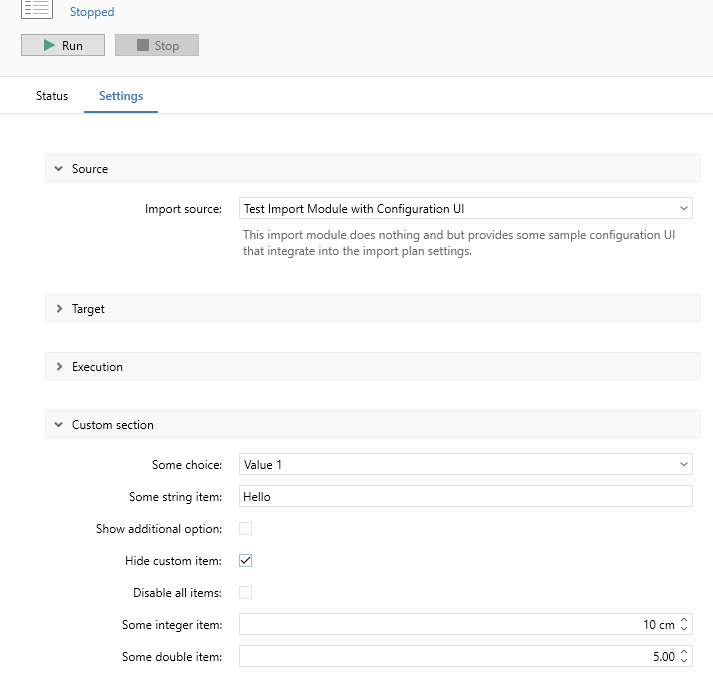
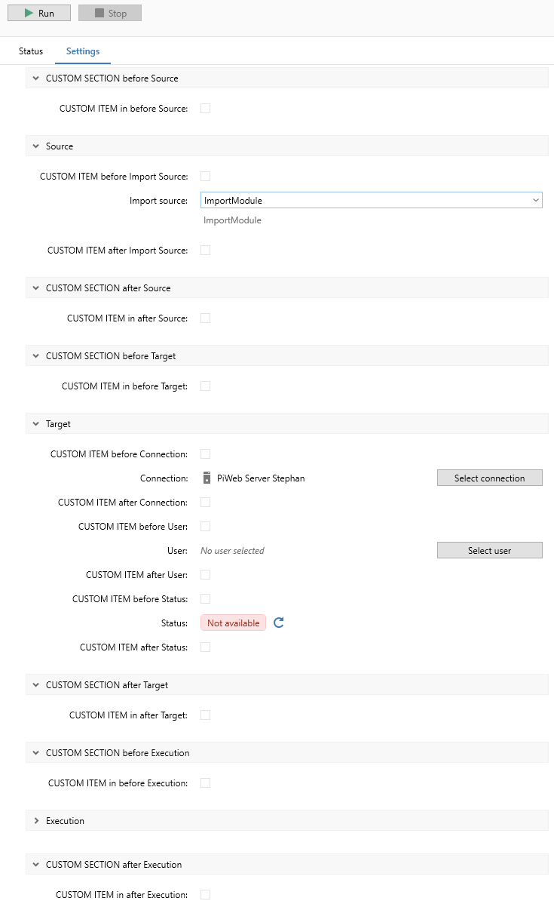

# {{ page.title }}

<!---
Ziele:
- aufzeigen, wie Auto Importer UI um Konfigurationselemente erweitert werden kann und wie Einstellungen gespeichert werden

Inhalt:
- mitgelieferte Elemente beschreiben
- auf Beispiel-Plug-in verweisen
- Storage bzw. Speicherung der Einstellungen erklären
--->

## CreateConfiguration
Besides **CreateImportRunnerAsync** from chapter [Create your first import automation]() you can use **CreateConfiguration** to load custom configuration items.

Loading the configuration in IImportAutomation:
```c#
using Zeiss.PiWeb.Import.Sdk.Modules.ImportAutomation;

public class MyImportModule : IImportAutomation
{
    public Task<IImportRunner> CreateImportRunnerAsync(IImportRunnerContext context)
    {
        return Task.FromResult<IImportRunner>(new MyImportRunner(context));
    }

    public IAutomationConfiguration CreateConfiguration(IAutomationConfigurationContext context)
    {
        return new AutomationConfiguration(context.PropertyStorage);
    }
}
```

**CreateConfiguration:** Creates a new automation configuration instance. An automation configuration is first created when an import plan uses this import automation as import source. Each import plan is expected to use a separate automation configuration instance. For this reason this method must never return the same *IAutomationConfiguration* instance twice.\
IAutomationConfiguration allows you to create your own configuration items for the ImportPlan, for example API-Urls.

## IAutomationConfiguration
Represents an automation configuration. Automation configurations specify additional settings for an import automation an user can edit to affect the import automation behavior for an import plan.

```c#
using Zeiss.PiWeb.Import.Sdk.ConfigurationItems;
using Zeiss.PiWeb.Import.Sdk.Modules.ImportAutomation;
using Zeiss.PiWeb.Import.Sdk.PropertyStorage;

public class AutomationConfiguration(IPropertyStorage storage) : IAutomationConfiguration
{
    private static readonly Section _ItemSection = new() {Title = "Test section", Priority = 0};

    [ConfigurationItem]
    private BoolConfigurationItem BoolItem { get; } = new BoolConfigurationItem(storage, "BoolDisable", true)
    {
        Title = "Use default UI texts",
        Section = _ItemSection,
        Tooltip = "If this item is checked the status item provides no text and the default text is used",
        Priority = 1
    };

    public void Update()
    {
        // Here you can react to updates of configuration items.
    }
}
```

### ConfigurationItem types
The Import SDK provides predefined types: bool, int, double, select, status and string.
* BoolConfigurationItemPropertyViewModel
* IntConfigurationItemPropertyViewModel
* DoubleConfigurationItemPropertyViewModel
* SelectConfigurationItemPropertyViewModel
* StatusConfigurationItemPropertyViewModel
* StringConfigurationItemPropertyViewModel

Example of different types:


It is also possible to place a description text anywhere via TextDescriptionItemPropertyViewModel:


### Configuration section and priority
Different sections and priorites for configuration items can be adressed:


The Import SDK already provides the familiar sections and priorites:
```c#
namespace Zeiss.PiWeb.Import.Sdk.ConfigurationItems
{
  public static class WellKnownSections
  {
    public static readonly Section Source;
    public static readonly Section Target;
    public static readonly Section Execution;
    public static readonly Section ImportHistory;
    public static readonly Section Backup;
  }

  public static class WellKnownPriorities
  {
    public const int TopMost = -1000000;
    public const int BottomMost = 1000000;

    public static class Backup
    {
      public const int BackupDescription = -10000;
      public const int BackupAfterSuccess = -9000;
      public const int BackupAfterFailure = -8000;
    }

    public static class Execution
    {
      public const int ExecutionMode = -10000;
      public const int Autostart = -9000;
    }

    public static class ImportHistory
    {
      public const int MaxOfflineLogEntries = -10000;
      public const int MaxOnlineLogEntries = -9000;
      public const int AttachImportFiles = -8000;
    }

    public static class Source
    {
      public const int ImportSource = -10000;
      public const int ImportFolder = -9000;
      public const int FolderStructure = -8000;
      public const int PartsWithImportOptionsOnly = -7000;
      public const int CreateFolders = -6000;
      public const int DeleteFolders = -5000;
      public const int SynchronizationInterval = -4000;
    }

    public static class Target
    {
      public const int Connection = -10000;
      public const int AuthenticationCredentials = -9000;
      public const int ConnectionStatus = -8000;
      public const int ConnectionSeparator = -7000;
      public const int ConfigureImportFormats = -6000;
    }
  }
}
```

These can be used accordingly:
```c#
[ConfigurationItem]
public BoolConfigurationItem BeforeImportSource { get; } = new()
{
    Title = "CUSTOM ITEM before Import Source",
    Section = WellKnownSections.Source,
    Priority = WellKnownPriorities.Source.ImportSource - 1
};
```

## Storage
You can access **IPropertyStorage** in your configuration class via dependancy injection.\
The defined ConfigurationItems are thus automatically saved and read out accordingly.

```c#
public class ImportConfiguration(IPropertyStorage storage) : IAutomationConfiguration
{
    private static readonly Section _CustomSection = new() {Title = "Custom section", Priority = 3};
    
    [ConfigurationItem]
    public BoolConfigurationItem BoolItem { get; } = new(storage, "MyBool", false)
    {
        Title = "Disable all items",
        Section = _CustomSection,
        Tooltip = "If this item is checked, all items provided by this module are in readonly mode.",
        Priority = 5
    };
```

### Use property values
The IImportRunner can read the storage via the IImportRunnerContext and thus use the values for import purposes.
```c#
public ImportRunner(IImportRunnerContext importRunnerContext)
{
    _Hostname = importRunnerContext.PropertyStorage.ReadString(nameof(ImportConfiguration.Hostname));
}
```

<!---
**TODO Priority erklären, niedrig zu hoch**
--->