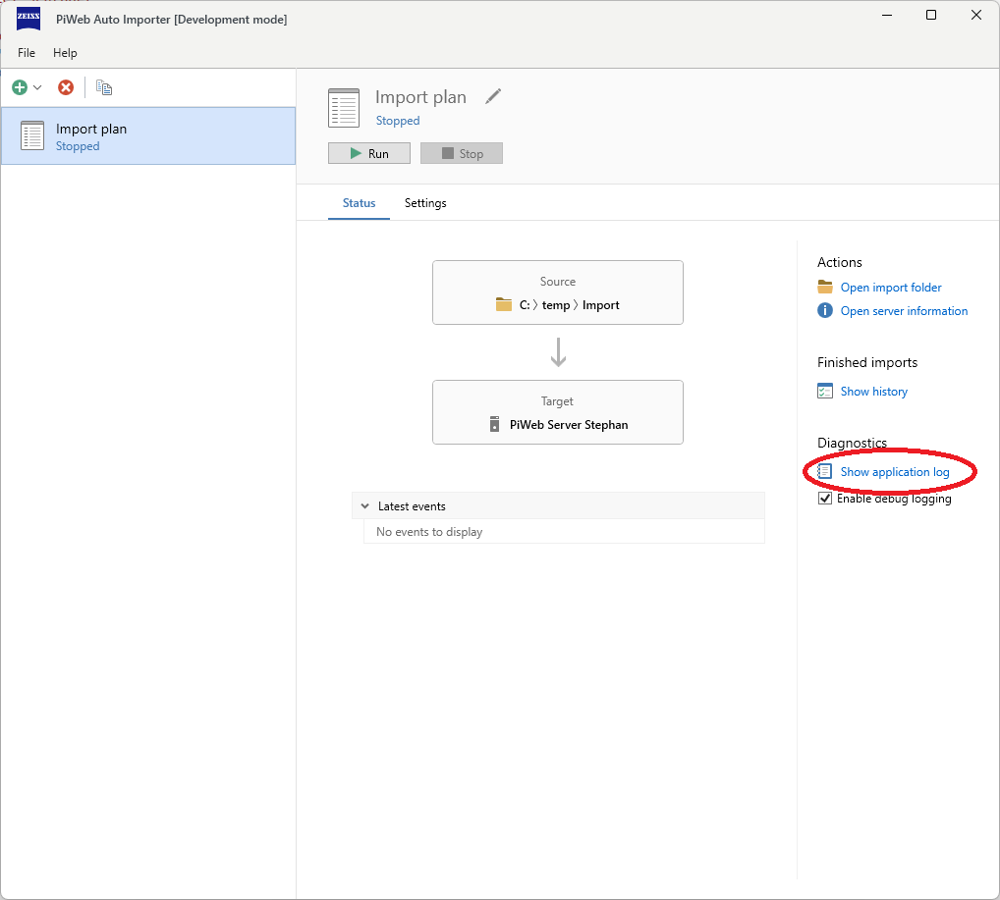
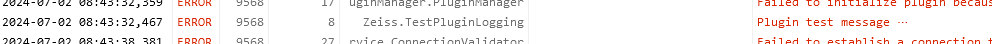
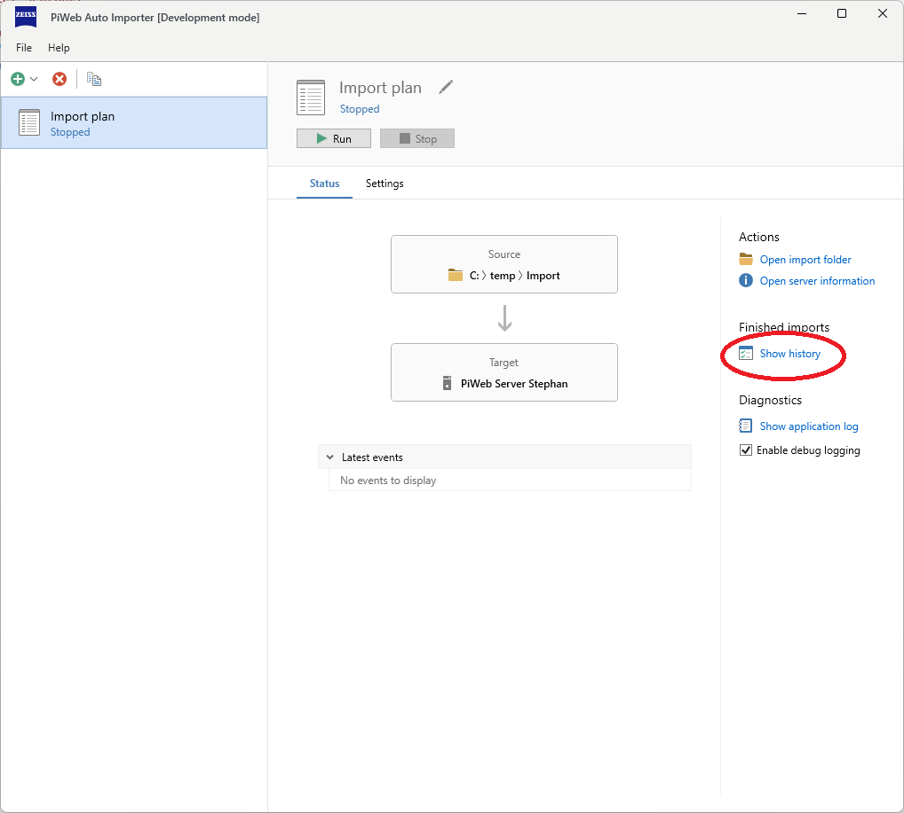
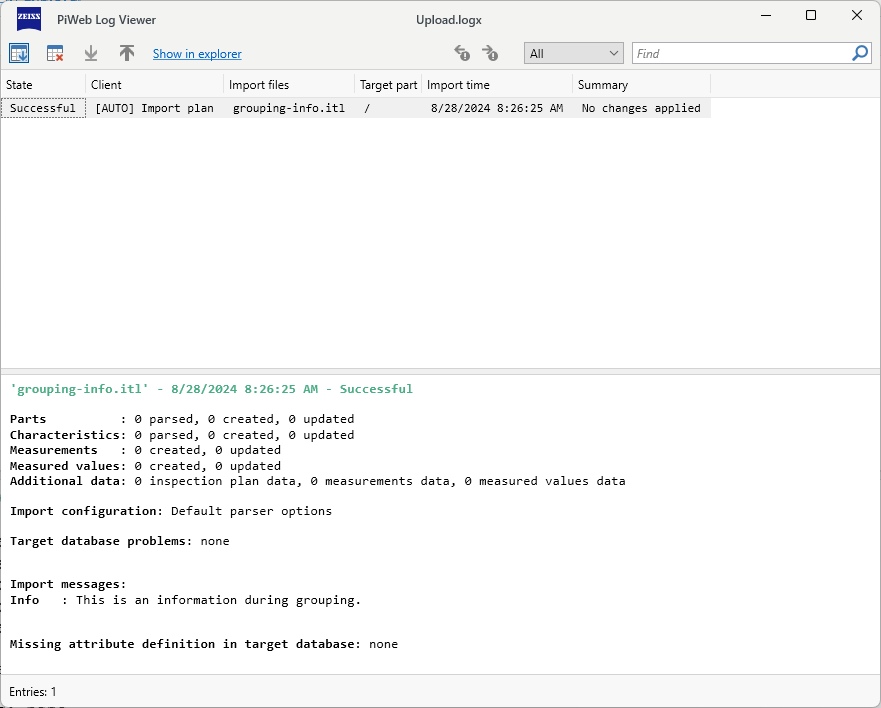
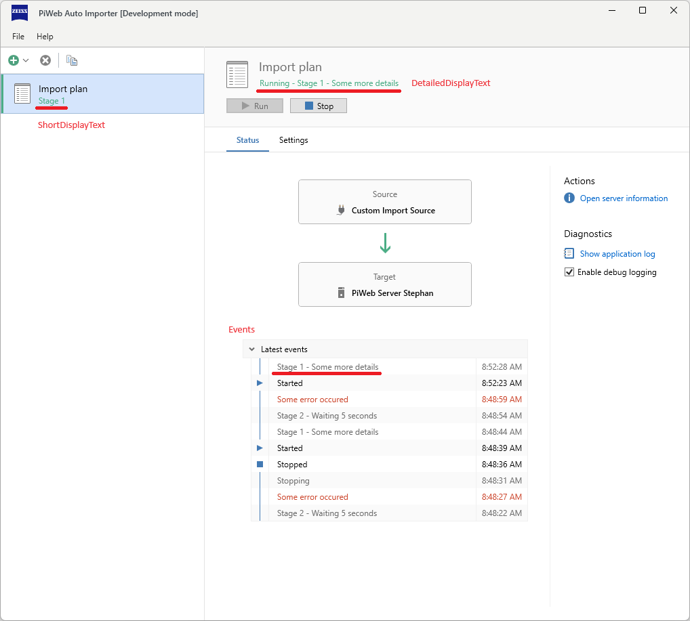
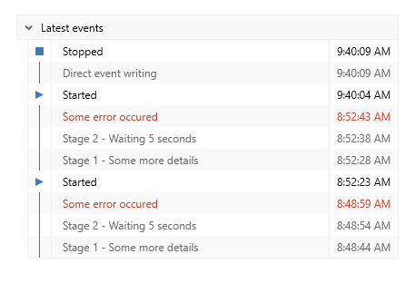

<!---
Ziele:
- aufzeigen, wie Monitoring der Ausführung des Plug-ins möglich ist

Inhalt:
- Logging
- Status
- Events
--->

# {{ page.title }}
There are various ways to monitor the Auto Importer and thus the developed plug-in and to track problems and activities.

The **application log** is used by the development team and support to track program steps. This should be used for debugging purposes and problems in the program flow.

The **import log** is important for the user, e.g. measurement engineer. Various steps in the import can be traced there. This is only available for import formats.

{: .note }
The import log cannot be used by plug-ins for import automation.

**Activities** and **events** can be used in the Auto Importer itself to present the current (and the previous) status to the user.

## Application log
The application log is a global log file that can be written to by all plug-ins and the Auto Importer itself. Import information could therefore be lost, which is why it is recommended to only use this log as a debug or in the event of program problems.

`IPluginInitContext` provides a logger that can be used to write to the application log:

```c#
public Task InitAsync(IPluginInitContext context)
{
    var logger = context.Logger;

    logger.LogTrace("Plug-in test message");
    logger.LogDebug("Plug-in test message");
    logger.LogInformation("Plug-in test message");
    logger.LogWarning("Plug-in test message with parameter: {parameter}", 5);
    logger.LogError(new Exception("Test exception"), "Plug-in test message");
    logger.LogInformation("Current UI culture: {cultureName}", CultureInfo.CurrentUICulture.Name);

    return Task.CompletedTask;
}
```

Log messages appear within the application log:\


{: .note }
The application log can also be found under `%AppData%\..\Local\Zeiss\PiWeb`.

Example message:\


## Import log
The import log is used to document import processes. This log file is located in the respective import folder and is therefore specific to the import plan. It mentions the file being processed and, in addition to the date and time, also provides information about parts, characteristics and measurements. This log should be used if import processes are to be traced.

{: .note }
The import log is only available for import formats. A separate solution should be used to log import processes in import automations, e.g. a separate logging file.

`IFilterContext` provides the `ImportHistoryService` a service that can be used to write to the import log:
```c#
using Zeiss.PiWeb.Sdk.Import.ImportFiles;
using Zeiss.PiWeb.Sdk.Import.ImportHistory;

public class LoggingTestImportGroupFilter : IImportGroupFilter
{
    public ValueTask<FilterResult> FilterAsync(IImportGroup importGroup, IFilterContext context)
    {
        if (!importGroup.PrimaryFile.HasExtension(".itl"))
            return ValueTask.FromResult(FilterResult.None);

        if (importGroup.PrimaryFile.BaseName.Contains("grouping-error", StringComparison.OrdinalIgnoreCase))
            context.ImportHistoryService.AddMessage(MessageSeverity.Error, "GroupingError");

        if (importGroup.PrimaryFile.BaseName.Contains("grouping-warning", StringComparison.OrdinalIgnoreCase))
            context.ImportHistoryService.AddMessage(MessageSeverity.Warning, "GroupingWarning");

        if (importGroup.PrimaryFile.BaseName.Contains("grouping-info", StringComparison.OrdinalIgnoreCase))
            context.ImportHistoryService.AddMessage(MessageSeverity.Info, "GroupingInfo");

        return ValueTask.FromResult(FilterResult.Import);
    }
}
```

Log messages appear within the import log:\


Example message:\


## Activities
Activities give the Auto Importer user the opportunity to stay informed about current activities of the import plan. There are two different display formats. 
`ShortDisplayText` is used in the import plan listing to identify activities across all import plans. In the detailed view of an import plan, you will also see the `DetailedDisplayText` at the top under the name of the import plan.\
In addition, these recorded activities are also noted as events and listed collectively under **Latest events**, see screenshot.\


`ICreateImportRunnerContext` provides the `IActivityService` that can be used to create activites:
```c#
using Zeiss.PiWeb.Sdk.Import.Modules.ImportAutomation;

public sealed class MyImportRunner : IImportRunner
{
    private readonly IActivityService _ActivityService;

    public MyImportRunner(ICreateImportRunnerContext context)
    {
        _ActivityService = context.ActivityService;
    }

    public async Task RunAsync(CancellationToken cancellationToken)
    {
        try
        {
            await Task.Delay(TimeSpan.FromSeconds(5), cancellationToken).ConfigureAwait(false);

            _ActivityService.SetActivity(
                new ActivityProperties()
                {
                    ActivityType = ActivityType.Normal,
                    ShortDisplayText = "Stage {0}",
                    DetailedDisplayText = "Stage {0} - Some more details"
                },
                1);

            await Task.Delay(TimeSpan.FromSeconds(5), cancellationToken).ConfigureAwait(false);

            _ActivityService.ClearActivity();

            await Task.Delay(TimeSpan.FromSeconds(5), cancellationToken).ConfigureAwait(false);

            _ActivityService.SetActivity(
                new ActivityProperties()
                {
                    ActivityType = ActivityType.Normal,
                    DetailedDisplayText = "Stage 2 - Waiting {0} seconds"
                },
                5);

            await Task.Delay(TimeSpan.FromSeconds(5), cancellationToken).ConfigureAwait(false);
            
            _ActivityService.SetActivity(
                new ActivityProperties()
                {
                    ActivityType = ActivityType.Suspension,
                    ShortDisplayText = "Some error occured",
                    DetailedDisplayText = "Some error occured",
                    IsSourceProblem = true
                });

            await Task.Delay(TimeSpan.FromMilliseconds(-1), cancellationToken).ConfigureAwait(false);
        }
        catch (OperationCanceledException)
        {
            // Do nothing
        }
    }
}
```

### ActivityProperties
The following properties can be used to customize your status message:
```c#
public class ActivityProperties
{
	/// <summary>
	/// The type of the activity.
	/// </summary>
	public ActivityType ActivityType { get; init; } = ActivityType.Normal;

	/// <summary>
	/// The detailed text to display. A localization handler will be used to localize this text.
	/// Implement <see cref="IPlugin.CreateLocalizationHandler"/> to specify your own localization and formatting.
	/// </summary>
	public string DetailedDisplayText { get; init; } = string.Empty;

	/// <summary>
	/// The short text to display. A localization handler will be used to localize this text with the given
	/// arguments. Implement <see cref="IPlugin.CreateLocalizationHandler"/> to specify your own localization and
	/// formatting.
	/// </summary>
	public string ShortDisplayText { get; init; } = string.Empty;

	/// <summary>
	/// Indicates whether this activity resulted from an import source error such as a missing import source.
	/// This property is only respected when <see cref="ActivityType"/> is <see cref="Activity.ActivityType.Suspension"/>.
	/// </summary>
	public bool IsSourceProblem { get; init; } = false;

	/// <summary>
	/// Indicates whether this activity resulted from an import target error such as an unreachable target server.
	/// This property is only respected when <see cref="ActivityType"/> is <see cref="Activity.ActivityType.Suspension"/>.
	/// </summary>
	public bool IsTargetProblem { get; init; } = false;
}

public enum ActivityType
{
	/// <summary>
	/// Normal activity, has no special behavior.
	/// </summary>
	Normal,

	/// <summary>
	/// Indicates that the import automation is temporarily suspended. This means that no imports are currently being carried out.
	/// An activity of this type should be set after an error occurs when time is required to recover from this error. A typical example
	/// is when the import target server cannot be reached. In this situation, it is recommended to wait for a short period of time
	/// before trying again to avoid traffic. Use a suspension activity during this wait time.
	/// </summary>
	Suspension
}
```

## Events
The last 10 events are displayed in the detailed view of an import plan. This allows the user to quickly obtain an overview of the last processes in the import plan.

As already mentioned, events are created automatically when the activity changes. However, it is also possible to create events explicitly, i.e. the activities area remains unchanged.

`IActivityService` provides the `PostActivityEvent` method for this purpose:
```c#
using Zeiss.PiWeb.Sdk.Import.Modules.ImportAutomation;

public sealed class MyImportRunner : IImportRunner
{
    private readonly IActivityService _ActivityService;

    public MyImportRunner(ICreateImportRunnerContext context)
    {
        _ActivityService = context.ActivityService;
    }

    public async Task RunAsync(CancellationToken cancellationToken)
    {
        try
        {
            await Task.Delay(TimeSpan.FromSeconds(5), cancellationToken).ConfigureAwait(false);

            _ActivityService.PostActivityEvent(EventSeverity.Info, "Direct event writing");
        }
        catch (OperationCanceledException)
        {
            // Do nothing
        }
    }
}
```

