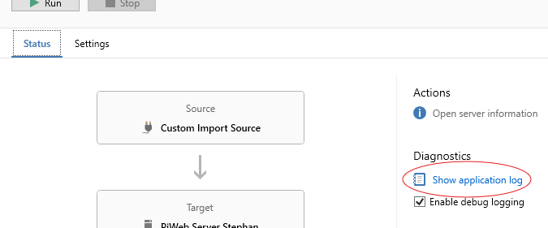
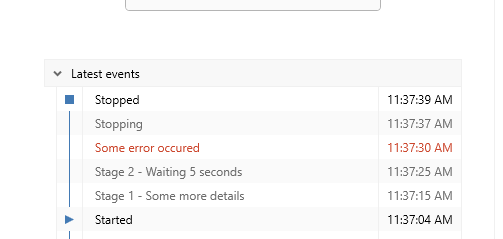

<!---
Ziele:
- aufzeigen, wie Monitoring der Ausführung des Plug-ins möglich ist

Inhalt:
- Logging
- Status
- Events
--->

# {{ page.title }}
There are various ways to monitor the Auto Importer and thus the developed plug-in and to track problems and activities.

The **application log** is used by the development team and support to track program steps. This should be used for debugging purposes and problems in the program flow.

The **import log** is important for the user, e.g. measurement engineer. Various steps in the import can be traced there.

**Activities** can be used in the Auto Importer itself to present the current status to the user. There is also the **status log**, which shows the user the last actions of the import plan.

## Application log
`IPluginInitContext` provides a logger that can be used to write to the application log:

```c#
public Task InitAsync(IPluginInitContext context)
{
    var logger = context.Logger;

    logger.LogTrace("Plug-in test message");
    logger.LogDebug("Plug-in test message");
    logger.LogInformation("Plug-in test message");
    logger.LogWarning("Plug-in test message with parameter: {parameter}", 5);
    logger.LogError(new Exception("Test exception"), "Plug-in test message");
    logger.LogInformation("Current UI culture: {cultureName}", CultureInfo.CurrentUICulture.Name);

    return Task.CompletedTask;
}
```

Log messages appear within the application log:\


Example message:\


<!-- TODO Dateipfad zum Log bereitstellen -->

## Import log


## Status log
In addition to the option of recording information in the log, information can also be noted in the status log:\


As with the logger, the context also provides the `StatusService` of type `IStatusService`.
```c#
private readonly IStatusService _StatusService;

public MyImportRunner(ICreateImportRunnerContext context)
{
    _StatusService = context.StatusService;
}

public async Task RunAsync(CancellationToken cancellationToken)
{
    try
    {
        await Task.Delay(TimeSpan.FromSeconds(5), cancellationToken).ConfigureAwait(false);

        _StatusService.SetActivity(
            new ActivityProperties()
            {
                ActivityType = ActivityType.Normal,
                ShortDisplayText = "Stage {0}",
                DetailedDisplayText = "Stage {0} - Some more details"
            },
            1);

        await Task.Delay(TimeSpan.FromSeconds(5), cancellationToken).ConfigureAwait(false);

        _StatusService.ClearActivity();

        await Task.Delay(TimeSpan.FromSeconds(5), cancellationToken).ConfigureAwait(false);

        _StatusService.SetActivity(
            new ActivityProperties()
            {
                ActivityType = ActivityType.Normal,
                DetailedDisplayText = "Stage 2 - Waiting {0} seconds"
            },
            5);

        await Task.Delay(TimeSpan.FromSeconds(5), cancellationToken).ConfigureAwait(false);
        
        _StatusService.SetActivity(
            new ActivityProperties()
            {
                ActivityType = ActivityType.Suspension,
                ShortDisplayText = "Some error occured",
                DetailedDisplayText = "Some error occured",
                IsSourceProblem = true
            });

        await Task.Delay(TimeSpan.FromMilliseconds(-1), cancellationToken).ConfigureAwait(false);
    }
    catch (OperationCanceledException)
    {
        // Do nothing
    }
}
```

### ActivityProperties
The following properties can be used to customize your status message:
```c#
public class ActivityProperties
{
	/// <summary>
	/// The type of the activity.
	/// </summary>
	public ActivityType ActivityType { get; init; } = ActivityType.Normal;

	/// <summary>
	/// The detailed text to display. A localization handler will be used to localize this text.
	/// Implement <see cref="IPlugin.CreateLocalizationHandler"/> to specify your own localization and formatting.
	/// </summary>
	public string DetailedDisplayText { get; init; } = string.Empty;

	/// <summary>
	/// The short text to display. A localization handler will be used to localize this text with the given
	/// arguments. Implement <see cref="IPlugin.CreateLocalizationHandler"/> to specify your own localization and
	/// formatting.
	/// </summary>
	public string ShortDisplayText { get; init; } = string.Empty;

	/// <summary>
	/// Indicates whether this activity resulted from an import source error such as a missing import source.
	/// This property is only respected when <see cref="ActivityType"/> is <see cref="Activity.ActivityType.Suspension"/>.
	/// </summary>
	public bool IsSourceProblem { get; init; } = false;

	/// <summary>
	/// Indicates whether this activity resulted from an import target error such as an unreachable target server.
	/// This property is only respected when <see cref="ActivityType"/> is <see cref="Activity.ActivityType.Suspension"/>.
	/// </summary>
	public bool IsTargetProblem { get; init; } = false;
}

public enum ActivityType
{
	/// <summary>
	/// Normal activity, has no special behavior.
	/// </summary>
	Normal,

	/// <summary>
	/// Indicates that the import automation is temporarily suspended. This means that no imports are currently being carried out.
	/// An activity of this type should be set after an error occurs when time is required to recover from this error. A typical example
	/// is when the import target server cannot be reached. In this situation, it is recommended to wait for a short period of time
	/// before trying again to avoid traffic. Use a suspension activity during this wait time.
	/// </summary>
	Suspension
}
```

## Activities

