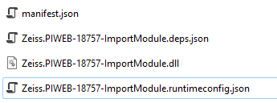
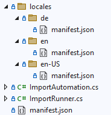

<!---
Ziele:
- allgemeinen Aufbau eines Plug-ins beschreiben

Inhalt:
- Grundstruktur
    - Ordner mit Manifest und Assemblies
- wo sucht AI nach Plug-ins
- Manifest referenziert das Einstiegs-Assembly (direkt oder indirekt)
- Einstiegs-Assembly muss Implementierung von IPlugin haben
- Manifest-Übersetzung in Unterordnern erwähnen
- C#-Projektdatei beschreiben
    - SDK-NuGet referenzieren
    - WICHTIG: Referenz auf SDK-NuGet braucht Flag, um nicht in die Ausgabe kopiert zu werden
    - Flag in Projekteigenschaften, um zu markieren, dass es ein C#-Plug-in ist (damit alle Abhängigkeiten in die Ausgabe gelegt werden)
--->

# {{ page.title }}

## Folder structure of a plug-in
`manifest.json` and assemblies must be located in the root directory of the plug-in folder.

## Auto Importer plug-ins folder
Plug-in folders must be placed under Auto Importer `"Plugins"` folder.\
The AutoImporter only loads plug-ins from its program directory (exception is the DeveloperMode see [PiWeb Auto Importer](#plug-in-search-paths)). As a rule, you therefore need admin rights to install and customize plug-ins.

## Start assembly
The `assemblyPath` property in manifest.json defines the start assembly. If assemblyPath is not specified, the `id` is used to determine the name of the assembly. The given assembly must provide a class that implements `IPlugin`, read [Import automation](#iplugin) for more information about IPlugin.

## Localization
The plug-in system supports localization of the manifest file, in which the supported language abbreviations appear as additional subfolders in the "locals" subfolder and contain a manifest.json. See [Localization]() for more details.\

## Project settings
### Nuget
The Nuget import SDK provided by us is required for plug-in development. Please integrate this into your project:\
`<PackageReference Include="Zeiss.PiWeb.Sdk.Import" Version="1.0.0" Private="false" ExcludeAssets="runtime"/>`

### Project file
The reference to the Import SDK-NuGet needs a flag to not be copied to the output, see above.\
Also make sure to mark the project as a C# plug-in (so that all dependencies appear in the output).