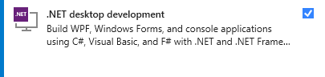
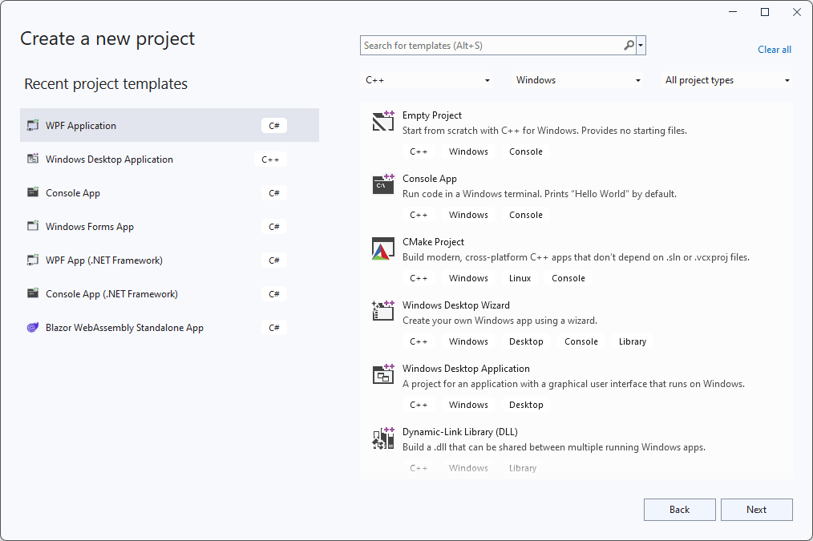
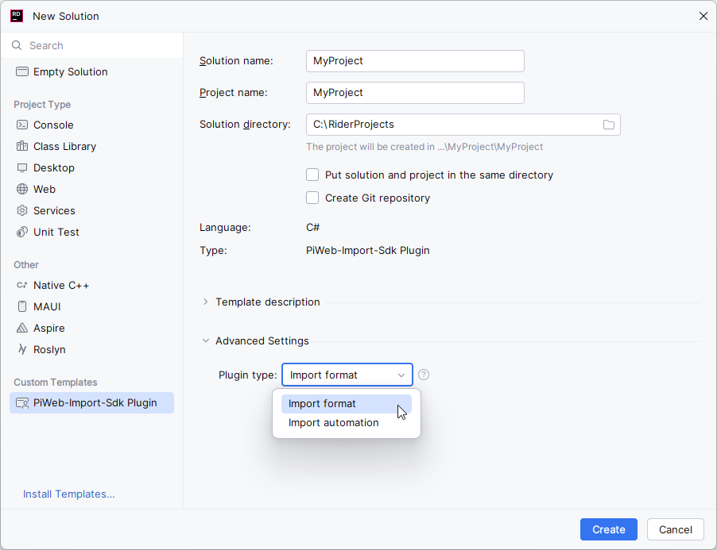

# {{ page.title }}

To develop import plug-ins, you need a working *.NET* development environment. At minimum this requires installing the *.NET SDK* ([download](https://dotnet.microsoft.com/en-us/download){:target="_blank"}).

Some IDEs like *Visual Studio* may already take care of installing the *.NET SDK* for you. *Visual Studio* for example will install the *.NET SDK* when the workload *.NET desktop development* is checked during installation.

{: .framed }

## Project templates
After installing the *.NET SDK* you can use can use your favorite IDE to develop import plug-ins. To make creating new plugin projects easier, we provide a project template. This template automatically creates the correct filesystem structure (including a basic manifest file). It also adds the *PiWeb Import SDK* NuGet package to the new project for you.

### Installing the project template
.NET provides command line tooling for installing project templates from NuGet. To install our project template, open a terminal and run `dotnet new install Zeiss.PiWeb.Sdk.Import.ProjectTemplates`. IDEs supporting this mechanism will now offer a template called `PiWeb-Import-Sdk Plugin` when creating a new project.

### Usage in Visual Studio
{: .bare }

### Usage in Rider
{: .bare }

{: .important }
Rider < 2024.1 does not support entering values for optional parameters for custom project templates.