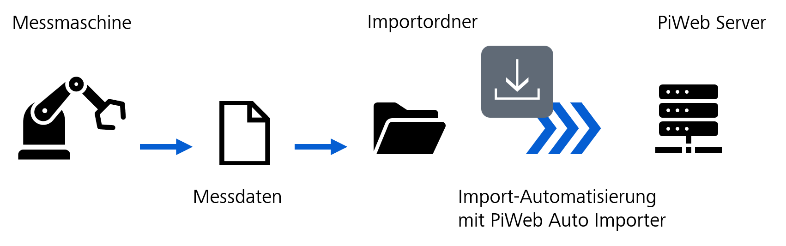
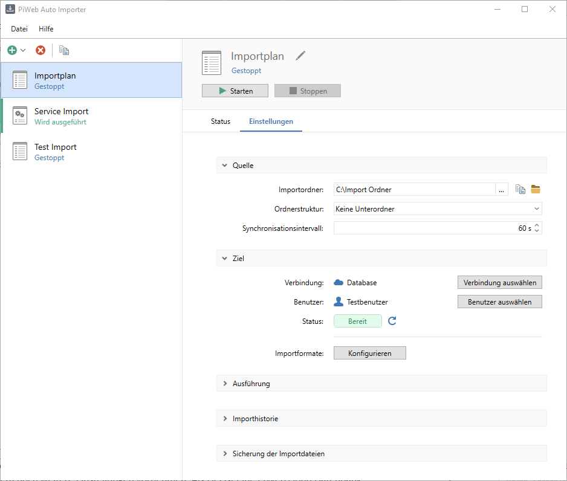
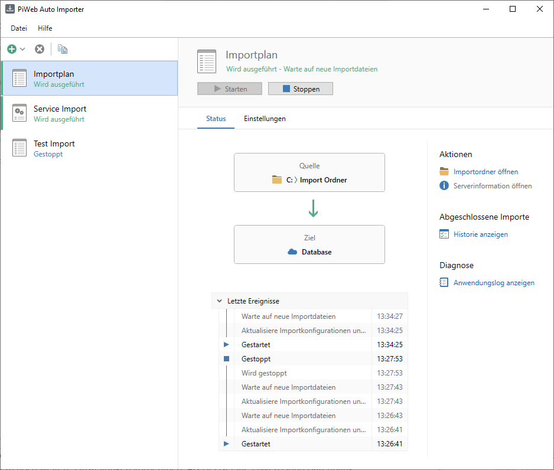

# {{ page.title }}

The ZEISS measuring software, e.g., ZEISS CALYPSO or ZEISS INSPECT, is able to directly synchronize data to the PiWeb Server. The measuring software of other manufacturers does not always offer a suitable connection. However, these products are frequently able to export the collected measuring data. Current export formats are CSV and DMO. Moreover, PiWeb is able to automatically evaluate other current formats.
These data can be read with the help of PiWeb Auto Importer and imported into the PiWeb database.
This allows you to also use the broad range of possible evaluations in PiWeb for the measuring data of other manufacturers.

PiWeb Auto Importer is configured to monitor the import folder. If a file is stored in this folder, PiWeb Auto Importer analyzes this file. If PiWeb Auto Importer recognizes the import format, the data are imported to the target database. Afterwards, PiWeb Auto Importer deletes the file from the import folder.

The PiWeb Auto Importer software must be installed in order to test / load your own plug-in.

## Automated Import with PiWeb Auto Importer
In PiWeb Auto Importer, you configure the source and target for your data. The import folder is set as the source. This folder can be located on the measuring computer or on a network drive. The import folder contains the import files.

A PiWeb Server is set as the target. This PiWeb Server is hosted either locally or in PiWeb Cloud.

Various other settings for your automatic import are available. All settings combined represent the import plan. In the image below, the configuration of an import plan is shown on the Settings tab.\

The import folder is available via the following path: C:\ImportFolder. In the Source area on the Settings tab, other settings are available. A PiWeb Cloud database is set as a target. The connection to the database has been successful since the correct login information were entered. In the Execution, Import history and Backup of import files areas, other settings are available. These areas are described in detail in section Settings tab.

You have the option to configure multiple import plans. E.g., you can test settings in a separate import plan without affecting production. For more information on the use, see section Import plan list.

After all settings have been made, you can execute the import plan. If an import plan is executed, you are able to monitor its status on the Status tab.\

The top part of the Workspace shows that the import plan is waiting for new import files. The Status tab summarizes the main information of the import plan. Thus, you easily realize if a problem occurred during the import.