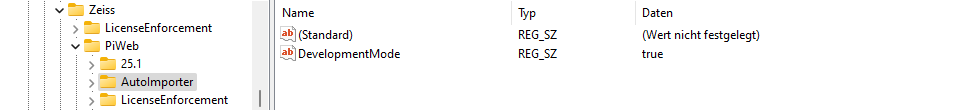
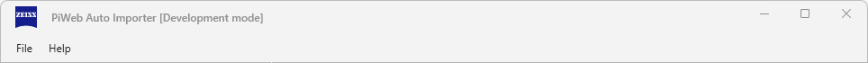
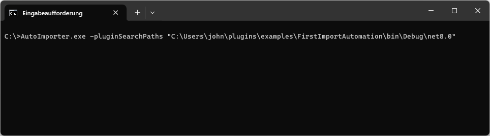

# {{ page.title }}

Import plug-ins extend the built-in functionality of *PiWeb Auto Importer* either by implementing an additional type of import automation or by implementing an additional import format for the built-in file based import automation. 

A single instance of the *PiWeb Auto Importer* can run and control any number of import automations. Each import automation is configured by an import plan and can be run and controlled independantly. In order to test an import plug-in, we need to do two things: Firstly, we need to make the plug-in known to the *PiWeb Auto Importer* and secondly, we need to create, configure and run a suitable import plan that uses the plug-in.

In this document we will show you how to generally setup and prepare the *PiWeb Auto Importer* for testing plug-ins. Later when developing our first plug-ins in [Gettings started](), we will also show you how to actually run these plug-ins using *PiWeb Auto Importer*. 

{: .note }
For more information about the different plug-in types and how they are used by *PiWeb Auto Importer*, see [Plug-in types]().

## Plug-in search paths
Import plug-ins are usually installed via *.pip* files to a specific plug-in installation folder. However, since the plug-in installation is system wide, administrator privileges would be required for each change. At the customer side this is desired for security reasons, however, this is not practical for plug-in development at all. For this reason, *PiWeb Auto Importer* has a special development mode that allows to load plug-ins from custom locations. To activate this development mode, you need to create a specific value in the windows registry:

In `HKEY_LOCAL_MACHINE\SOFTWARE\Zeiss\PiWeb\AutoImporter`, if it does not yet exist, create a new **string** value `DevelopmentMode`. Set it to `true`.

{: .framed }

If this is done correctly, PiWeb Auto Importer will now show [Development mode] in its title bar.

{: .bare }

With active development mode, it is now possible to specify additional plug-in search paths via command line parameter `-pluginSearchPaths` when starting the *PiWeb Auto Importer*. The typical usage of this parameter is to set the plug-in search path directly to the output folder of your plug-in project.

{: .bare }

## Import plans
  

TBD:
- Create import plan
- Choose target connection 
- Authentication