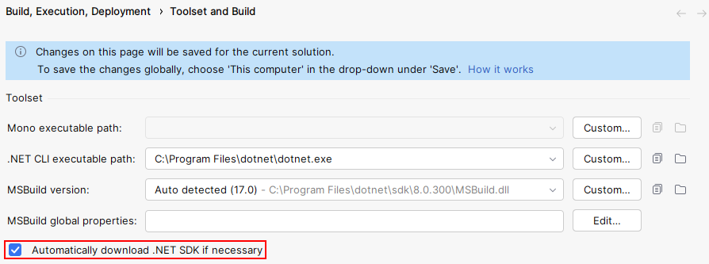
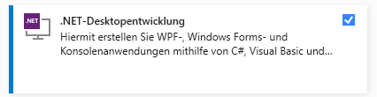

# {{ page.title }}
In principle, the Import SDK can be used with any text editor. However, we recommend the use of Visual Studio or Rider.

{: .important }
.NET version 8 and the .NET SDK are required.

## Project template
We provide a project template for Visual Studio and Rider. This contains the minimum project structure to start developing a plug-in.

### Download and install
<!-- Auf andere Seite verweisen oder hier beschreiben? -->

### Rider
Add the current folder to `Add > New Project... > More Templates > Install Template...` and press `Reload`. On the left hand side should be a new template called `PiWeb AutoImporter Plug-in` at the bottom under `Other`.

{: .note }
Rider < 2024.1 does not support entering values for optional parameters for custom project templates.

### Visual Studio
Open a terminal in this location and run `dotnet new install`. When adding a new project there should now be a template called `PiWeb AutoImporter Plug-in`.

### Command line
Open a terminal in this location and run `dotnet new install`.
Now you can add new projects with `dotnet new zeiss-ai-plug-in`. Use `dotnet new zeiss-ai-plug-in -h` to see options.

## Rider .NET SDK
Make sure that Rider automatically loads the .NET SDK. This should be the default setting.\


## Visual Studio workload
Please make sure that Visual Studio has been installed with the **.Net desktop development** workload. This can be set via the Visual Studio Installer.\


## Import SDK nuget
The Import SDK nuget is required for the development of Auto Importer plug-ins. This can be obtained from .

{: .important }
> Please ensure that this assembly is not copied to the output:
> ```xml
> <PackageReference Include="Zeiss.PiWeb.Import.Sdk" Version="$(ImportSdkNuGetVersion)">
>    <Private>false</Private>
>     <ExcludeAssets>runtime</ExcludeAssets>
> </PackageReference>
> ```
<!-- ImportSdkNuGetVersion immer defined? -->