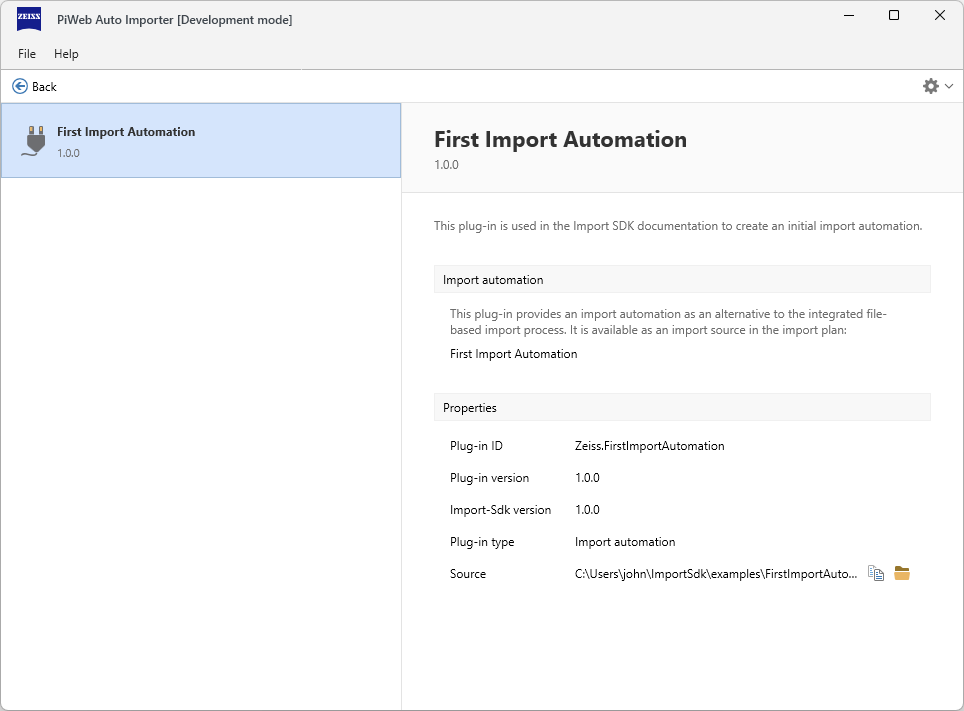

# {{ page.title }}

{: .note }
The first complete installation of a plugin is covered in the [Starting a plug-in](). However, as certain settings are necessary or recommended for starting, these are listed here beforehand.

## Development mode
For security reasons, the Auto Importer only allows plug-ins to be loaded from its program folder. In plug-in development, however, it can be helpful to manage and develop your own plug-in in a separate environment. For this reason, the Auto Importer provides a development mode.

An entry in the registry is required to activate this mode. This must be placed under\
`Computer\HKEY_LOCAL_MACHINE\SOFTWARE\Zeiss\PiWeb\AutoImporter`\
Name: **DevelopmentMode** as a string with the value: **True**

If development mode is active (restart is required), this is displayed accordingly in the title bar of the Auto Importer.

## Command for external plug-in folder
The development mode makes it possible to load plug-ins from a given folder in the Auto Importer via a start parameter:\
`-pluginSearchPaths "C:\Plugins"`

There should be a subfolder for each plug-in in this folder. [Read more about structure]().

## Auto Importer plug-in management
To check whether the Auto Importer has loaded the desired plug-in, you can go to `File > Plug-ins...`.\
There you will see a list of all known plug-ins and their load status.

If a plug-in could not be loaded, this is displayed accordingly. Clicking on a plug-in calls up the plug-in information in the right-hand area. The loading problems are also listed there.
You can find more information on this at [Troubleshooting]().