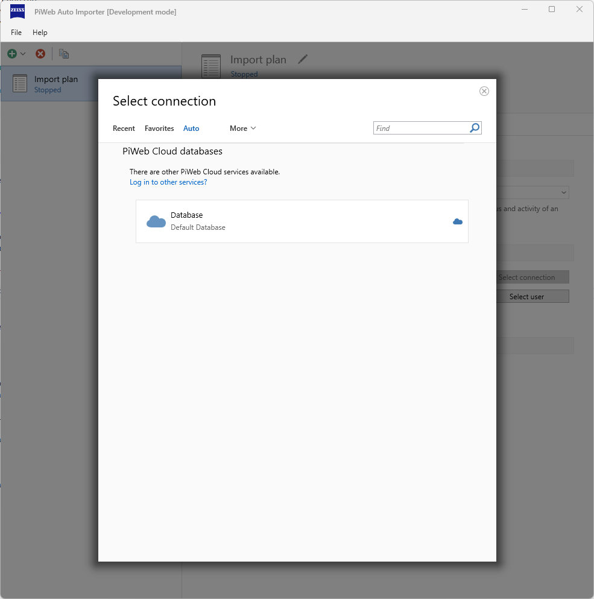
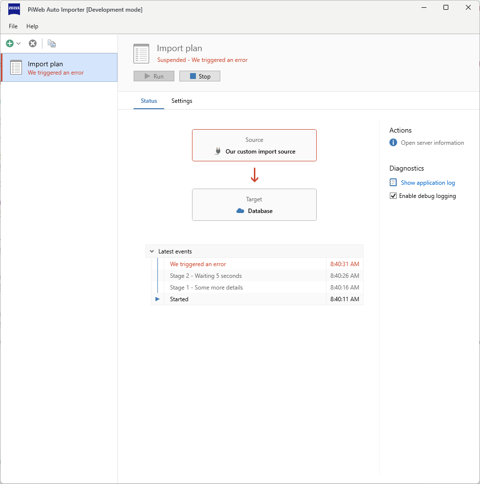

# {{ page.title }}
This article describes the use of the plug-in from the user's perspective, i.e., how a compiled plug-in is installed and how it is used in the import plan. It is assumed that the user already has a finished plug-in.

## Download compiled example plug-in
<!-- TODO Plug-in link zu pip bereitstellen -->

## Plug-in installation
A plug-in can be installed in various ways, see [Deployment](). We assume here that the installation takes place via the `Install plug-in` button within the Auto Importer.

The Auto Importer provides an installer option, for which the following steps must be carried out:

1. Open `File > Plug-ins...`, You can select the Install plug-in... option via the cogwheel in the top right-hand area. option. Alternatively, if you have not yet installed a plug-in, you can select Install plug-in directly in the middle of the view.

This will open the file explorer with filtering for Auto Importer plug-in files.
2. After selecting the desired plug-in, an overview of the manifest data appears.

3. After the action was scheduled, you will be prompted to restart the Auto Importer.

4. When restarting, the planned action is recognized and the plug-in installer is started. This shows the pending actions. Administration rights are required to execute the actions. (`Run now`)

5. A green tick appears in front of successfully executed actions. The plug-in installer can now be closed, after which the Auto Importer starts with the installed plug-in.

## Check plug-in
To ensure that the plug-in has been installed correctly, you can call up the plug-in management view (`File > Plug-ins...`) again. The loaded plug-in will now appear there.\

## Create import plan
To test the installed plug-in, an import plan must first be created; an import plan defines a source and a target. To do this, please click on `Create import plan`.\

## Import plan with custom import source
If the plug-in has been loaded correctly, the custom import source can be selected as an import source in an import plan. Please adjust all settings according to the screenshot.\

To select your cloud database as the destination, please go to Select connection and select Auto.\

Via `Run`, the import plan is started with this configuration. The plug-in only demonstrates the switching of the activity and status log. At the end of the execution, an error is provoked.\

You can find out more about import visualization options at [Import monitoring](). The following chapters describe the minimum source code required for a plug-in.