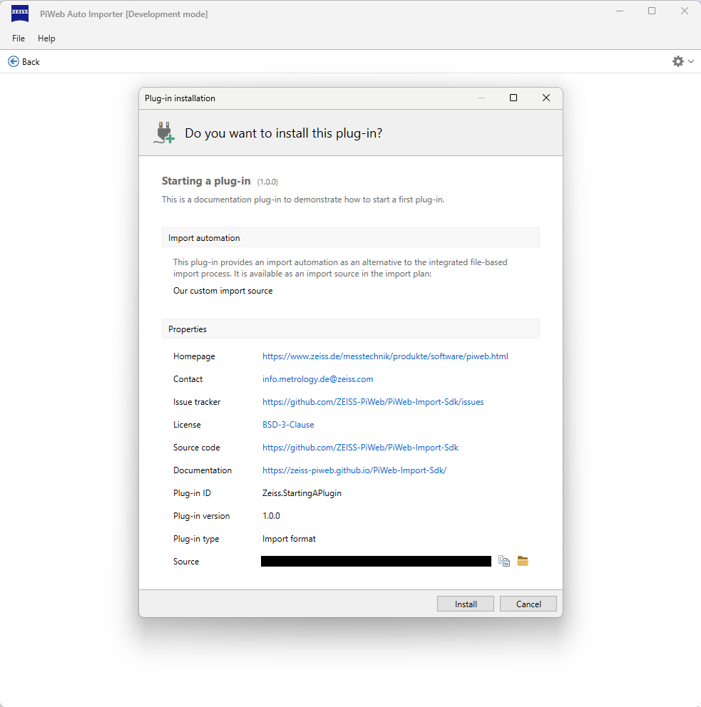
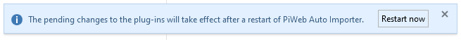

# {{ page.title }}

This chapter describes the use of the plug-in from the user's perspective, i.e., how a compiled plug-in is installed and how it is used in the import plan. It is assumed that the user already has a finished plug-in.

## Download compiled example plug-in
<!-- TODO Plug-in link zu pip bereitstellen -->

## Plug-in installation
A plug-in can be installed in various ways, see chapter [Deployment](). We assume here that the installation takes place via the *Install plug-in* button within the Auto Importer.

The Auto Importer provides an installer option, for which the following steps must be carried out:

<!-- TODO: Anleitung auf neuen Installer umstellen -->
1. Open `File > Plug-ins...`. You can select the *Install plug-in...* option via the cogwheel in the top right-hand area. Alternatively, if you have not yet installed a plug-in, you can select *Install plug-in* directly in the middle of the view.\
   

   This will open the file explorer with filtering for Auto Importer plug-in files.

2. After selecting the desired plug-in, an overview of the manifest data appears.\
   

   Administration rights are requested for installation.

3. After successful execution, you will be prompted to restart the Auto Importer.\
   

## Check plug-in
To ensure that the plug-in has been installed correctly, you can call up the plug-in management view (`File > Plug-ins...`) again. The loaded plug-in will now appear there.

<!-- TODO Besseres vollständiges Bild einbetten, mit dem Download plug-in übereinstimmend -->

## Import plan with custom module
If the plug-in has been loaded correctly and modules have been recognized, they can be selected as an import source in an import plan:

After selecting the module, the defined configuration entries are displayed.

Via **Run**, the import plan is started with this configuration.
