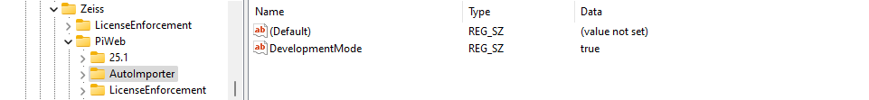
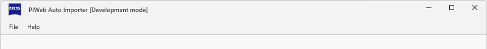
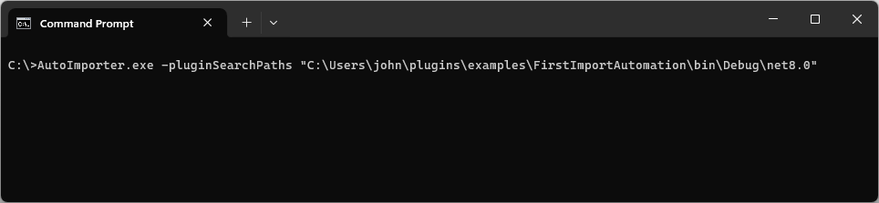
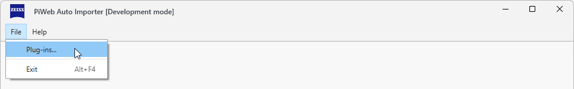
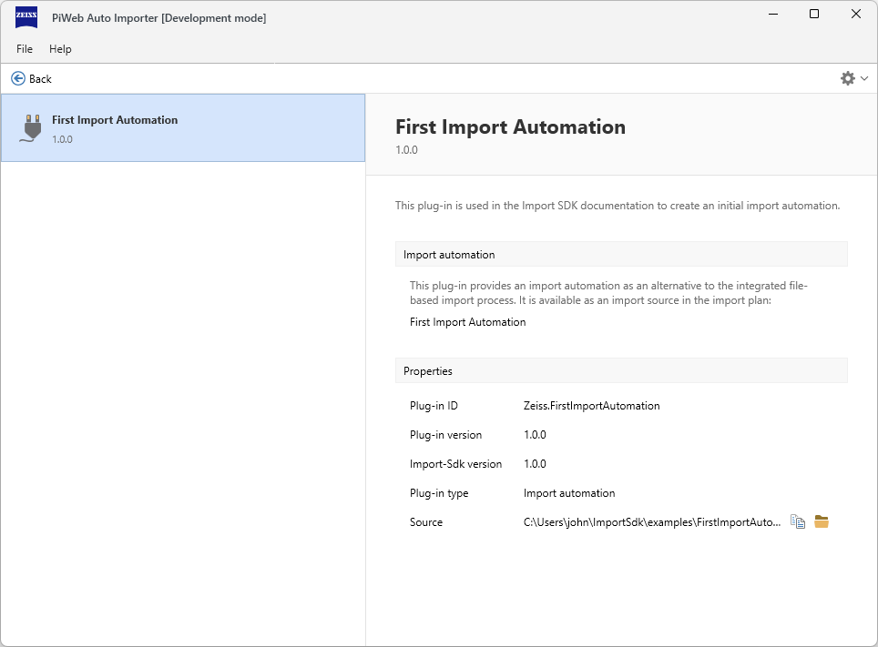
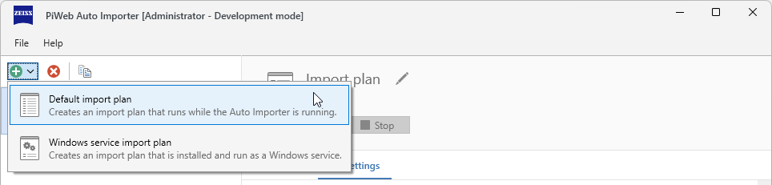
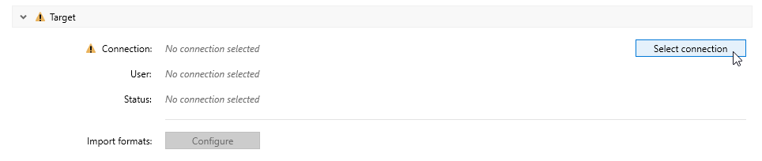

# {{ page.title }}
{: .no_toc }

Import plug-ins extend the built-in functionality of *PiWeb Auto Importer* either by implementing an additional type of import automation or by implementing an additional import format for the built-in file based import automation. 

A single instance of the *PiWeb Auto Importer* can run and control any number of import automations. Each import automation is configured by an import plan and can be run and controlled independently. In order to test an import plug-in, we need to do two things: Firstly, we need to make the plug-in known to the *PiWeb Auto Importer* and secondly, we need to create, configure and run a suitable import plan that uses the plug-in.

In this document we will show you how to generally setup and prepare the *PiWeb Auto Importer* for testing plug-ins. Later when developing our first plug-ins in [Gettings started](), we will make use of this setup.

## Table of Contents
{: .no_toc }
1. TOC
{:toc}

## Development mode
*PiWeb Auto Importer* supports a special development mode that enables additional features useful for developing plug-ins. For security reasons, these features are not enabled by default in a standard installation of *PiWeb Auto Importer*. To activate the development mode, you need to create a specific value in the windows registry:

In `HKEY_LOCAL_MACHINE\SOFTWARE\Zeiss\PiWeb\AutoImporter`, if it does not yet exist, create a new *string* value `DevelopmentMode` and set it to `true`.

{: .framed }

After the next start, *PiWeb Auto Importer* will now show [Development mode] in its title bar to indicate that the development mode is active.

## Plug-in search paths
Import plug-ins are usually installed via *.pip* files to a specific plug-in installation folder. However, since the plug-in installation is system wide, administrator privileges would be required for each change. At the customer side this is desired for security reasons, however, this is not practical for plug-in development at all. For this reason, *PiWeb Auto Importer* allows to load plug-ins from custom unprivileged locations by specifying additional plug-in search paths via command line parameter `-pluginSearchPaths`. The typical usage of this parameter is to set the plug-in search path directly to the output folder of your plug-in project. Plug-in projects usually have a `launchSettings.json` configured to do this when the project is launched.

{: .note }
The `-pluginSearchPaths` command line parameter is only available when *PiWeb Auto Importer* is in development mode. See [Development mode](#development-mode) for how to activate development mode.

## Plug-in management
To see whether plug-ins in custom search paths are found, you can compile one of the example plug-ins, use its build output path as custom search path and open the plug-in management view.

{: .note }
Unlike regularly installed plug-ins, plug-ins from custom search paths cannot be uninstalled.

## Import plans
The last step of setting up *PiWeb Auto Importer* is to create and configure an import plan we can run. A new import plan can easily be created by clicking the green plus icon in the toolbar. If there are no import plans created so far, you can use the displayed link to create a new first import plan instead. You can now enter a name for the newly created import plan or just keep the default name.

Most of the default settings of the import plan are fine, however, it is still missing a valid import target. Use the "Select connection" button to choose an import target. The import target must be a running *PiWeb* backend, see [PiWeb backend]() for your options to set one up.

{: .framed }

Depending on your chosen import target, you may also need to authenticate at the import target. When everything is working correctly, the connection status should now be 'Ready'.

This is all the basic setup you need. In the next section [Writing plug-ins](), we will show you how to create, build an run your own plug-ins.