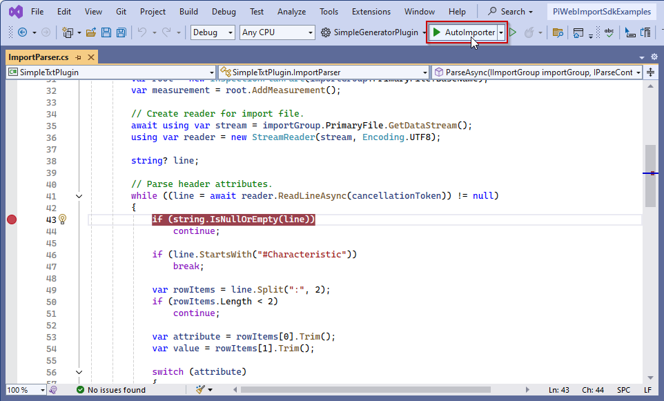

# {{ page.title }}
{: .no_toc }
When a plug-in does not behave as expected, you need the means to analyze the problem. In this section we will show you what tools are available to do just that.

## Table of Contents
{: .no_toc }
1. TOC
{:toc}

## Logging
Looking at a log file is often the most accessable way of problem analysis after an error occured. To support this, import plug-ins of any type can add entries to the regular application log of *PiWeb Auto Importer*. More details about how to do this and where to find the resulting logs are available in our dedicated [Application logs]() article.

## Debugging
When a misbehavior is reproducible, debugging is usually the easiest way to find the problem. An import plug-in can be debugged simply by attaching a debugger to an *PiWeb Auto Importer* process using the plug-in. Ideally a debug build of the plug-in. If you have used our project template to create the *.NET* project of the plug-in (see [Installing project templates](#installing-project-templates)), the project already contains a launch profile to do this in a single click:



If you do not have this launch configuration, you can easily add it to your project by creating a `launchSettings.js` file in the `Properties` folder of your project:
```json
{
  "profiles": {
    "AutoImporter": {
      "commandName": "Executable",
      "workingDirectory": "$(ProjectDir)",
      "executablePath": "%ProgramFiles%\\Zeiss\\PiWeb\\AutoImporter.exe",
      "commandLineArgs": "-pluginSearchPaths $(OutDir)"
    }
  }
}
```

{: .note }
> For this to work correctly, two conditions need to be met:
> - *PiWeb Auto Importer* must be installed locally.  
 The executable is expected to be found in <span class="nowrap">`%ProgramFiles%\Zeiss\PiWeb\AutoImporter.exe`</span>. If the *PiWeb Auto Importer* executable is in another path, you can update the path specified in `launchSettings.json` accordingly.
> - *PiWeb Auto Importer* must be in development mode.  
 See [Development mode](#development-mode) for details on how to activate development mode.