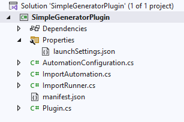
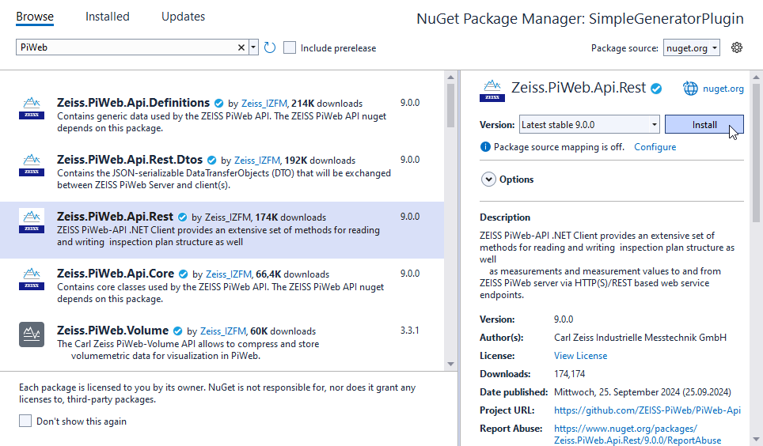
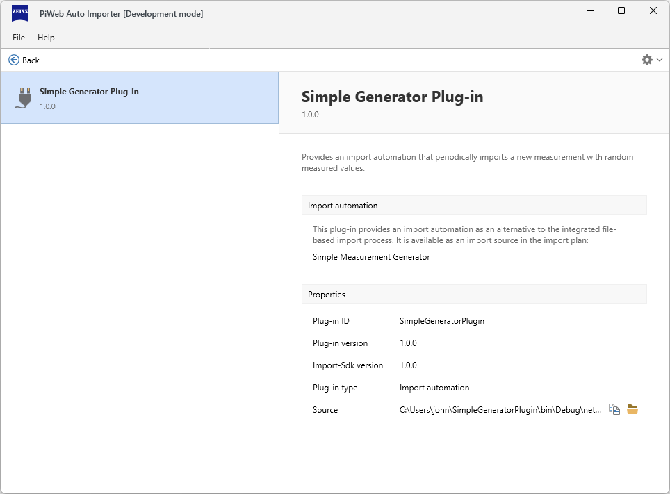
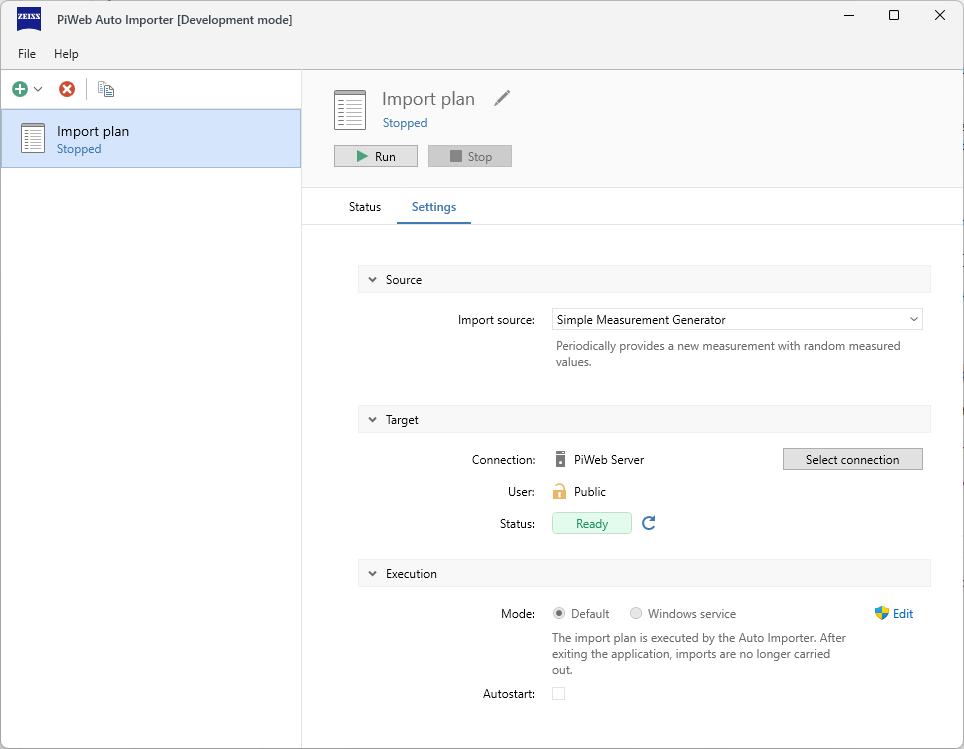
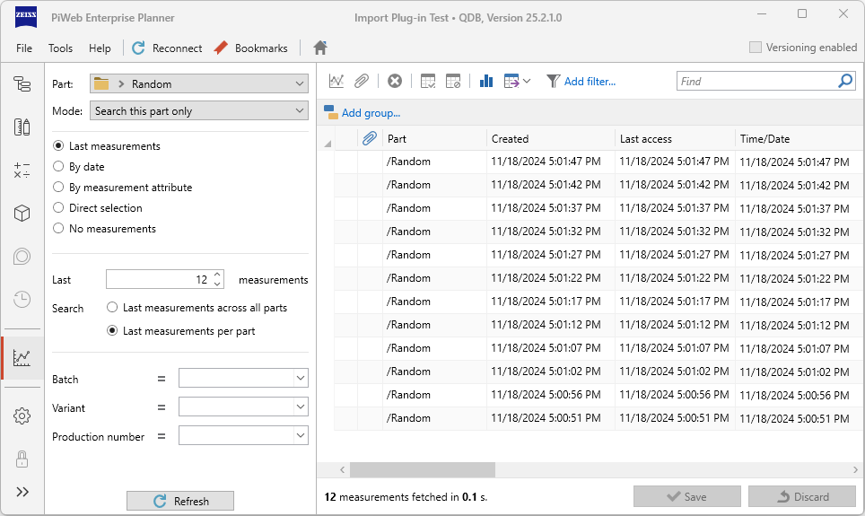

<!---
Ziele:
- anhand einer einfachen Beispielanwendung Schritt für Schritt das Vorgehen und die wichtigsten Themen für den Modultyp beschreiben

Inhalt:
- IImportAutomation implementieren
- Implementierung registrieren
- Implementierung im manifest eintragen
- IImportRunner implementieren (wird für jeden Run erzeugt)
- Events verwenden um zu demonstrieren, dass es läuft (auf genaue Erklärung im Kapitel "Import Monitoring" verweisen)

Notizen:
- Schema mit voller URL auf GitHub bereitstellen
--->

# {{ page.title }}
{: .no_toc }
Import automation plug-ins allow you to automate imports from almost any source using *PiWeb Auto Importer*. Unlike with import format plug-ins the source of import data is not limited to the filesystem and there are no limitations on how already existing data on the backend can be modified during import. However, this high degree of customizability means that the automation loop must be fully implemented by the plug-in. In this article we will show you step-by-step, how to create a simple but fully functional import automation plug-in and how to use this plug-in to import data with *PiWeb Auto Importer*. As a data source we will simply use a random number generator, so the import loop will continuously create new measurements with randomly generated measured values in a fixed intervall.

{: .note}
The full sources of the plug-in built in this article are part of the *Import SDK* plug-in examples and can be found [here](https://github.com/ZEISS-PiWeb/PiWeb-Import-Sdk/tree/develop/examples/SimpleGeneratorPlugin).

## Table of Contents
{: .no_toc }
1. TOC
{:toc}

## Step 1 - Create a new .NET project
To start developing the new import automation plug-in, create a new *.NET* project using the project template <span class="nowrap">`PiWeb-Import-Sdk Plugin`</span>. Enter `SimpleGeneratorPlugin` as project name and select `Import automation` as Plugin type. If you are using this guide to start your own import automation plug-in, use another project name that better fits your import automation. Since the project name is by default also used as plug-in id, make sure the project name is reasonably unique.

{: .note }
If you do not have a project template named <span class="nowrap">`PiWeb-Import-Sdk Plugin`</span>, take a look at [Installing project templates](#installing-project-templates).

The newly created project should now look similar to this:

{: .framed }

Let us have a look at the files created by the project template: The `manifest.json` file is the manifest of the plug-in. We will edit it in the next step. In addition to the manifest file, the project template has also created four source code files for us: `Plugin.cs`, `ImportAutomation.cs`, `ImportRunner.cs` and `AutomationConfiguration.cs`. Each of these files contains a class of the same name:
- `Plugin` is the entry point of the plug-in. It acts as a factory for the import automation provided by our plug-in. The project template already set this up to create instances of `ImportAutomation`, so we do not need to change its implementation.
- `ImportAutomation` represents our new import automation. It acts as a factory to delegate its two responsibilities: Firstly, it creates instances of `ImportRunner` thus determining what the import loop will do. Secondly, it creates instances of `AutomationConfiguration` to determine what import plan settings will be available in the *PiWeb Auto Importer* UI when our import automation is used.
- `ImportRunner` implements the actual import loop. We will implement it to periodically upload a new measurement to the *PiWeb* backend in step 4.
- `AutomationConfiguration` implements custom import plan settings for our new import automation. Since we do not need any settings for this example plug-in, we do not need to make any changes to the implementation provided by the project template.

There is also a `launchSettings.json` which contains a launch configuration that builds our plug-in and starts a locally installed *PiWeb Auto Importer* with the necessary configuration to load and run our plug-in directly from the build output. We come back to this later when we are testing the new plug-in.

## Step 2 - Edit the plug-in manifest
One of the automatically created project files is the plug-in manifest `manifest.json`. This manifest file contains static information about the plug-in. Most entries are given sensible default values but we need to set a few values specific to our new plug-in project:

```json
{
  "$schema": "https://raw.github.com/ZEISS-PiWeb/PiWeb-Import-Sdk/refs/heads/pub/schemas/manifest-schema.json",
  "id": "SimpleGeneratorPlugin",
  "version": "1.0.0",
  "title": "Simple Generator Plug-in",
  "description": "Provides an import automation that periodically imports a new measurement with random measured values.",

  "provides": {
    "type": "ImportAutomation",
    "displayName": "Simple Measurement Generator",
    "summary": "Periodically provides a new measurement with random measured values."
  }
}
```

The first two properties we have updated are `title` and `description`. These two values determine how our new plug-in should be displayed in the plug-in management view of *PiWeb Auto Importer*. This is not strictly necessary for a working plug-in, but it helps us to find our plug-in in the plug-in management view. Similarly, the `displayName` property in the `provides` section specifies how the import automation provided by our plug-in should be displayed in the import source selection of an import plan in *PiWeb Auto Importer*. The `summary` property in the same section can be used to add a more detailed description of the import automation that will be displayed as explanation of the selected import source selection.

{: .note }
There are many other optional manifest properties. You can find more information about the manifest file in [Manifest]().

## Step 3 - Unpack context information
We are going to need information about the currently executing import plan of the hosting *PiWeb Auto Importer*. For example we need the URI of the target backend and the authentication information to actually write measurements. All of those values are passed to the `ImportRunner` via constructor parameter as a single context object when an `ImportRunner` instance is constructed. To get easier access later on, we create members in the `ImportRunner` for all the context information we are interested in and then unpack the context parameter of the constructor:

```c#
private readonly IActivityService _ActivityService;
private readonly ImportTarget _ImportTarget;

public ImportRunner(ICreateImportRunnerContext context)
{
  _ActivityService = context.ActivityService;
  _ImportTarget = context.ImportTarget;
}
```

The original `_Context` member created by the project template is now unnecessary and can be removed from the `ImportRunner` class.

## Step 4 - Add the PiWeb API NuGet to the project
Since the *Import SDK* does not provide a specific way for import automations to access the *PiWeb* backend, we will add the *PiWeb API* to our plug-in project and use it to write the generated measurements to the backend. Open the NuGet Package Manager and install `Zeiss.PiWeb.Api.Rest`.

{: .framed }

## Step 5 - Add a method to create data service REST clients
Having the *PiWeb API* available now, we can add a method to the `ImportRunner` class that creates a data service REST client for a given URI. We use the given authentication data to authenticate any requests. Later on, we will pass URI and authentication data from `_ImportTarget` to this method.
```c#
private static DataServiceRestClient CreateDataServiceClient(Uri uri, IAuthData authData)
{
  var authenticationHandler = authData.AuthType switch
  {
    AuthType.Basic => NonInteractiveAuthenticationHandler.Basic(authData.Username, authData.Password),
    AuthType.WindowsSSO => NonInteractiveAuthenticationHandler.WindowsSSO(),
    AuthType.Certificate => NonInteractiveAuthenticationHandler.Certificate(authData.CertificateThumbprint),
    AuthType.OIDC => NonInteractiveAuthenticationHandler.OIDC(authData.ReadAndUpdateRefreshTokenAsync),
    _ => null
  };
        
  return new RestClientBuilder(uri)
    .SetAuthenticationHandler(authenticationHandler)
    .CreateDataServiceRestClient();
}
```

## Step 6 - Add methods to create the inspection plan entities
Before we can create measurements in the backend, we need a target part to create these measurements for. Also, to add a randomly generated measured value to the measurement, the target part needs to have a characteristic. For this simple plug-in, we will use fixed names for both. The target part will always be a part named "Random" directly below the root part. The characteristic will always be named "Width". We need to check whether these two entities already exist in the backend and if not, we need to create them. Also we need to find their UUIDs to reference them in our new measurement later on. Let us add two methods to the `ImportRunner` class that implement this logic:

```c#
private static async Task<InspectionPlanPartDto> GetOrCreateTargetPart(DataServiceRestClient restClient)
{
  var targetPath = PathInformation.Combine(PathInformation.Root, PathElement.Part("Random"));
  var fetchedParts = await restClient.GetParts(targetPath, depth: 0);

  if (fetchedParts.Count > 0)
    return fetchedParts[0];

  var newTargetPart = new InspectionPlanPartDto
  {
    Path = targetPath,
    Uuid = Guid.NewGuid()
  };

  await restClient.CreateParts([newTargetPart]);
  return newTargetPart;
}

private static async Task<InspectionPlanCharacteristicDto> GetOrCreateCharacteristic(
  DataServiceRestClient restClient,
  InspectionPlanPartDto targetPart)
{
  var fetchedCharacteristics = await restClient.GetCharacteristics(targetPart.Path, depth: 1);
  var existingCharacteristic = fetchedCharacteristics
    .Where(characteristic =>
      string.Equals(characteristic.Path.Name, "Width", StringComparison.OrdinalIgnoreCase))
    .FirstOrDefault();

  if (existingCharacteristic != null)
    return existingCharacteristic;

  var characteristicPath = PathInformation.Combine(targetPart.Path, PathElement.Char("Width"));
  var newCharacteristic = new InspectionPlanCharacteristicDto
  {
    Path = characteristicPath,
    Uuid = Guid.NewGuid()
  };

  await restClient.CreateCharacteristics([newCharacteristic]);
  return newCharacteristic;
}
```

## Step 7 - Add a method to upload a new measurement
After we made sure our target part and its characteristic actually exist in the backend, we can now write a method for the `ImportRunner` class that creates and uploads a new measurement for the target part. The measurement will have a given measured value for its characteristic.

```c#
private static async Task UploadMeasurement(
  DataServiceRestClient restClient,
  InspectionPlanPartDto targetPart,
  InspectionPlanCharacteristicDto characteristic,
  double measuredValue)
{
  var measurementValues = new Dictionary<Guid, DataValueDto>()
  {
     { characteristic.Uuid, new DataValueDto(measuredValue) }
  };

  var newMeasurement = new DataMeasurementDto
  {
    Uuid = Guid.NewGuid(),
    PartUuid = targetPart.Uuid,
    Time = DateTime.UtcNow,
    Characteristics = measurementValues
  };

  await restClient.CreateMeasurementValues([newMeasurement]);
}
```

## Step 8 - Implement the automation loop
Now that we have all the basic building blocks, we can finally implement the actual automation loop by implementing the `RunAsync` method of the `ImportRunner` class. This method is called when a user hits the run button of an import plan using our plug-in. It is expected to loop until the user hits the stop button which will be signaled to our plug-in by canceling the given cancellation token.

```c#
public async Task RunAsync(CancellationToken cancellationToken)
{
  if (_ImportTarget.Type != ConnectionType.Webservice)
  {
    _ActivityService.PostActivityEvent(EventSeverity.Error, "The import target is not supported");
    return;
  }

  try
  {
    var uri = new Uri(_ImportTarget.ServiceAddress);
    var authData = _ImportTarget.AuthData;
    using var restClient = CreateDataServiceClient(uri, authData);
    var random = new Random();

    while (!cancellationToken.IsCancellationRequested)
    {
      var value = Math.Round(random.NextDouble(), 2);

      var targetPart = await GetOrCreateTargetPart(restClient);
      var characteristic = await GetOrCreateCharacteristic(restClient, targetPart);
      await UploadMeasurement(restClient, targetPart, characteristic, value);

      _ActivityService.PostActivityEvent(EventSeverity.Info, $"Uploaded new measurement value: {value}");

      await Task.Delay(TimeSpan.FromSeconds(5), cancellationToken);
    }
  }
  catch (OperationCanceledException)
  {
    // Do nothing
  }
}
```

First we check whether the backend connection configured for the import plan is actually a web service. Since we use the *PiWeb API* to connect to the backend, we do not support any other connection types. Next, we create the REST client using the `CreateDataServiceClient` method from step 5.

The actual automation loop is a while loop that creates a random number, checks whether target part and characteristic exist (if not we create them) and then uploads the new measurement. Before we loop back and repeat, we simply wait for 5 seconds. Since we pass the cancellation token, an `OperationCanceledException` will be raised when the user hits the stop button, which causes the loop and the `RunAsync` method to exit. Note that we always finish the current measurement upload, even if the cancellation token was triggered.

## Testing the plug-in
After building the project, the plug-in is ready to test. Since the project template already created launch settings for the project, running *PiWeb Auto Importer* to host the new plug-in is as easy as hitting the start button of your IDE.

{: .framed }

This will start *PiWeb Auto Importer* with the necessary command line parameters to load the plug-in build from the current project and also attach a debugger to the process.

{: .note }
> For this to work correctly, two conditions need to be met:
> - *PiWeb Auto Importer* must be installed locally. The executable is expected to be found in <span class="nowrap">`%ProgramFiles%\Zeiss\PiWeb\AutoImporter.exe`</span>. If the *PiWeb Auto Importer* executable is in another path, you can update the path specified in `launchSettings.json` accordingly.
> - *PiWeb Auto Importer* must be in development mode. See [Development mode](#development-mode) for details on how to activate development mode.

After *PiWeb Auto Importer* has started, the *Simple Generator* plug-in should be available in the plug-in management view opened via <span class="nowrap">`File > Plug-ins...`</span> and there should be no error messages.



When the plug-in is loaded and shows no errors, the new import automation is available as import source in import plans. We can now run the generator by creating a new import plan (or reusing an existing one) and then selecting the <span class="nowrap">`Simple Measurement Generator`</span> as import source.



After hitting the run button, the automation will be generating new measurements with random measured values every 5 seconds until stopped again. Using *PiWeb Planner*, we can observe these new measurements:



## Next steps
Now that we have a running plug-in, you can continue with [Deploying plug-ins]() explaining how to actually deploy your plug-in to a *PiWeb Auto Importer* in production use. You may also want to read the articles in the [Plug-in fundamentals]() and [Advanced topics]() sections to get a better understanding of the concepts behind plug-ins and also learn about other features available for your own plug-in implementations.